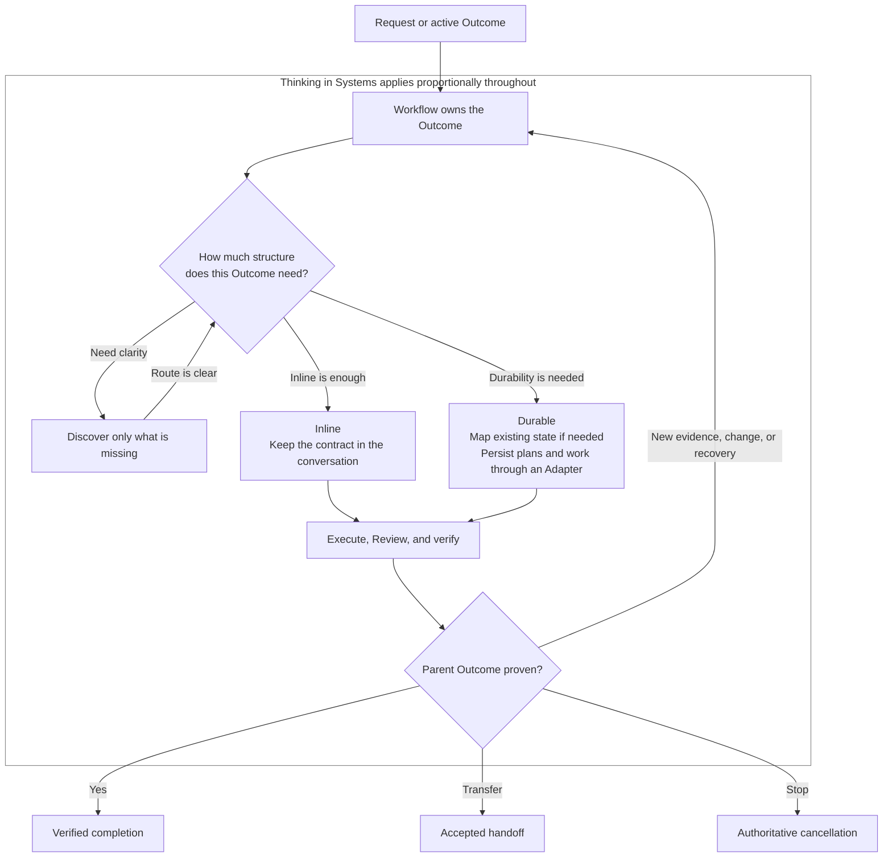

# Skills for Systems That Need to Work

[](https://skills.sh/JustYannicc/skills)

Systems thinking changes the question from "How do I complete this task?" to "What has to be true for this to work?" That shift can make a huge difference almost anywhere. It reveals the conditions a task depends on, helping you solve the right problem and produce a result that holds up in real life rather than a fix that only works in isolation. This suite applies that thinking to every request, but always in proportion to the work. Simple work stays simple. Work with real consequences gets the depth it deserves.

This project came from a need to formalize a way of thinking that had lived mostly in my head. I realized a while ago that many of the fundamentals I learned in programming also applied to life. Designing software systems that work and designing systems for life rely on many of the same principles. The terminology is different, but the underlying thinking has a lot in common.

**[Thinking in Systems](skills/thinking-in-systems) is my secret sauce.** It grew out of roughly a year and a half of learning what helps me create things that actually work. As someone with ADHD, I need to design systems for my life as much as I need to design them for software. Before I wrote the method down, I had to remember and apply it as I went. Formalizing it helps me use what I know more consistently and gives agents a method they can follow too. By sharing it, I hope to help other people develop systems that work.

That shared method lets me treat agents less like autocomplete and more like employees. It gives them enough clarity to take on broader work without losing sight of the outcome.

I used [Matt Pocock](https://x.com/mattpocockuk)'s [agent skills](https://github.com/mattpocock/skills) every day for development. They fundamentally changed how much I can do with agents. His workflow is excellent, but it was designed specifically for software development. I wanted to make it universal and use my systems-thinking approach everywhere.

Thinking in Systems is my method. Matt's workflow gives it structure. This suite brings the two together so the same way of thinking and working can apply far beyond software. [Workflow](skills/workflow) coordinates the skills and keeps responsibility for the outcome until the work is genuinely finished.

## Installation

### 1. Install Setup

For one project:

```bash
npx skills@latest add JustYannicc/skills --skill setup-system-thinking
```

Or install it globally:

```bash
npx skills@latest add JustYannicc/skills --skill setup-system-thinking --global
```

One Setup run manages exactly one scope: project or global. Run it once in each scope if you want both. Within that scope, Setup can configure one or more supported agent harnesses.

### 2. Run `/setup-system-thinking`

Invoke it inside your agent. Setup will inspect the environment, show every proposed change, install and configure the complete pinned suite, verify fresh-context behavior, and remove itself when the installation passes.

### 3. Start working

Open a fresh agent context and make an ordinary request. Thinking in Systems loads first; Workflow then chooses the smallest route that can truthfully complete the Outcome.

If you only want route advice, invoke `/ask-yannic`. It reads the matching Workflow revision and explains the smallest applicable route without executing it.

<details>
<summary><strong>What Setup manages</strong></summary>

Setup will:

- inspect the selected scope, effective instruction chain, installed skills, source fingerprints, repository and remote, available Adapters, authentication, and conflicts;
- show the proposed installation, inherited and overridden configuration, exact instruction changes, verification plan, and rollback before writing;
- install the pinned suite and apply the overlays recorded in [`overlays/manifest.yaml`](overlays/manifest.yaml);
- recommend an Adapter from the real environment, then configure any explicitly selected providers and Supplemental skills;
- teach the Inline and Durable modes, responsibility model, migration, Review, waiting, recovery, updates, rollback, and removal;
- verify fingerprints, configuration precedence, Adapter behavior, every selected agent target, and fresh-context activation;
- remove `setup-system-thinking` from the selected scope after every other check passes.

Setup owns only a marked block in each selected agent instruction surface and one human-readable scope configuration record. It preserves surrounding instructions, credentials, unrelated skills, and user data.

</details>

<details>
<summary><strong>Install individual packages</strong></summary>

Every local package remains independently discoverable:

```bash
npx skills@latest add JustYannicc/skills --list
```

You can install a package directly with `--skill <name>`, but that does not compose dependencies, apply the standard overlays, create standing activation, configure an Adapter, or verify the suite. Use Setup for the standard profile.

</details>

## What changes

Agents can produce a convincing intermediate result and stop there. Work may look complete even though the real outcome has not been reached. This suite keeps the parent outcome owned until the result has been verified where it actually needs to work.

That does not mean turning every request into a process. A bounded task can stay **Inline** in one conversation. Work that must survive the conversation or coordinate across boundaries becomes **Durable** through one selected Adapter. Workflow adds only the structure needed to keep the outcome truthful.

## How the workflow scales



Thinking in Systems is the governing lens, not a phase to finish and leave behind. Workflow chooses the route, revisits it when the situation changes, and remains responsible for reaching a truthful terminal condition. The [Workflow skill](skills/workflow) is the canonical source for the complete routing and completion rules.

## Skill guide

### Govern and coordinate

- **[Thinking in Systems](skills/thinking-in-systems):** Applies the governing lens: outcome and boundary, actors and authority, incentives and friction, evidence, operation under real conditions, recovery, and legacy impact. It scales the depth of the analysis without switching the method off.
- **[Workflow](skills/workflow):** Owns one parent Outcome from request to verified completion, accepted transfer, or authoritative cancellation. It selects Inline or Durable mode, invokes bounded phase skills, integrates their evidence, and retains responsibility for the whole.
- **[Ask Yannic](skills/ask-yannic):** A user-invoked route guide. It reads the matching Workflow source and recommends the smallest applicable route without running skills or causing effects.
- **[Setup System Thinking](skills/setup-system-thinking):** A user-invoked, disposable installer and maintainer. It owns one scoped installation transaction from inspection through fresh-context proof, then removes itself; reinstalling it provides status, repair, update, reconfiguration, rollback, and removal.

### Understand the situation

- **[Migrate System](skills/migrate-system):** Adopts an existing scope by mapping and verifying its actual current state. It changes the representation, not the underlying system; repairs return to ordinary Workflow as separate work.
- **[Domain Modeling](skills/domain-modeling):** Establishes shared operative terminology when a word's meaning, classification, or scope is unclear or conflicting. Accepted terms are bound to their evidence, authority, and canonical record.
- **[Wayfinder](skills/wayfinder):** Navigates persistent fog with a durable decision Map and operating Strategy. It keeps the frontier, blockers, evidence, and next route visible without pretending that uncertainty is a predictable plan.
- **[Prototype](skills/prototype):** Runs one reversible experiment to answer one material design question. It returns a decision-changing observation and disposition, not production implementation.

### Specify, execute, and prove

- **[To Spec](skills/to-spec):** Turns an accepted Outcome contract into one revision-bound Specification for downstream work. It synthesizes accepted decisions and exposes missing prerequisites instead of reopening discovery silently.
- **[To Tickets](skills/to-tickets):** Decomposes an accepted Specification into bounded, owned, dependency-aware Tickets. Every Ticket names one result, owner, authority, proof seam, relationships, and terminal condition.
- **[Implement](skills/implement):** Executes one accepted Ticket, preserves responsibility through delegation and waiting, gathers effect evidence, and submits an exact Result to Review.
- **[Review](skills/review):** Independently verifies an exact Result against its accepted Specification and governing standards at the agreed proof seam. It returns one revision-bound verdict; it does not complete the parent Outcome.
- **[Handoff](skills/handoff):** Preserves exact continuation state across an actor, session, service, wait, or operating-context boundary. Responsibility transfers only when an identifiable successor accepts the exact handoff.

All runtime packages except Ask Yannic are model-invoked: an agent may reach for them automatically when the task fits. Ask Yannic and Setup System Thinking are user-invoked because they advise or manage an installation only when explicitly requested.

## Adapters and Supplemental skills

An **Adapter** is the selected canonical implementation for Durable records and coordination. It gives Outcome, Ticket, state, relationship, evidence, and continuation meanings a real home without making Git or any hosted tracker part of those meanings.

| Environment | Truthful default |
| --- | --- |
| No Git repository | Keep bounded work Inline. At a persistence boundary, use plain Local Markdown or another configured conforming Adapter. Local Git initialization is an explicit choice, not a prerequisite. |
| Git without GitHub | Prefer Git-backed Local Markdown when durable, reviewable local state is useful. A remote is optional. |
| GitHub-connected repository | GitHub may be selected only after its actual integration proves the required identity, state, relationship, evidence, responsibility, continuation, and recovery behavior. Unsupported capabilities stay visible. |
| External provider | It becomes canonical only after satisfying the same universal Adapter contract. A narrower integration remains a derived view or Supplemental capability. |

A **Supplemental skill** adds specialist evidence at a declared Extension point. For example, a code-focused reviewer can contribute findings to universal Review. It is pinned and configured explicitly as advisory or required. It never silently replaces the core skill's responsibility or completion criterion.

## The composed suite

The standard profile contains 17 skills: the 12 runtime packages in this repository, four pinned upstream packages, and disposable Setup.

- [`grill-with-docs`](https://github.com/mattpocock/skills/tree/6acc160e4e0cd062dbbbd7a1b26ae92855edf07e/skills/engineering/grill-with-docs): user-decision discovery with repository-backed language and decisions;
- [`grilling`](https://github.com/mattpocock/skills/tree/6acc160e4e0cd062dbbbd7a1b26ae92855edf07e/skills/productivity/grilling): the reusable interview frontier;
- [`research`](https://github.com/mattpocock/skills/tree/6acc160e4e0cd062dbbbd7a1b26ae92855edf07e/skills/engineering/research): source-grounded reading legwork;
- [`to-questionnaire`](https://github.com/mattpocock/skills/tree/6acc160e4e0cd062dbbbd7a1b26ae92855edf07e/skills/productivity/to-questionnaire): questions for knowledge held by another person;
- [`setup-system-thinking`](skills/setup-system-thinking): one scoped, transactional installation and maintenance skill that removes itself after verification.

The exact upstream revision, target paths, patch files, hashes, and installation order live in [`overlays/manifest.yaml`](overlays/manifest.yaml). The overlays adapt invocation and integration behavior without copying the complete upstream packages into this repository.

## Update, remove, and recover

Reinstall Setup in the scope you want to maintain:

```bash
npx skills@latest add JustYannicc/skills --skill setup-system-thinking
```

Add `--global` for the global scope, then invoke `/setup-system-thinking`. Setup detects the existing installation and offers the maintenance branches:

- **Status** compares installed and effective state with the pinned manifest.
- **Repair** restores accepted fingerprints and activation while preserving unrelated state.
- **Update** previews source and overlay changes, preserves the last-known-good manifest, verifies the candidate, and advances pins only after proof.
- **Reconfigure** changes agent targets, Adapter, providers, or Supplemental mappings through the same inspected transaction.
- **Rollback** restores the complete last-known-good installation and behavior.
- **Remove** deletes only manifest-owned skills, selected providers, managed instruction blocks, and suite configuration in that scope. Outcome records and user data remain in place unless you separately authorize their export or deletion.

Every successful maintenance run verifies the resulting fresh-context behavior and removes Setup again.

If the installation is unhealthy, reinstall Setup at the affected scope and choose **Status** first. Its inspection distinguishes source drift, overlay mismatch, configuration precedence, instruction-block drift, missing access, and target activation failures. Choose **Repair** for the accepted manifest or **Rollback** for the last-known-good installation. When a failure occurs before commit, Setup restores the prior files and removes only objects introduced by that run.

If Setup's final self-removal fails, the verified runtime stays active. Setup reports the exact retry and rollback choices and leaves the maintenance run visibly incomplete rather than undoing a working installation.

The raw skills CLI remains available for standalone packages:

```bash
npx skills@latest update --project
npx skills@latest remove
```

Use `--global` for global packages. The CLI's `remove --all` removes every installed skill in the selected scope and agent target, not only this suite; suite-wide maintenance should go through Setup.

## Credits

Nearly every skill here owes its shape to [Matt Pocock](https://x.com/mattpocockuk)'s [agent skills](https://github.com/mattpocock/skills). Wayfinder, Prototype, Domain Modeling, To Spec, To Tickets, Implement, Review, and Handoff are cross-domain successors to his corresponding skills and engineering flow.

Ask Yannic adapts the router pattern from [Ask Matt](https://github.com/mattpocock/skills/tree/6acc160e4e0cd062dbbbd7a1b26ae92855edf07e/skills/engineering/ask-matt). Setup System Thinking adapts the inspect-first, repository-aware pattern from [Setup Matt Pocock's Skills](https://github.com/mattpocock/skills/tree/6acc160e4e0cd062dbbbd7a1b26ae92855edf07e/skills/engineering/setup-matt-pocock-skills). Workflow and Migrate System form the universal coordination layer around those ideas.

Thinking in Systems is Yannic's original method, packaged using the skill-design approach Matt established.

This README also follows [Matt Pocock](https://x.com/mattpocockuk)'s [example](https://github.com/mattpocock/skills/blob/main/README.md) by putting installation first and explaining the skills in plain language.

The composed suite also installs and patches four MIT-licensed packages by [Matt Pocock](https://x.com/mattpocockuk) directly at the immutable revision recorded in [`overlays/manifest.yaml`](overlays/manifest.yaml): `grill-with-docs`, `grilling`, `research`, and `to-questionnaire`. He is their upstream author. The overlays and this suite are not an endorsement by or official release from him.
