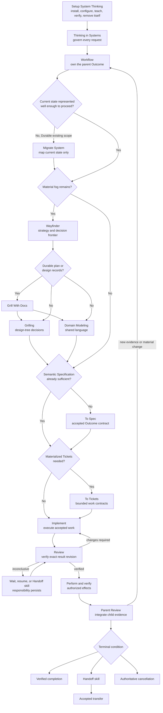

# Skills

Public agent skills by [JustYannicc](https://github.com/JustYannicc).

This repository is being built around a simple idea: agents become much more useful when they follow clear, inspectable methods instead of improvising a different process every time. Each skill has one job. Together, they should make good thinking easier to apply across software, personal life, organizations, physical environments, and agent systems.

## Skills

No skill has been published yet. Thinking in Systems, Workflow's Inline and
Durable routes, To Spec, To Tickets, Domain Modeling, Review, and Prototype are
approved. Handoff has an implementation candidate awaiting the issue #26 human
review gate. Suite publication remains gated by the composed-suite and
clean-install proof in #31 and the immutable-release review in #32.

### [Thinking in Systems](skills/thinking-in-systems) — approved

Thinking in Systems is my secret sauce: the way of thinking I have developed and applied over roughly the last year and a half. It is a large part of how I have been able to make unusually fast progress. The skill distills that method into universal governing knowledge for designing systems.

It is meant for almost anything: technical work, personal routines, organizations, physical environments, decisions, agent execution, and the systems connecting them. It starts from intent and outcomes, makes assumptions and handoffs explicit, aligns incentives and friction, designs for low-capacity operation, proves behavior at meaningful seams, and keeps systems recoverable as they change and decay.

Installing a skill is not a substitute for understanding it. Read the method, practice it, challenge it, and learn to apply the thinking yourself. The agent should make the process easier and more consistent; the human retains intent, judgment, authority, and the right to make informed exceptions.

Yannic approved the skill's governing behavior in issue #12. That approval is
distinct from publishing the complete suite, which still requires #31 and #32.

### [Workflow](skills/workflow) — approved

Workflow coordinates one parent Outcome from the accepted request through the
smallest truthful route to verified completion, accepted transfer, or
authoritative cancellation. Its Inline route keeps the Outcome, Specification,
Ticket, evidence, and immediate Review in the conversation for bounded
synchronous work. Its Durable route materializes the same meanings through one
selected Adapter as canonical Outcome, Ticket, Claim, Evidence, Continuation,
history, change, and proof records while preserving the same systems method,
responsibility, Authority, exact revisions, effect proof, and parent terminal
check.

During active work it classifies clarification, extensions or Constraint
changes, corrections, authorized exceptions, explicit replacements, and
unrelated switches before changing state. Material changes invalidate and
propagate only affected work; parent and unaffected delegated ownership remain
intact. Durable Systems bind to the accepted #35 System Record representation:
one human-readable Markdown authority with constrained YAML formal fields,
native Adapter mappings where appropriate, and optional read-only projections.
Yannic approved the Durable route in issue #14, and PR #45 merged it into
`main`. This approval does not change private or global configuration.

### [To Spec](skills/to-spec) — approved

To Spec turns an accepted Outcome contract into a clear Specification artifact for downstream work, or revises it after a material change. It preserves the Outcome's vocabulary, routes material gaps to the capability that owns them, and returns responsibility to Workflow. Yannic approved issue #22; publication still depends on the composed-suite release proof.

### [To Tickets](skills/to-tickets) — approved

To Tickets decomposes an accepted Specification into a collectively complete set of bounded, owned, dependency-aware Tickets. It preserves each Result, Authority, Proof seam, containment relationship, and Workflow context; exposes the accepted Work frontier; and returns material Specification or capability gaps without silently changing intent. One bounded Inline unit may remain implicit, while Durable decomposition is reserved for coordination boundaries. Yannic approved issue #23, and PR #45 merged the skill into `main`; publication still depends on the composed-suite release proof.

### [Review](skills/review) — approved

Review independently verifies any exact result against its accepted Specification and governing standards at the Proof seam. It shows how the result works, keeps Specification and Standards evidence distinct, checks interaction quality and maintainability across domains, and integrates only configured Supplemental reviewers before returning one revision-bound Verified, Changes required, or Inconclusive verdict. Yannic approved issue #25; publication still depends on the composed-suite release proof.

### [Prototype](skills/prototype) — approved

Prototype answers one material design question through a reversible experiment.
Use it when trying, simulating, or rehearsing a candidate can produce evidence
before commitment. Each run names its learning question, reversible boundary,
Proof seam, stopping rule, verdict, and disposition, then returns revision-bound
evidence to the active `'Workflow'` skill. A configured `technical-prototype` Supplemental skill may
construct a bounded technical result, while Prototype retains evidence
integration and its completion criterion. Live effects, Specification,
implementation, Review, and parent completion remain with their owning phases.

### [Domain Modeling](skills/domain-modeling) — approved

Domain Modeling establishes shared, operative terminology for the active scope.
It traces candidate meanings to authoritative sources, exposes conflicts and
unknowns, records accepted decisions through the selected Adapter when they
must persist, and returns the bounded language result to Workflow. Yannic
approved issue #16; publication still depends on the composed-suite release
proof.

### [Wayfinder](skills/wayfinder) — candidate

Wayfinder navigates persistent, multi-session, or irreducible fog through a
durable decision Map and operating Strategy. It preserves the destination,
accepted decisions, frontier, blockers, Evidence, ownership, and Continuation
through the selected Adapter, invokes discovery companions only for their owned
uncertainty, and completes only when the next route is truthfully specifiable or
remaining fog has accepted operating rules. Issue #21 still requires human
review; this candidate does not approve or publish the skill.

## Planned suite

Thinking in Systems is the anchor, not a container for every workflow. The accepted first runtime suite contains 17 single-job skills covering automatic coordination, adoption of existing systems, discovery, specification, decomposition, implementation, review, handoff, guidance, and setup. Some are universal successors to Matt Pocock's skills; small universal upstream skills remain installed directly with deterministic overlays instead of being copied. For documented planning and design, Grill With Docs composes Grilling's decision-tree interview with Domain Modeling's shared-language and decision records through the selected Adapter.

The roster and its one-job boundaries are recorded in the [skill suite roster](docs/SUITE_ROSTER.md). Its complete public-safe inputs are preserved in the [source archive](docs/source/README.md), including the full universalized S01 standard, reusable template, skill-design record, supporting research, private-source fingerprints, and the [requirements ledger](docs/requirements/REQUIREMENTS_LEDGER.md). See also the [roadmap](docs/ROADMAP.md), [architecture](docs/ARCHITECTURE.md), [development setup](docs/DEVELOPMENT.md), and [historical Workflow Durable candidate handoff](docs/handoffs/2026-08-08-workflow-durable-candidate.md).

Publication evidence, clean-install proof, behavioral evaluation, and the
separate private-activation gate are defined by the
[validation and release contract](docs/VALIDATION_AND_RELEASE.md).

## Workflow

Setup runs once and installs the standing entry. After that, every request uses Thinking in Systems and the proportional Workflow automatically. The phases are universal: implementation may mean sending a reply, changing a routine, performing organizational work, modifying a physical environment, or writing code. Inline work compresses the artifacts; Durable work records them through the selected Adapter.

The route is not mandatory ceremony or a software pipeline. Workflow chooses the smallest path that can satisfy the same responsibility and proof contract. The canonical rules are in the [Workflow routing contract](docs/WORKFLOW_ROUTING.md). Responsibility across phases, effect gates, parent Review, recovery, and terminal proof is defined by the [Ownership and completion lifecycle](docs/OWNERSHIP_LIFECYCLE.md). Installation, harness-specific instruction changes, Adapter selection, verification, rollback, and disposal are defined by the [Setup System Thinking contract](docs/SETUP_CONTRACT.md).

## Distribution

The canonical source lives in this repository. The suite and individual skills
will be discovered and installed through [skills.sh](https://skills.sh/).
Setup explicitly installs the selected suite because skills.sh does not resolve
skill-to-skill dependencies or edit standing instructions.

## License

The repository is available under the [MIT License](LICENSE).
