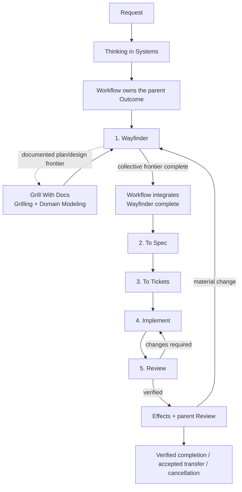

# Skills for Systems That Need to Work

[](https://skills.sh/JustYannicc/skills)

Systems thinking changes the question from "How do I complete this task?" to "What has to be true for this to work?" That shift can make a huge difference almost anywhere. It reveals the conditions a task depends on, helping you solve the right problem and produce a result that holds up in real life rather than a fix that only works in isolation. This suite applies that thinking to every request, but always in proportion to the work. Simple work stays simple. Work with real consequences gets the depth it deserves.

This project came from a need to formalize a way of thinking that had lived mostly in my head. I realized a while ago that many of the fundamentals I learned in programming also applied to life. Designing software systems that work and designing systems for life rely on many of the same principles. The terminology is different, but the underlying thinking has a lot in common.

**[Thinking in Systems](skills/thinking-in-systems) is my secret sauce.** It grew out of roughly a year and a half of learning what helps me create things that actually work. As someone with ADHD, I need to design systems for my life as much as I need to design them for software. Before I wrote the method down, I had to remember and apply it as I went. Formalizing it helps me use what I know more consistently and gives agents a method they can follow too. By sharing it, I hope to help other people develop systems that work.

That shared method lets me treat agents less like autocomplete and more like employees. It gives them enough clarity to take on broader work without losing sight of the outcome.

I used [Matt Pocock](https://x.com/mattpocockuk)'s [agent skills](https://github.com/mattpocock/skills) every day for development. They fundamentally changed how much I can do with agents. His workflow is excellent, but it was designed specifically for software development. I wanted to make it universal and use my systems-thinking approach everywhere.

Thinking in Systems is my method. Matt's workflow gives it structure. This suite brings the two together so the same way of thinking and working can apply far beyond software. [Workflow](skills/workflow) coordinates the skills and keeps responsibility for the outcome until the work is genuinely finished.

## Installation

Install Setup by itself first. It checks duplicate names before installing the rest of the suite and replaces only the overlaps you approve.

### 1. Install Setup

For one project:

```bash
npx skills add JustYannicc/skills --skill setup-system-thinking
```

Or install it globally:

```bash
npx skills add JustYannicc/skills --skill setup-system-thinking --global
```

One Setup run manages exactly one scope: project or global. Run it once in each scope if you want both. Within that scope, Setup can configure one or more supported agent harnesses.

### 2. Run `/setup-system-thinking`

Invoke it inside your agent. Setup inspects the selected scope, shows every proposed command and instruction-file edit, and waits for approval. You may edit the proposed instructions before anything is written. Unrelated instructions are preserved; conflicts receive the smallest suggested edit for you to accept or change.

The accepted block is the first substantive instruction section in `AGENTS.md` or `CLAUDE.md`, immediately after any YAML frontmatter and document title:

```markdown
<!-- thinking-in-systems-suite:begin -->
## Thinking in Systems workflow

**ALWAYS START EVERY REQUEST WITH `thinking-in-systems`, THEN `workflow`.**

1. Read and apply the full `thinking-in-systems` skill.
2. Read and apply the `workflow` skill.
3. Enter exactly one Workflow context for the request. Workflow owns the parent Outcome and runs these gates in order: `wayfinder` → `to-spec` → `to-tickets` → `implement` → `review`.
4. Finish each gate before starting the next. For Durable or Material work, invoke every named gate skill. Wayfinder invokes `grill-with-docs` for documented plan or design decisions and keeps working full question rounds until its collective completion gate passes. `to-spec` rejects every incomplete, one-round, unconfirmed, or coverage-incomplete Wayfinder handoff.
5. Return every bounded result to its invoking capability and ultimately to Workflow. Continue until Workflow verifies completion, records an accepted transfer, or records authoritative cancellation.

A response, plan, Specification, Ticket set, implementation, Review, delegation, or handoff offer is an intermediate result unless Workflow's terminal check passes. Keep bounded work Inline and proportional; cross a Persistence boundary only when state must survive the current conversation.
<!-- thinking-in-systems-suite:end -->
```

You can accept, edit, or decline this draft. Declining leaves the packages installed without automatic Thinking in Systems → Workflow activation.

Before editing instructions, Setup uses Matt's `writing-for-agents` skill. If it is missing, Setup offers its normal `npx skills add mattpocock/skills --skill writing-for-agents` command as a separate optional helper.

After approval, Setup removes only overlapping Matt packages, installs the 12 local runtime skills and four required Matt skills with the same `skills` command, applies the bundled Matt corrections, verifies the result, and removes itself with `skills remove`.

The generated transaction uses three explicit operations with the accepted scope and agent flags:

```text
npx skills remove --skill <only verified Matt overlap names> <scope-and-agent-flags> --yes
npx skills add JustYannicc/skills --skill thinking-in-systems workflow migrate-system domain-modeling wayfinder prototype to-spec to-tickets implement review handoff ask-yannic <scope-and-agent-flags>
npx skills add mattpocock/skills --skill grill-with-docs grilling research to-questionnaire <scope-and-agent-flags>
```

Setup constructs and previews the exact commands; the placeholders above are not a manual-install shortcut. Existing matching packages can be reused. The Matt installation is followed by six correction patches bundled inside Setup.

After verification, Setup removes itself with the same CLI rather than deleting its directory:

```bash
npx skills remove --skill setup-system-thinking --yes
```

Setup adds `--global` and any selected agent flag when required by the installation scope.

### 3. Start working

If you accepted the activation block, open a fresh agent context and make an ordinary request. Thinking in Systems loads first; the request then enters one Workflow context that owns the ordered `Wayfinder → To Spec → To Tickets → Implement → Review` route until its terminal check passes. For Durable or Material work, Wayfinder invokes Grill With Docs when documented decisions are present and repeats breadth-first question rounds, Map updates, and frontier expansion. It returns `Wayfinder complete` only after a separate empty-frontier confirmation and shared-understanding confirmation; To Spec rejects anything less. In install-only mode, explicit invocation is the deterministic way to use an installed skill; model-invoked skills may still be selected when their descriptions match.

If you only want route advice, invoke `/ask-yannic`. It reads the matching Workflow revision and explains the smallest applicable route without executing it.

<details>
<summary><strong>What Setup manages</strong></summary>

Setup will:

- inspect the selected scope, installed skill sources, exact-name overlaps, instruction files, and conflicts;
- show every removal, installation, correction, and editable instruction change before asking for approval;
- remove only approved Matt overlaps with `skills remove`, preserving every non-overlapping or differently sourced package;
- install the local and Matt runtime rosters, apply bundled corrections, and verify the accepted activation state;
- keep a small ownership and recovery receipt, then remove Setup with `skills remove`.

Setup owns only its marked instruction block, the packages it adds or replaces, and one human-readable ownership and recovery receipt. It preserves surrounding instructions, credentials, reused or changed packages, unrelated skills, and user data.

</details>

<details>
<summary><strong>Install individual packages</strong></summary>

Every local package remains independently discoverable:

```bash
npx skills add JustYannicc/skills --list
```

You can install a package directly with `--skill <name>`, but that does not compose dependencies, apply the bundled corrections, create standing activation, or verify the suite. Use Setup for the standard profile.

Installing a same-name package from another source replaces the existing flat install; the skills CLI does not namespace duplicates. Inspect `npx skills list --global --json` or the equivalent project list before direct replacement.

</details>

## What changes

Agents can produce a convincing intermediate result and stop there. Work may look complete even though the real outcome has not been reached. This suite keeps the parent outcome owned until the result has been verified where it actually needs to work.

That does not mean turning every request into a process. A bounded task can stay **Inline** in one conversation. Work that must survive the conversation or coordinate across boundaries becomes **Durable** through one selected Adapter. Workflow adds only the structure needed to keep the outcome truthful.

## How the workflow scales



Thinking in Systems is the governing lens, not a phase to finish and leave behind. Workflow evaluates the gates in the displayed order and remains responsible for reaching a truthful terminal condition. Durable or Material work invokes every named gate. Bounded Inline work may prove a gate already satisfied, but it preserves the order. Wayfinder keeps cycling through full frontier rounds and returns to Workflow only after its collective completion gate passes. The [Workflow skill](skills/workflow) is the canonical source for the complete routing and completion rules.

## Skill guide

### Govern and coordinate

- **[Thinking in Systems](skills/thinking-in-systems):** Applies the governing lens: outcome and boundary, actors and authority, incentives and friction, evidence, operation under real conditions, recovery, and legacy impact. It scales the depth of the analysis without switching the method off.
- **[Workflow](skills/workflow):** Owns one parent Outcome from request to verified completion, accepted transfer, or authoritative cancellation. It selects Inline or Durable mode, invokes bounded phase skills, integrates their evidence, and retains responsibility for the whole.
- **[Ask Yannic](skills/ask-yannic):** A user-invoked route guide. It reads the matching Workflow source and recommends the smallest applicable route without running skills or causing effects.
- **[Setup System Thinking](skills/setup-system-thinking):** A user-invoked, disposable installer and maintainer. It owns one scoped installation transaction from inspection through fresh-context proof, then removes itself; reinstalling it provides status, repair, update, reconfiguration, rollback, and removal.

### Understand the situation

- **[Migrate System](skills/migrate-system):** Adopts an existing scope by mapping and verifying its actual current state. It changes the representation, not the underlying system; repairs return to ordinary Workflow as separate work.
- **[Domain Modeling](skills/domain-modeling):** Establishes shared operative terminology when a word's meaning, classification, or scope is unclear or conflicting. Accepted terms are bound to their evidence, authority, and canonical record.
- **[Wayfinder](skills/wayfinder):** Navigates persistent fog with a durable decision Map and operating Strategy. It keeps the frontier, blockers, evidence, and next route visible without pretending that uncertainty is a predictable plan.
- **[Prototype](skills/prototype):** Runs one reversible experiment to answer one material design question. It returns a decision-changing observation and disposition, not production implementation.

### Specify, execute, and prove

- **[To Spec](skills/to-spec):** Turns an accepted Outcome contract into one revision-bound Specification for downstream work. It synthesizes accepted decisions and exposes missing prerequisites instead of reopening discovery silently.
- **[To Tickets](skills/to-tickets):** Decomposes an accepted Specification into bounded, owned, dependency-aware Tickets. Every Ticket names one result, owner, authority, proof seam, relationships, and terminal condition.
- **[Implement](skills/implement):** Executes one accepted Ticket, preserves responsibility through delegation and waiting, gathers effect evidence, and submits an exact Result to Review.
- **[Review](skills/review):** Independently verifies an exact Result against its accepted Specification and governing standards at the agreed proof seam. It returns one revision-bound verdict; it does not complete the parent Outcome.
- **[Handoff](skills/handoff):** Preserves exact continuation state across an actor, session, service, wait, or operating-context boundary. Responsibility transfers only when an identifiable successor accepts the exact handoff.

All runtime packages except Ask Yannic are model-invoked: an agent may reach for them automatically when the task fits. Ask Yannic and Setup System Thinking are user-invoked because they advise or manage an installation only when explicitly requested.

## Adapters and Supplemental skills

An **Adapter** is the selected canonical implementation for Durable records and coordination. It gives Outcome, Ticket, state, relationship, evidence, and continuation meanings a real home without making Git or any hosted tracker part of those meanings.

| Environment | Truthful default |
| --- | --- |
| No Git repository | Keep bounded work Inline. At a persistence boundary, use plain Local Markdown or another configured conforming Adapter. Local Git initialization is an explicit choice, not a prerequisite. |
| Git without GitHub | Prefer Git-backed Local Markdown when durable, reviewable local state is useful. A remote is optional. |
| GitHub-connected repository | GitHub may be selected only after its actual integration proves the required identity, state, relationship, evidence, responsibility, continuation, and recovery behavior. Unsupported capabilities stay visible. |
| External provider | It becomes canonical only after satisfying the same universal Adapter contract. A narrower integration remains a derived view or Supplemental capability. |

A **Supplemental skill** adds specialist evidence at a declared Extension point. For example, a code-focused reviewer can contribute findings to universal Review. It is pinned and configured explicitly as advisory or required. It never silently replaces the core skill's responsibility or completion criterion.

## The composed suite

The standard profile contains 17 skills: the 12 runtime packages in this repository, four upstream packages, and disposable Setup.

- [`grill-with-docs`](https://github.com/mattpocock/skills/tree/6acc160e4e0cd062dbbbd7a1b26ae92855edf07e/skills/engineering/grill-with-docs): user-decision discovery with repository-backed language and decisions;
- [`grilling`](https://github.com/mattpocock/skills/tree/6acc160e4e0cd062dbbbd7a1b26ae92855edf07e/skills/productivity/grilling): the reusable interview frontier;
- [`research`](https://github.com/mattpocock/skills/tree/6acc160e4e0cd062dbbbd7a1b26ae92855edf07e/skills/engineering/research): source-grounded reading legwork;
- [`to-questionnaire`](https://github.com/mattpocock/skills/tree/6acc160e4e0cd062dbbbd7a1b26ae92855edf07e/skills/productivity/to-questionnaire): questions for knowledge held by another person;
- [`setup-system-thinking`](skills/setup-system-thinking): one scoped, transactional installation and maintenance skill that removes itself after verification.

The correction behavior and normal install commands are documented in the Setup package's [corrections reference](skills/setup-system-thinking/references/corrections.md). The patches adapt invocation and integration behavior without copying Matt's complete packages into this repository.

## Distribution

GitHub is the public source of truth. The official [skills.sh FAQ](https://skills.sh/docs/faq) says public skills appear automatically after an `npx skills add <owner/repo>` install emits anonymous telemetry. During release, that owner/repository-form command installs only Setup in a disposable isolated scope; it is never used as a full-roster shortcut in a personal scope. The root [`skills.sh.json`](skills.sh.json) groups the repository page after discovery. Release tags preserve reviewed snapshots; the normal install commands use the repositories' current default branches.

## Update, remove, and recover

Reinstall Setup in the scope you want to maintain:

```bash
npx skills add JustYannicc/skills --skill setup-system-thinking
```

Add `--global` for the global scope, then invoke `/setup-system-thinking`. Setup detects the existing installation and offers the maintenance branches:

- **Status** compares installed sources, bundled corrections, instructions, and the receipt without writing.
- **Repair** restores missing owned packages, corrections, or the accepted activation block while preserving unrelated state.
- **Update** previews the normal install commands, reapplies compatible corrections to replaced Matt packages, and verifies the result.
- **Reconfigure** changes the instruction standard or approved activation wording.
- **Rollback** restores the recorded backup.
- **Remove** removes only receipt-owned packages whose current source still matches, removes the marked instruction block after approval, and preserves reused or changed packages.

Every successful maintenance run performs its branch-specific proof and removes Setup again.

If the installation is unhealthy, reinstall Setup at the affected scope and choose **Status** first. Choose **Repair** for missing or changed suite state, or **Rollback** to restore the recorded backup. A failed write restores only objects changed by that run.

If Setup's final self-removal fails, the verified post-branch state remains in place. Setup reports the exact retry and rollback choices and leaves the maintenance run visibly incomplete rather than undoing a successful install, repair, rollback, or removal.

The raw skills CLI remains available for standalone packages:

```bash
npx skills update --project
npx skills remove
```

Use `--global` for global packages. The CLI's `remove --all` removes every installed skill in the selected scope and agent target, not only this suite; suite-wide maintenance should go through Setup.

## Credits

Nearly every skill here owes its shape to [Matt Pocock](https://x.com/mattpocockuk)'s [agent skills](https://github.com/mattpocock/skills). Wayfinder, Prototype, Domain Modeling, To Spec, To Tickets, Implement, Review, and Handoff are cross-domain successors to his corresponding skills and engineering flow.

Ask Yannic adapts the router pattern from [Ask Matt](https://github.com/mattpocock/skills/tree/6acc160e4e0cd062dbbbd7a1b26ae92855edf07e/skills/engineering/ask-matt). Setup System Thinking adapts the inspect-first, repository-aware pattern from [Setup Matt Pocock's Skills](https://github.com/mattpocock/skills/tree/6acc160e4e0cd062dbbbd7a1b26ae92855edf07e/skills/engineering/setup-matt-pocock-skills). Workflow and Migrate System form the universal coordination layer around those ideas.

Thinking in Systems is Yannic's original method, packaged using the skill-design approach Matt established.

This README also follows [Matt Pocock](https://x.com/mattpocockuk)'s [example](https://github.com/mattpocock/skills/blob/main/README.md) by putting installation first and explaining the skills in plain language.

The composed suite also installs and patches four MIT-licensed packages by [Matt Pocock](https://x.com/mattpocockuk): `grill-with-docs`, `grilling`, `research`, and `to-questionnaire`. He is their upstream author. The corrections and this suite are not an endorsement by or official release from him.
