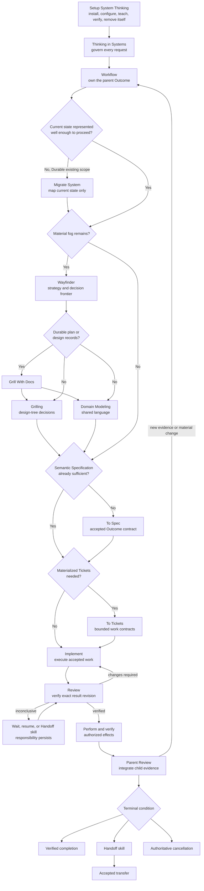

# Skills

Public agent skills by [JustYannicc](https://github.com/JustYannicc).

This repository is being built around a simple idea: agents become much more useful when they follow clear, inspectable methods instead of improvising a different process every time. Each skill has one job. Together, they should make good thinking easier to apply across software, personal life, organizations, physical environments, and agent systems.

## Skills

No skill has been published yet. Thinking in Systems is approved. Workflow's
Inline route is implemented as a human-review-required candidate. Suite
publication remains gated by the composed-suite and clean-install proof in #31
and the immutable-release review in #32.

### [Thinking in Systems](skills/thinking-in-systems) — approved

Thinking in Systems is my secret sauce: the way of thinking I have developed and applied over roughly the last year and a half. It is a large part of how I have been able to make unusually fast progress. The skill distills that method into universal governing knowledge for designing systems.

It is meant for almost anything: technical work, personal routines, organizations, physical environments, decisions, agent execution, and the systems connecting them. It starts from intent and outcomes, makes assumptions and handoffs explicit, aligns incentives and friction, designs for low-capacity operation, proves behavior at meaningful seams, and keeps systems recoverable as they change and decay.

Installing a skill is not a substitute for understanding it. Read the method, practice it, challenge it, and learn to apply the thinking yourself. The agent should make the process easier and more consistent; the human retains intent, judgment, authority, and the right to make informed exceptions.

Yannic approved the skill's governing behavior in issue #12. That approval is
distinct from publishing the complete suite, which still requires #31 and #32.

### [Workflow](skills/workflow) — Inline candidate; human review required

Workflow coordinates one parent Outcome from the accepted request through the
smallest truthful route to verified completion, accepted transfer, or
authoritative cancellation. Its Inline route keeps the Outcome, Specification,
Ticket, evidence, and immediate Review in the conversation for bounded
synchronous work while preserving the same systems method, responsibility,
Authority, exact revisions, effect proof, and parent terminal check used by
Durable work.

During active work it classifies clarification, extensions or Constraint
changes, corrections, authorized exceptions, explicit replacements, and
unrelated switches before changing state. Material changes invalidate and
propagate only affected work; parent and unaffected delegated ownership remain
intact. Durable Adapter coordination is intentionally left to #14 and the
System Record representation remains undecided in #35.

## Planned suite

Thinking in Systems is the anchor, not a container for every workflow. The accepted first runtime suite contains 17 single-job skills covering automatic coordination, adoption of existing systems, discovery, specification, decomposition, implementation, review, handoff, guidance, and setup. Some are universal successors to Matt Pocock's skills; small universal upstream skills remain installed directly with deterministic overlays instead of being copied. For documented planning and design, Grill With Docs composes Grilling's decision-tree interview with Domain Modeling's shared-language and decision records through the selected Adapter.

The roster and its one-job boundaries are recorded in the [skill suite roster](docs/SUITE_ROSTER.md). Its complete public-safe inputs are preserved in the [source archive](docs/source/README.md), including the full universalized S01 standard, reusable template, skill-design record, supporting research, private-source fingerprints, and the [requirements ledger](docs/requirements/REQUIREMENTS_LEDGER.md). See also the [roadmap](docs/ROADMAP.md), [architecture](docs/ARCHITECTURE.md), [development setup](docs/DEVELOPMENT.md), and [current handoff](docs/handoffs/2026-08-06-workflow-rewrite-candidate.md).

Publication evidence, clean-install proof, behavioral evaluation, and the
separate private-activation gate are defined by the
[validation and release contract](docs/VALIDATION_AND_RELEASE.md).

## Workflow

Setup runs once and installs the standing entry. After that, every request uses Thinking in Systems and the proportional Workflow automatically. The phases are universal: implementation may mean sending a reply, changing a routine, performing organizational work, modifying a physical environment, or writing code. Inline work compresses the artifacts; Durable work records them through the selected Adapter.

The route is not mandatory ceremony or a software pipeline. Workflow chooses the smallest path that can satisfy the same responsibility and proof contract. The canonical rules are in the [Workflow routing contract](docs/WORKFLOW_ROUTING.md). Responsibility across phases, effect gates, parent Review, recovery, and terminal proof is defined by the [Ownership and completion lifecycle](docs/OWNERSHIP_LIFECYCLE.md). Installation, harness-specific instruction changes, Adapter selection, verification, rollback, and disposal are defined by the [Setup System Thinking contract](docs/SETUP_CONTRACT.md).

## Distribution

The canonical source lives in this repository. The suite and individual skills
will be discovered and installed through [skills.sh](https://skills.sh/).
Setup explicitly installs the selected suite because skills.sh does not resolve
skill-to-skill dependencies or edit standing instructions.

## License

The repository is available under the [MIT License](LICENSE).
