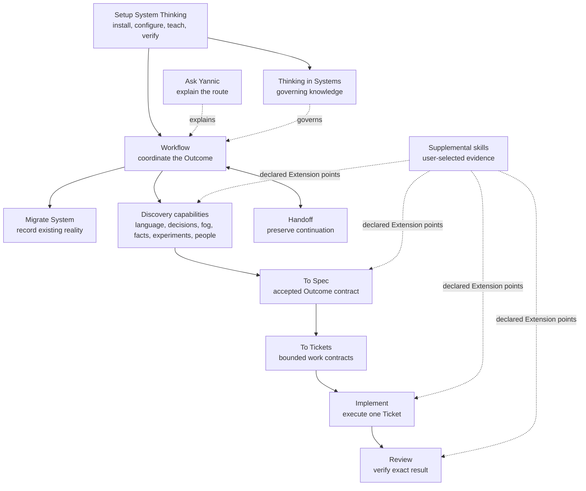

# Repository architecture

## Outcome

Build a public suite of predictable, universal agent skills. Each skill owns one job; Thinking in Systems supplies the shared systems thesis without absorbing every planning, research, clarification, prototyping, or handoff workflow.

Thinking in Systems is implemented and approved through issue #12. This
governing-behavior approval does not publish the suite: composed-suite and
clean-install proof remains gated by #31, and immutable-release review and
publication remains gated by #32. The validation foundation checks the skill
against the same deterministic and behavioral proof boundary required for
every later skill.

Workflow's complete Inline route is implemented and approved through issue #13.
It coordinates bounded synchronous work and active mid-work changes through
immediate Review while preserving exact responsibility, revision, approval,
effect, interruption, and continuation semantics. Durable coordination is
implemented as the issue #14 candidate through the same Workflow skill and
adapter-neutral work contract. Human review of the #14 candidate remains
required. Durable System state binds to the accepted #35 System Record
representation; its one-writable-authority and validator/action-guard boundary
remains authoritative.

The complete current runtime method and its vocabulary are owned by the Thinking in Systems [governing standard](../skills/thinking-in-systems/references/standard.md) and are read on every invocation. Section pointers in `SKILL.md` provide traceability and fast rereading rather than conditional loading. The installed [source guide](../skills/thinking-in-systems/references/sources.md) links professional concepts to public evidence for optional deeper reading without becoming a second governing authority. [`source/THINKING_IN_SYSTEMS_STANDARD.md`](source/THINKING_IN_SYSTEMS_STANDARD.md) is its stable source-archive pointer, and [`THINKING_IN_SYSTEMS.md`](THINKING_IN_SYSTEMS.md) is a compact orientation; neither substitutes for the complete reference. The accepted jobs and source strategy are owned by [`SUITE_ROSTER.md`](SUITE_ROSTER.md). Repository- and suite-specific requirements are owned by [`requirements/REQUIREMENTS_LEDGER.md`](requirements/REQUIREMENTS_LEDGER.md). Private provenance, evidence classification, and maintainer history remain in the [`source` archive](source/README.md), outside the installed agent guidance.

Automatic entry, proportional phase selection, migration, resumption, effects,
and completion are owned by the [`Workflow routing contract`](WORKFLOW_ROUTING.md).
Adapter-neutral work, state, and responsibility meanings are owned by the
[`Universal work and coordination contract`](UNIVERSAL_WORK_CONTRACT.md).
Installation scope, harness instruction surfaces, layered configuration,
Adapter selection, verification, rollback, and self-removal are owned by the
[`Setup System Thinking contract`](SETUP_CONTRACT.md).
Role responsibility, phase returns, effect gates, parent Review, correction,
and terminal proof are owned by the
[`Ownership and completion lifecycle`](OWNERSHIP_LIFECYCLE.md).
Behavioral evidence, capability environments, clean installation, publication,
and separate private activation are owned by the
[`Validation and release contract`](VALIDATION_AND_RELEASE.md).

## Skill-suite model



Arrows show lifecycle relationships, not package dependencies. Setup installs
every selected skill explicitly because current distribution does not resolve
transitive dependencies.

The accepted runtime roster contains 17 skills. Within discovery, Grill With
Docs is the documented-plan composition entry: it invokes Grilling for
design-tree rounds and Domain Modeling for shared language and qualifying
decision records through the selected Adapter. Grilling and Domain Modeling
remain independently invocable one-job skills. Their arrows are capability
relationships, so unavailable companions produce a visible gap instead of an
assumed transitive installation.

## Strategy before plan

A plan assumes enough visibility to select actions. Strategy defines how decisions are made as observations change. The universal Wayfinder must therefore support three conditions:

1. Fog that can be reduced through research, clarification, or a prototype.
2. Fog that can be reduced only after operating the system for a while.
3. Fog that cannot be eliminated and must be governed through thresholds, safe modes, feedback, reversibility, and recovery.

Completion is not “all fog disappeared.” Completion is a truthful operating strategy, a visible current frontier, and enough state for the next decision to be made without reconstructing context.

## One-job boundary

Thinking in Systems owns the cross-domain constitutional method:

- find intent and outcome before selecting a tool;
- distinguish facts, assumptions, inferences, decisions, and unknowns;
- define actors, sources, handoffs, authority, incentives, friction, and environment;
- combine LLM judgment with deterministic state and enforcement;
- work at the lowest common denominator and degrade gracefully;
- prove behavior at meaningful seams;
- preserve recovery, anti-decay, change rationale, and legacy migration;
- treat failure empathetically as evidence about system conditions before blame;
- allow informed exceptions without hiding their consequences.

It does not own the full interview, research, prototype, long-horizon navigation, handoff, implementation, or review procedure. Those are separate jobs.

## Distribution reality

The Agent Skills specification, Vercel skills CLI, and skills.sh do not provide
portable transitive skill dependencies. A repository may contain several skills
and an installer may select several names explicitly, but each installed skill
remains independent.

The setup design must therefore:

1. List the recommended suite and exact explicit installation command.
2. Verify every requested skill is present and reachable.
3. Add standing triggers only through a previewed, governed configuration change.
4. Define honest degraded behavior when a companion is absent.
5. Pin the public source or release used by private configuration.

## Per-skill shape

```text
skills/<name>/
├── SKILL.md
├── agents/
│   └── openai.yaml
├── references/        # disclosed runtime standards, templates, and branch material
├── assets/            # only files copied or rendered by the workflow
└── scripts/           # only deterministic behavior that instructions cannot provide reliably
```

`agents/openai.yaml` is optional in Codex but required by this repository's convention. It owns user-facing metadata, explicit-versus-implicit invocation policy, and tool dependencies. It does not declare other skill dependencies.

The Vercel `skills init` command currently generates only `SKILL.md`; authors must create and validate `agents/openai.yaml` separately.

## Validation foundation

```text
src/validation/             # deterministic schemas and validators
validation/                 # expected skill set and immutable source pins
evaluations/
├── fixtures/               # prompts, environments, expected routes and seams
├── observations/           # fresh-context observations
├── evidence/               # hash-bound raw evidence
└── reports/                # deterministic revision-bound reports
```

`pnpm validate` is the public repository gate. It composes formatting, lint,
type, and test checks with local links, public-data boundaries, skill metadata,
invocation-policy agreement, provenance, immutable source pins, official Agent
Skills validation, fixture schemas, raw-evidence hashes, repetition rules, and
recorded-report freshness. Behavioral evidence remains a separate proof layer;
the deterministic runner records and checks it but does not manufacture LLM
observations.

## Public/private authority

- This repository owns universal skill behavior, public examples, evaluations, setup guidance, and attribution.
- The private design workspace owns exact historical preservation. This public repository retains fingerprints, complete universalized authorities, and public-safe evidence.
- Private agent configuration owns personal defaults, model routing, global standing triggers, local paths, employer policy, and private tool configuration.
- The maintainer's private governance record owns personal operating policy until a separately reviewed migration pins the public method and retains only private overrides.
- No private authority changes until the replacement skill suite is installed and behaviorally proven.

## Publication channel

- GitHub is the editable source of truth under MIT.
- skills.sh discovers skills from the public repository and installs selected skill folders.
- A future OpenAI plugin may bundle related skills for Codex/ChatGPT distribution, but it is not required for the skills.sh path and is not part of this release.
