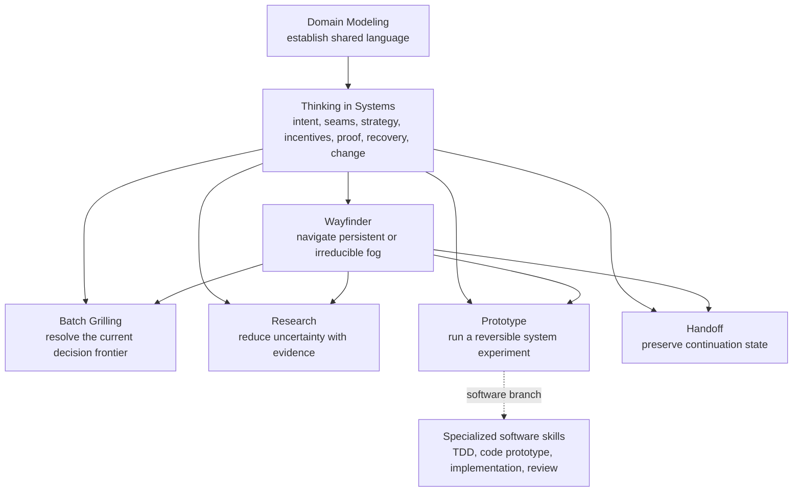

# Repository architecture

## Outcome

Build a public suite of predictable, universal agent skills. Each skill owns one job; Thinking in Systems supplies the shared systems thesis without absorbing every planning, research, clarification, prototyping, or handoff workflow.

The current repository is scaffolding only. No skill is implemented or publishable yet.

The complete universal method is owned by [`source/THINKING_IN_SYSTEMS_STANDARD.md`](source/THINKING_IN_SYSTEMS_STANDARD.md). [`THINKING_IN_SYSTEMS.md`](THINKING_IN_SYSTEMS.md) is a compact orientation, not a substitute. Repository- and suite-specific requirements are owned by [`requirements/REQUIREMENTS_LEDGER.md`](requirements/REQUIREMENTS_LEDGER.md). The complete public-safe skill design and evidence used to produce the method are retained in the [`source` archive](source/README.md); private originals are represented by fingerprints and do not override the universalized public authority.

## Skill-suite model



Arrows mean “may request this capability when installed,” not “the installer resolves this dependency.”

## Strategy before plan

A plan assumes enough visibility to select actions. Strategy defines how decisions are made as observations change. The universal Wayfinder must therefore support three conditions:

1. Fog that can be reduced through research, clarification, or a prototype.
2. Fog that can be reduced only after operating the system for a while.
3. Fog that cannot be eliminated and must be governed through thresholds, safe modes, feedback, reversibility, and recovery.

Completion is not “all fog disappeared.” Completion is a truthful operating strategy, a visible current frontier, and enough state for the next decision to be made without reconstructing context.

## One-job boundary

Thinking in Systems owns the cross-domain constitutional method:

- find intent and outcome before selecting a tool;
- distinguish facts, assumptions, inferences, decisions, and unknowns;
- define actors, sources, handoffs, authority, incentives, friction, and environment;
- combine model judgment with deterministic state and enforcement;
- work at the lowest common denominator and degrade gracefully;
- prove behavior at meaningful seams;
- preserve recovery, anti-decay, change rationale, and legacy migration;
- treat failure empathetically as evidence about system conditions before blame;
- allow informed exceptions without hiding their consequences.

It does not own the full interview, research, prototype, long-horizon navigation, handoff, implementation, or review procedure. Those are separate jobs.

## Distribution reality

The Agent Skills specification, Vercel skills CLI, skills.sh, and ClawHub do not provide portable transitive skill dependencies. A repository may contain several skills and an installer may select several names explicitly, but each installed skill remains independent.

The setup design must therefore:

1. List the recommended suite and exact explicit installation command.
2. Verify every requested skill is present and reachable.
3. Add standing triggers only through a previewed, governed configuration change.
4. Define honest degraded behavior when a companion is absent.
5. Pin the public source or release used by private configuration.

## Per-skill shape

```text
skills/<name>/
├── SKILL.md
├── agents/
│   └── openai.yaml
├── references/        # only branch-specific material
├── assets/            # only files copied or rendered by the workflow
└── scripts/           # only deterministic behavior that instructions cannot provide reliably
```

`agents/openai.yaml` is optional in Codex but required by this repository's convention. It owns user-facing metadata, explicit-versus-implicit invocation policy, and tool dependencies. It does not declare other skill dependencies.

The Vercel `skills init` command currently generates only `SKILL.md`; authors must create and validate `agents/openai.yaml` separately.

## Public/private authority

- This repository owns universal skill behavior, public examples, evaluations, setup guidance, and attribution.
- The private design workspace owns exact historical preservation. This public repository retains fingerprints, complete universalized authorities, and public-safe evidence.
- Private agent configuration owns personal defaults, model routing, global standing triggers, local paths, employer policy, and private tool configuration.
- The maintainer's private governance record owns personal operating policy until a separately reviewed migration pins the public method and retains only private overrides.
- No private authority changes until the replacement skill suite is installed and behaviorally proven.

## Publication channels

- GitHub is the editable source of truth under MIT.
- skills.sh discovers skills from the public repository and installs selected skill folders.
- ClawHub is a separate SemVer release channel and applies MIT-0 to its distributed artifact.
- A future OpenAI plugin may bundle related skills for Codex/ChatGPT distribution, but it is not required for the initial skills.sh/OpenClaw path and is not part of this scaffold.
