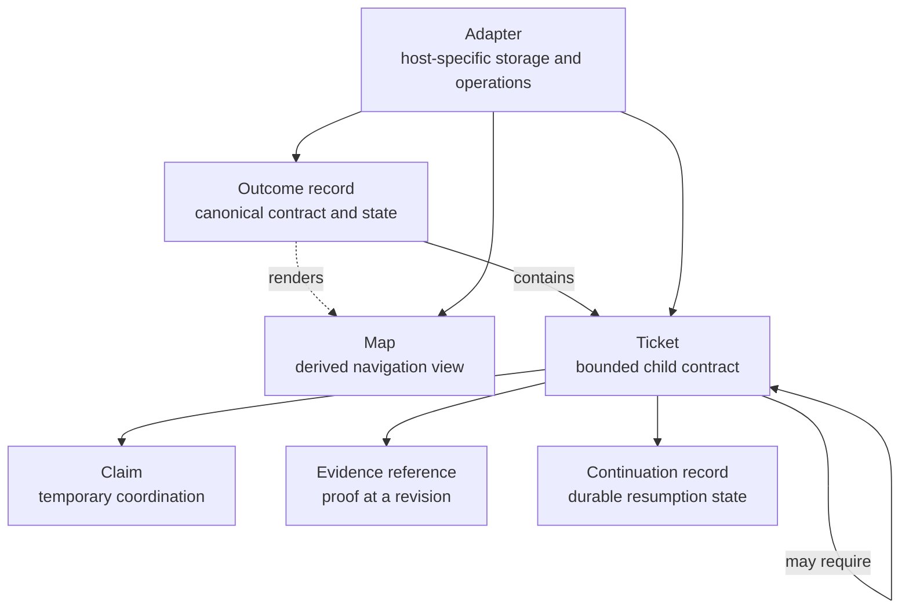
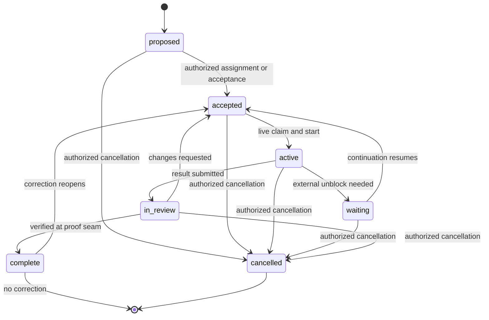

# Universal work and coordination contract

**Status:** accepted design
**Decision source:** [Choose the universal artifact and coordination contract](https://github.com/JustYannicc/skills/issues/5)
**Applies to:** every domain and every supported workflow adapter

## Purpose

This contract gives work the same meaning whether it happens in a conversation,
local files, GitHub, another task system, or a future host. It governs Outcomes,
Tickets, responsibility, dependencies, claims, state, evidence, continuation,
and verified completion. Storage and automation are adapter concerns.

The contract applies proportionately. A synchronous typo correction still has
an implicit Outcome, Ticket, proof seam, and completion check; it does not need
files. Durable records become mandatory at a Persistence boundary.

## Invariants

1. Every accepted Outcome has one identifiable Outcome owner. Every accepted
   Ticket has one Work owner.
2. Delegation creates nested responsibility. It does not complete or transfer
   the parent Outcome unless an authorized transfer is explicitly accepted.
3. A claim coordinates active work. It is not assignment, ownership, approval,
   review, or completion.
4. An intermediate artifact—draft, delegation, schedule, submission, pull
   request, or approval—is not the completed Outcome.
5. Every material meaning has one writable canonical source. Maps and
   dashboards are derived views.
6. State, responsibility, evidence, waiting, and recovery remain inspectable
   without asking a model to reconstruct them.
7. Git, a hosted account, concurrent claiming, and executable scheduling are
   optional capabilities. The workflow must disclose their absence.
8. Completion is verified at the accepted proof seam and bound to the exact
   result revision. Parent completion is never inferred from child completion.
9. Encountering an existing system that does not conform starts a proportional
   Conformance migration. The workflow records reality in this contract before
   proceeding instead of operating from undocumented assumptions.
10. Later evidence that disproves completion appends a correction and reopens
    responsibility. History and invalid evidence remain visible.

## Semantic model



### Outcome, Ticket, and Map

- An **Outcome** is the externally meaningful condition the work must produce
  or preserve.
- An **Outcome record** is its canonical contract and current state.
- A **Ticket** is one bounded, independently finishable child contract. Its
  kind may be decision, research, prototype, action, review, or another
  explicitly defined extension.
- A **Map** is a view over an Outcome and its Tickets, decisions, dependencies,
  frontier, recovery queue, and fog. It points to canonical records and never
  owns copied Ticket detail.

“Ticket” is universal vocabulary here. It does not mean GitHub, software, or a
particular file format.

### Relationships

| Relationship | Canonical owner | Meaning |
| --- | --- | --- |
| `contains` | Parent Outcome or Ticket | Organizes child responsibility and navigation; does not impose order. |
| `requires` | Dependent Ticket | Blocks the dependent until the prerequisite Ticket completes or is explicitly waived or replaced. |
| `related` | Record creating the context | Adds non-blocking context. |

Cancellation does not satisfy `requires`. The dependent owner must explicitly
replace, waive, or cancel the requirement within their authority.

External events are not fake Tickets. A reply, weather condition, service
recovery, or other ungoverned event belongs in a waiting Ticket's Continuation
record. A Ticket is created only when someone can validly own its bounded
contract.

## Durable records

The universal contract defines meanings, not serialization. YAML, Markdown,
tracker fields, database columns, and comments are adapter choices.

### Shared kernel

Every durable Outcome and Ticket records:

| Field | Rule |
| --- | --- |
| Schema version | Identifies the contract version used by the record. |
| Identity | Immutable and unique within the Coordination space. |
| Aliases | Previous identifiers retained after a canonical migration. |
| Name | Human-readable and mutable without changing identity. |
| State | Current lifecycle state. |
| Owner | One unambiguous Actor reference. |
| Created/updated | Observable record times. |
| Canonical locator | Adapter and location of the writable authority. |
| Transition history | Append-only meaningful state changes. |

Authority, claims, continuation, reviewers, approvers, evidence, and result
revisions are conditional sections. They become required when the work crosses
the corresponding boundary; empty placeholders are not required.

### Outcome payload

An Outcome record adds:

- intended externally meaningful result;
- scope, exclusions, and constraints;
- inline Specification or its canonical reference;
- terminal condition and proof seam;
- canonical `contains` relationships; and
- current strategy, decisions, frontier, and fog when those concepts apply.
- observation horizon, review cadence, transfer rule, or cancellation condition
  when the Outcome preserves a condition or recurs.

### Ticket payload

A Ticket adds:

- kind and parent reference;
- bounded child result, not merely an action;
- scope and available authority;
- acceptance conditions and proof seam;
- canonical `requires` and `related` relationships;
- designated Reviewer or Approver when required; and
- current Claim, Continuation record, Evidence references, and result revision
  when applicable.

### Actor and evidence references

An Actor reference has a human-readable label and identifies exactly one
responsible party. It may also include actor kind, a stable host identifier,
and a return route. A local label is sufficient when it remains unambiguous.

An Evidence reference records the condition evaluated, method or observation,
result, observer, and time. When the result can change, it also identifies the
exact location and revision evaluated. A bare link is not evidence.

## Lifecycle and authority

The lifecycle applies to Tickets and, at their own proof seam, Outcomes.
Ticket claims are governed separately.



Each transition records its actor, time, authority, rationale, and evidence or
result revision when applicable.

- A valid authoritative assignment, voluntary acceptance, or starting the
  work can create responsibility. Starting implicitly performs acceptance
  before claim and activation.
- An `active` Ticket requires a live Claim. Outcome activation does not require
  a Ticket Claim.
- Submission releases execution coordination and begins review; review may use
  a distinct Reviewer claim without transferring the Work owner's duty.
- Changes requested return the Ticket to `accepted`; the Work owner must claim
  it again before acting.
- An authorized cancellation is terminal and records the disposition of work,
  dependencies, effects, and retained evidence.
- One Actor may hold several roles, but assignment, execution, review,
  approval, and ownership actions remain explicit.
- Reopening appends a correction event, invalidates affected evidence, and
  resumes responsibility without erasing the earlier completion transition.

A failed attempt is an event, not a terminal state. The Ticket remains `active`
for an authorized immediate retry, moves to `waiting` for an external unblock,
or releases its Claim and returns to `accepted` for recovery or reassignment.
It never silently completes, cancels, or becomes ownerless.

### Responsibility and completion

The Outcome owner retains responsibility for integrating every child result
and verifying the parent Outcome. A delegated Work owner owns the child Ticket
through its verified terminal condition. Executors perform actions; Reviewers
own verification verdicts; Approvers own authorization decisions.

Completing every child Ticket may make a parent reviewable, but cannot complete
it. The parent owner must integrate the evidence and verify the parent's own
terminal condition.

Approval is bound to an exact result revision. A material change invalidates
that approval. Performing the approved action is separate from approving it,
and completion requires evidence at the real effect boundary. An approved
email draft is not complete until the authorized message is sent and the mail
service accepts it.

Approval may carry validity conditions, expiry, and revocation. The workflow
rechecks them immediately before the effect.

Review returns one integrated verdict: verified permits completion, changes
required returns the target to accepted execution, and inconclusive moves it to
waiting with the missing evidence and exact next check.

Parent completion records a compact proof bundle bound to the current
Specification and result revisions. Its phase-by-phase ownership and terminal
gate are defined by the
[Ownership and completion lifecycle](OWNERSHIP_LIFECYCLE.md).

## Claims and deterministic queues

A durable Claim records claimant, start time, and its staleness or expiry rule.
Expiry releases coordination, not ownership. There is no universal claim
duration; the Coordination space defines it.

Where atomic claiming is unavailable, an adapter must either disable parallel
claiming or declare that it cannot guarantee coordination. A read-then-write
sequence must not be described as concurrency-safe.

For Ticket `t`:

```text
blocked(t) = any unwaived requires target is not complete

frontier(t) =
  state(t) is accepted
  and not blocked(t)
  and no live claim exists

recovery(t) =
  state(t) is active, waiting, or in_review
  and its claim, continuation, owner, review, or deadline needs intervention
```

Stale active work enters the Recovery queue. It never silently reappears on the
Work frontier.

Missed checks, overdue Reviews, unreachable owners, and expired Continuation
records also enter Recovery. An authorized actor must record new responsibility
and the next action before work returns to the frontier.

## Waiting and continuation

A Ticket entering `waiting` records:

- reason and external dependency;
- observable unblock condition;
- last observation and next check;
- scheduled action reference, when one exists;
- retry, escalation, and expiry rules;
- exact resumption action; and
- context required to resume safely.

If an authorized executable scheduler exists, the owner may create a scheduled
continuation and must verify that the scheduler accepted it. The scheduler is
an execution mechanism, not the Outcome owner.

Without a scheduler, responsibility persists through the durable Continuation
record and its explicit human or next-session trigger. The workflow must not
claim that it is monitoring work when nothing can resume it.

A resumed process rereads the canonical Ticket and verifies that its
Continuation record is still current before acting. It does not trust stale
prompt or scheduler context.

## Adapter contract

Every conforming Adapter supports these semantic operation groups:

1. create, read, and update records and canonical relationships;
2. claim, release, and perform authorized lifecycle transitions;
3. append evidence, continuation state, and transition history;
4. compute the Work frontier and Recovery queue and render the Map; and
5. verify or canonically migrate the Coordination space.

An Adapter declares its actual capability level:

| Level | Guarantee |
| --- | --- |
| Baseline | Durable canonical records, transitions, history, evidence, and continuation. |
| Coordination | Safe concurrent claims. |
| Continuation | Executable scheduling or monitoring. |

Baseline is mandatory after a Persistence boundary. When it is unavailable,
the workflow falls back to the Local Markdown Adapter or performs an explicit
human handoff. Coordination and Continuation capabilities remain optional and
must never be implied.

### Adopting existing systems

An existing project, workspace, organization, or personal system may use
different artifacts, states, ownership conventions, or no explicit workflow.
Conformance migration adopts that existing reality into this operating process;
it does not repair or redesign the underlying system. The migration:

1. inventories current sources, system boundaries, actors, responsibilities,
   interfaces, active work, dependencies, evidence, waiting state, and unknowns;
2. delegates independent mapping areas to subagents or other Work owners when
   useful, while the migration owner retains integration and verification;
3. establishes the canonical Coordination space and Adapter, then records the
   observed current state with provenance and visible confidence;
4. maps existing meanings to the universal contract without renaming away a
   real conflict and records legacy coverage, exceptions, and unresolved fog;
5. verifies the integrated map against authoritative sources and meaningful
   seams; and
6. hands every discovered system change to ordinary Workflow as a new Outcome
   or Ticket rather than implementing it inside migration.

Creating the coordination records and instruction pointers needed to represent
the current system is migration work. Changing the represented product,
organization, environment, policy, or behavior is not. A trivial isolated
interaction may align in place; a live multi-actor system needs durable,
integrated, and verified current-state records before ordinary work proceeds.

### Transient Conversation Adapter

Simple synchronous work uses the active conversation as an implicit Outcome,
Ticket, history, and evidence boundary. The systems method, responsibility,
state meanings, and completion proof still apply. Claim and transition actions
may be implicit when they remain visible within that same interaction. No
durable files are needed.

When work crosses a session, actor, waiting period, approval boundary, or
meaningful risk boundary, the owner materializes current state in a Baseline
Adapter before continuing.

### Local Markdown Adapter

The no-Git baseline uses a visible directory:

```text
workflow/<outcome-id>/
├── README.md                  # canonical Outcome record rendered as its Map
├── tickets/<ticket-id>.md     # canonical Ticket records
├── claims/                    # active local coordination claims
└── evidence/                  # optional local evidence
```

Small YAML frontmatter stores stable machine fields. Human-readable Markdown
sections store contracts, rationale, evidence, Continuation records, and
history. This serialization is adapter-specific and does not redefine the
universal contract.

The Local Markdown Adapter acquires a claim by atomically creating that
Ticket's claim path inside `claims/`, then writes the Claim record there. A
corrupt or incomplete claim enters recovery. If atomic creation is unavailable,
the Adapter declares parallel claiming unsupported and avoids concurrent
execution.

No Git repository, remote, account, or network connection is required.

### Hosted adapters

A hosted Adapter maps native objects to the same contract. For example, a
GitHub implementation may use a parent issue for the Outcome record, child
issues for Tickets, native sub-issue/dependency relationships, comments for
history, and linked checks or artifacts for evidence.

The Adapter must respect the host's established meaning. It may use an
assignee as a Claim only when that Coordination space explicitly defines
assignees that way. If assignees represent Work ownership, the Adapter uses a
different native field or guarded record for Claims.

### Canonical migration

One Adapter is writable and authoritative per Coordination space. Live
bidirectional synchronization between equal sources is forbidden.

A migration:

1. freezes the old source;
2. copies every canonical record, relationship, current state, and history;
3. verifies semantic equivalence;
4. records predecessor and successor locators and identity aliases; and
5. makes the old source read-only.

Generated Maps and dashboards visibly identify themselves as derived and
carry enough freshness information to detect staleness.

## Conformance examples

| Scenario | Required behavior |
| --- | --- |
| Correct a typo in the current response | Use the Transient Conversation Adapter, apply the method proportionately, inspect the correction, and complete without creating files. |
| Draft, revise, approve, and send an email | Preserve the exact approved revision; execution owns sending; completion evidence comes from the mail service, not the draft. |
| Delegate a simple rewrite | The child Work owner returns a usable rewrite; the parent Outcome owner still integrates and verifies the final response. |
| Continue tomorrow without Git or GitHub | Materialize the Outcome and Tickets under `workflow/`, including current owner, state, history, and resumption instructions. |
| Wait without a scheduler | Record the Continuation and explicit resumption trigger; do not claim active monitoring. |
| Encounter a stale active Claim | Put the Ticket in the Recovery queue; do not make it frontier work until responsibility and coordination are resolved. |
| Cancel a prerequisite | Keep dependents blocked until their owners replace, waive, or cancel the requirement. |
| Modify an approved result | Invalidate the approval and require review of the new exact revision before the effect. |

## Evidence and design sources

- [Portable workflow capabilities](research/PORTABLE_WORKFLOW_CAPABILITIES.md)
- [Thinking in Systems standard](source/THINKING_IN_SYSTEMS_STANDARD.md)
- [Requirements ledger](requirements/REQUIREMENTS_LEDGER.md)
- [Repository architecture](ARCHITECTURE.md)
- [Ownership and completion lifecycle](OWNERSHIP_LIFECYCLE.md)
