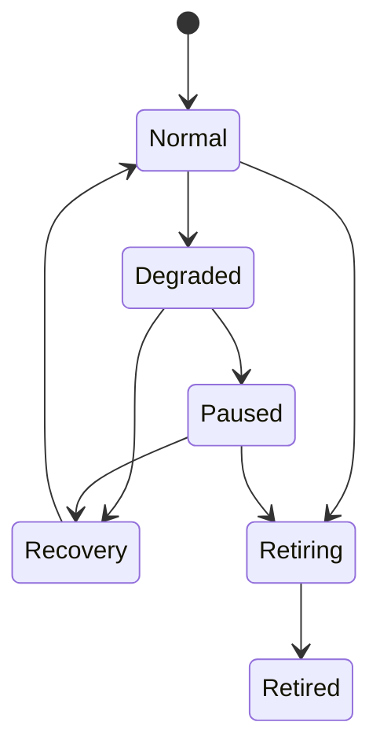

# System-Design Template

Use this template for every durable system and material system change. It is a contract, not a demand for maximum documentation: complete the mandatory core, include conditional sections when their consumer or risk exists, and mark a materially relevant omission `N/A` with a one-line reason. Do not duplicate a fact owned by another system; link to its authority.

## 1. Original request, intent, and outcome

- **Original request/problem:**
- **Underlying intent:**
- **Accepted outcome:**
- **Productivity/progress relationship:**
- **Good-enough threshold (satisficing):**
- **Non-outcomes:**
- **Decision authority:**

## 2. Scope and boundary

- **Owned responsibilities:**
- **Affected but not controlled:**
- **Included / excluded:**
- **Support matrix:** actors, environments, devices, permissions, volumes, and cases.
- **Construction class:** temporary experiment, bounded tool, or maintained system.
- **Maturity status:** Idea, Spike, Pilot, or Production.
- **Evidence claim bound to support matrix:** demonstrated seams/cases, real environment, evidence artifact, date/freshness, and evidence still missing.
- **Assumption delta from the nearest existing system:** operator, cadence, environment, permissions, communication, state, recovery, consequence, fallback, ownership, lifetime, variability.

## 3. Discovery contract

- **Stable `system_id` and canonical record:**
- **Applicability triggers:** request types, domain terms, state/events, and explicit invocation.
- **Operations/capabilities provided:**
- **Inputs consumed / outputs produced:**
- **Dependencies and required capabilities:**
- **Conflicts and precedence:**
- **Design status, operational status, catalog eligibility, version, and freshness:**
- **Owner and decision authority:**

The agent's catalog first shortlists only `eligible` systems deterministically by explicit ID, request/operation type, domain, event/state, required capability, operational mode, version, and precedence. `Candidate`, `DesignComplete` but `Unbuilt`, `Superseded`, `Retired`, and explicitly `not_eligible` records cannot govern execution. A Degraded system advertises only the operations its degraded contract still permits. A model may interpret the request and choose among that bounded set while showing the matched evidence. If no system applies, several conflict, or a required capability is missing, the agent preserves the request and enters the unknown-case or gap process rather than inventing a contract.

## 4. Sources, assumptions, ambiguity, and gaps

- **Authoritative facts/decisions and links:**
- **Material assumptions, provenance, status, and affected proposal revision:**
- **Potentially ambiguous intent, meaning, scope, authority, cost, or effect:**
- **Smallest discriminating question for each unresolved ambiguity:**
- **Unknown-case behavior:**
- **Capability/connection gap behavior and resumption pointer:** bind the original request/proposal version, blocked preconditions, required proof, source-freshness check, governing-contract revalidation, replay requirement, and approval invalidation rule.

## 5. Actors, authority, state, and interfaces

| Producer | Consumer | Input/precondition | Output | Authority/effect boundary | Timing | Failure/degraded behavior | Completion evidence |
| --- | --- | --- | --- | --- | --- | --- | --- |
|  |  |  |  |  |  |  |  |

- **Writable authority per information type:**
- **Projections/caches and freshness rule:**
- **Stable identifiers and version binding:**
- **Approval binding and revocation:**
- **Handoff packet:** objective, current state, completed evidence, remaining work, decisions/assumptions, blockers, artifact links, next action, authority, and verification.

## 6. Mise en place and readiness

- **Required inputs/context:**
- **Tools, capabilities, connections, and permissions:**
- **Physical/digital environment:**
- **Test/simulation seam:**
- **Fallback, rollback, and resumption state:**
- **Readiness conditions:** classify each as required or optional and name the evidence that clears it.
- **Preparation budget or review point:**
- **Checkpoint disposition:** start the smallest safe experiment; open a capability/unknown gap and pause with a resumption condition; reduce scope; defer to a named review trigger; or cancel.
- **Stopping rule:** start the smallest credible execution/experiment when required readiness passes and the next preparation step has less expected decision/risk value than action.

A missing completion-critical capability is a durable gap, not an excuse for a partial result to be called done. Preserve the work, expose the gap and affected outcome, and propose the smallest safe remedy. After the capability is proven, revalidate source freshness and the governing contract, replay the affected compose-only simulation, and obtain new approval whenever the exact effect proposal is no longer current before resuming.

## 7. Economics, incentives, and friction

- **Options:** do nothing, wait/recheck, environmental/process change, configure, maintained existing solution, custom work.
- **Wait/recheck contract:** trigger, date or cadence, expected new evidence, and expiry disposition.
- **Opportunity cost, transition cost, maintenance cost, cost of delay:**
- **Option value / reversible next step:**
- **Why the selected option clears the threshold:**
- **Desired and actual incentives:**
- **Helpful and harmful friction/search cost:**
- **Compliance dependencies:** what currently requires repeated remembering, noticing, checking, understanding, caring, or willpower?
- **Ambient progress:** which safe pre-authorized preparation, preservation, maintenance, reconciliation, or recovery continues without active attention?
- **Exception-based attention:** what genuinely requires a human, when does it surface, and what state remains visible while waiting?
- **Goodhart/Campbell gaming routes and counter-signals:**
- **Loss-aversion risk and safeguards:**

### Ambient-operation contract

Every ambient operation has one row. If none is safe or useful, record `none`; absence must not be interpreted as authority.

| Operation | Exact pre-authorization/version | Inputs and privacy/retention boundary | Trigger/cadence | Permitted output/state | Forbidden effects | Health/failure signal | Exception route | Resumption/review condition |
| --- | --- | --- | --- | --- | --- | --- | --- | --- |
|  |  |  |  |  |  |  |  |  |

## 8. State, degradation, recovery, and retirement

For each applicable mode—Normal, Degraded, Paused, Recovery—define trigger, allowed and forbidden actions, preserved state, visibility, owner, re-entry criteria, and effect behavior. Add system-specific tiers only when they change behavior. Define month-without-response behavior and retirement disposition.

## 9. Proof before effects

### Acceptance scenarios

| Scenario | Initial state/input | Expected visible proposal/result | Forbidden effect | Evidence |
| --- | --- | --- | --- | --- |
| Normal |  |  |  |  |
| Lowest common denominator |  |  |  |  |
| Ambiguous |  |  |  |  |
| Missing capability/dependency |  |  |  |  |
| Month without attention: eligible ambient operations continue; failures form a bounded discoverable exception set; reminders do not multiply; authority/approvals do not expand; recovery uses preserved state |  |  |  |  |
| Degraded and recovery |  |  |  |  |
| Legacy item |  |  |  |  |

- **Compose-only simulation fixture and effector boundary:**
- **Production-path evidence required:**
- **Adversarial review:** reviewer/task that did not author the reviewed revision; record reviewer identity, exact revision, credible-risk scope, and findings.
- **Resolution:** record resolver identity and evidence that each material finding was fixed, explicitly accepted, or made out of scope with rationale.
- **Resolution check:** checker identity and result. The checker did not author the reviewed revision and did not make the fix. A material boundary change may trigger a new full pass; otherwise use targeted re-checking.

## 10. Measurement and learning

- **Hypothesis and mechanism:**
- **Baseline:**
- **Outcome signal:**
- **Process/fidelity signal:**
- **Burden/harm signal:**
- **Attention burden:** required checks, reminders, searches, decisions, and interventions per meaningful outcome; never optimized to zero without an authority/autonomy counter-signal.
- **Quantitative evidence available without human burden:**
- **Goodhart counter-signal:**
- **Observation window and expected delay:**
- **Optional early feasibility checkpoint:**
- **Decision rule:** retain, revise, expand, pause, retire, or repeat.

## 11. Operation, visibility, and attention

- **Human-readable status/control surface:**
- **Current state, freshness, last/next action, owner, and source links:**
- **What surfaces immediately versus in the next briefing:**
- **Happy-path invisibility and exception visibility:** what recedes from attention when healthy, and what becomes conspicuous when human judgment or correction is required?
- **Deterministic schedules, events, retries, and expiry:**
- **What the model interprets/composes:**
- **Operational receipts and audit trail:**

## 12. Anti-decay and reset

- **Accepted healthy baseline:**
- **Decay signals:**
- **Reset trigger:**
- **Meaningful reset action:**
- **Reset proof and baseline date:**
- **Owner/escalation:**
- **Pause, replacement, and retirement conditions:**

## 13. Change, legacy, and rationale

- **Decision record:** framing, alternatives, evidence, assumptions, trade-offs, choice, expected consequences, and review conditions.
- **Affected population and discoverability query:**
- **Legacy classes:** unaffected, compatible, auto-adapt, review-required, conflict, exempt, unreachable/unknown.
- **Zero-effect migration simulation:**
- **Rollout/cutover/rollback:**
- **Coverage and verification:**
- **What changed since the prior decision:**

## 14. Estimate and commitment contract

- **Milestone type:** Budget, Question, Checkpoint, or Deliverable.
- **Unresolved architecture/production assumptions:**
- **Reference class and actual history:** initial estimate, apparent completion, actual usability.
- **Experiment estimate versus delivery estimate:**
- **Project-capture signals and stop/reset rule:**

## 15. Decisions and completion gate

- **Accepted decisions:**
- **Current decision frontier:**
- **Delegated reversible implementation choices:**
- **Design Complete check:** another competent human or agent can implement and simulate this version without inventing a material rule.
- **Approval and date:**
