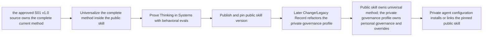

# Public skills repository and Thinking in Systems skill

> Historical design archive. Later accepted decisions supersede its two-channel
> distribution proposal: the operative suite publishes through skills.sh only.

## 1. Outcome and current boundary

Create a public, installable `thinking-in-systems` skill that contains the complete transferable method in the private governance profile and makes its use predictable for Codex, OpenClaw, and other compatible agents. The repository should become a durable home for additional public skills without exposing private agent configuration.

This design covers the repository and first skill. The public repository foundation now exists at [JustYannicc/skills](https://github.com/JustYannicc/skills), with no implemented or discoverable skill. Updating private/global instructions remains a separately reviewed change after the public skill suite is proven. No installation or global configuration has been changed.

Good-enough initial outcome:

- one public multi-skill GitHub repository with an explicit license;
- one self-contained, model-invoked `thinking-in-systems` skill;
- the complete universalized S01 standard available through precise progressive-disclosure pointers;
- installable for Codex and OpenClaw through the official skills CLI;
- behavior-based evaluations demonstrate the important S01 seams;
- the maintainer's private agent configuration consumes the public skill without publishing private instructions or creating a second editable copy.

Accepted public foundations:

- repository: `JustYannicc/skills`;
- GitHub license: MIT, attributed publicly to `JustYannicc`;
- skill: `thinking-in-systems`, displayed as **Thinking in Systems**;
- the obsolete private predecessor will be removed only after the replacement passes proof;
- the complete universalized method and setup reference ship inside the skill;
- the public skill is proven before the private governance profile and agent configuration migrate to it.

## 2. Verified skills.sh facts

The official Vercel skills CLI already supplies the distribution system:

- `npx skills init [name]` scaffolds a skill;
- the standard multi-skill layout is `skills/<skill-name>/SKILL.md`;
- required skill frontmatter is `name` and `description`;
- `npx skills add owner/repo --list` discovers repository skills;
- `npx skills add owner/repo --skill thinking-in-systems -g -a codex` targets Codex;
- the same command with `-a openclaw` targets OpenClaw;
- publishing is a public GitHub repository, not a registry upload;
- skills.sh discovers and audits a skill after real installation activity; no documented manual submission is required;
- a Claude plugin manifest is optional and unnecessary for the first Codex/OpenClaw release.

Sources: [skills CLI repository and creation/discovery documentation](https://github.com/vercel-labs/skills), [skills.sh documentation](https://www.skills.sh/docs), [FAQ](https://www.skills.sh/docs/faq), and [API/audit documentation](https://www.skills.sh/docs/api).

### Dependency result

The [Agent Skills specification](https://agentskills.io/specification) and Vercel CLI provide no native or transitive skill dependencies: no standard dependency field, version solver, automatic companion installation, or activation guarantee. A repository can contain multiple independently selected skills, and `--all` installs all discovered skills; neither is dependency resolution. The complete cited result is in [dependency research](research/public-skill/dependencies.md).

Therefore Thinking in Systems must work correctly when installed alone. It will independently express every indispensable universal pattern, while separately installed skills may be documented as optional capability companions with a complete built-in fallback.

### ClawHub result

The same canonical skill directory can be published independently to skills.sh and [ClawHub](https://clawdhub.com/skills). ClawHub uses its own CLI, authentication, SemVer releases, scans, origin/lock state, and update path; publication does not synchronize between registries. It also has no skill-to-skill dependency resolver or `AGENTS.md` setup hook. The repository remains the sole editable source and each registry release is recorded explicitly. See [ClawHub research](research/public-skill/clawdhub.md).

ClawHub applies MIT-0 to distributed skills and does not preserve an attribution requirement. This is a material difference from the accepted MIT GitHub repository license and requires explicit acceptance before ClawHub publication.

A search of the current public catalog found adjacent software-oriented `system-design` and `system-architect` skills. The proposed `thinking-in-systems` skill is materially different: it is cross-domain, applies to almost any non-trivial request, agent execution, and life/organizational/technical systems, and includes incentives, low-capacity operation, ambiguity, ambient progress, recovery, decay, change, and legacy propagation.

## 3. Recommended public/private boundary

The maintainer's private agent-configuration repository remains the personal integration layer. It owns global instructions, routing, personal vocabulary, local links, work-specific policy, and private preferences. It must not become public.

The public repository shape is:

```text
skills
└── skills/
    └── thinking-in-systems/
```

The selected remote is `JustYannicc/skills`. It is short and supports a future catalog. `agent-skills` was the clearer but longer fallback. `system-skills` was rejected because it artificially narrows future public skills.

Never publish private agent-configuration instructions, context, local paths, link installers, backups, credentials, tool state, employer material, personal dashboards, or private notes. The public repository contains only deliberately generalized skills, public documentation, tests/evaluations, and license material.

## 4. Source-of-truth transition

The public skill may contain the entire S01 method; the problem is permanent duplicate authority, not length behind good progressive disclosure. The migration therefore has explicit stages:



Until the public version is accepted, the approved S01 v1.0 source remains authoritative. After proof, a separate governed change will make the public skill the authority for the complete transferable method while the private governance profile retains only the pinned skill version, operator-specific authority, local task/knowledge placement policy, approval rules, and implementation constraints. This avoids both premature migration and permanent duplication.

## 5. Skill identity and invocation

Accepted name: `thinking-in-systems`, displayed publicly as **Thinking in Systems**.

Reasons:

- it names the mindset being taught rather than one implementation step;
- it describes a method that works for technical, personal, organizational, and agent systems;
- it is broad enough to cover nearly every non-trivial request without implying software-only system design;
- the obsolete private predecessor will be removed and replaced during the later governed agent-configuration migration.

Accepted invocation: model-invoked. Agents must reach it without the user remembering to name it, so the permanent description cost is justified.

Both proposed descriptions are rejected. The description will be authored and tested with the skill itself in the dedicated implementation task; repository scaffolding must not freeze a weak trigger.

Primary leading words:

- **door before hammer** — find the outcome and intervention before constructing a solution;
- **seam** — every handoff has explicit input, output, authority, state, failure behavior, and proof;
- **line forward** — accepted action produces outcome progress, reusable evidence, preservation, or a genuinely easier next action;
- **mise en place** — prepare the real context, capability, environment, proof seam, fallback, and resumption state before execution;
- **everyone will not just** — repeated remembering, checking, caring, or willpower is a design dependency to remove where possible.
- **how you do anything** — an informed exception remains available, but the system first exposes the skipped safeguard, likely consequence, scope, and recovery trigger because process choices create reusable habits and future defaults.

## 6. Invocation branches

| Branch | Trigger | Required result |
| --- | --- | --- |
| Direct operation | Bounded reversible request with obvious proof | Lightweight execution contract and visible result |
| Contract instance | An accepted system already governs the request | Bound contract/version, visible assumptions, and action only within authority |
| New durable system | Recurrence, durable state, automation, or repeated failure | Full System Record and design lifecycle |
| Material change | Scope, authority, interface, environment, rule, evidence, or legacy population changes | Successor record plus Change/Legacy record |
| Recovery or decay | System is stale, degraded, blocked, failing, or captured | Truthful status, safe mode, reset/recovery path, and causal improvement item |

Build-versus-buy is evaluated within the durable-system and material-change branches. It is not a competing skill or separate invocation.

## 7. Ordered skill steps and gates

`SKILL.md` should remain procedural and compact—approximately 100–140 lines. Each step ends at a checkable gate.

1. **Choose the branch.** Identify the governing contract or why none applies, the persistence level, and allowed action.
2. **Find the door.** State original request, intent, outcome, non-outcomes, scope, authority, good-enough threshold, and the smallest discriminating question for material ambiguity.
3. **Map the seams.** Identify actors, sources of truth, inputs/outputs, handoffs, incentives, friction, environment, support matrix, privacy, permissions, and effect boundaries.
4. **Choose the smallest adequate path.** Compare doing nothing, waiting/rechecking, environmental/process change, configuration, maintained solutions, and custom work using satisficing, opportunity cost, reversibility, maintenance, and option value.
5. **Design normal operation and the bad day.** Specify normal, degraded, paused, recovery, ambiguity, capability-gap, and no-response behavior; remove avoidable compliance dependencies and define authorized ambient progress.
6. **Set mise en place and prove the path.** Define readiness, capabilities, real seam, effect-free simulation, outcome/process/burden evidence, and the checkpoint disposition: experiment, gap/pause, reduced scope, named deferral, or cancellation.
7. **Break it, record it, and make it discoverable.** Run the independent adversarial pass and separate resolution check; record rationale, version, catalog metadata, decay/reset, migration, legacy coverage, and retirement.

Final completion criterion: the selected branch has its proportionate visible contract; every material assumption and seam is resolved or explicitly blocked; proof, lowest-common-denominator behavior, recovery, change/legacy disposition, and authority are testable; another competent agent can continue without inventing a material rule.

## 8. Progressive disclosure and complete standard

The entire universalized S01 method ships with the skill, but only the process needed on every run stays in `SKILL.md`:

```text
skills/thinking-in-systems/
├── SKILL.md
├── references/
│   ├── standard.md
│   ├── decision-patterns.md
│   ├── formalization.md
│   ├── proof-recovery-and-change.md
│   ├── remediation.md
│   ├── examples-and-evals.md
│   ├── sources.md
│   └── setup.md
└── templates/
    ├── system-record.md
    └── remediation-record.md
```

- `SKILL.md` owns invocation, branch selection, steps, gates, and leading-word definitions.
- `references/standard.md` owns the core method: outcome, system-interaction branches, universal entry check, constitutional rules, lifecycle, discovery, interface/authority layers, and the technical-to-life translation. It points to the two specialized standards below rather than duplicating their definitions. Every durable-system, material-change, recovery, or review branch reads it; the direct-operation branch does not pay that load.
- `references/decision-patterns.md` owns intentional productivity/progress, intent discovery, incentives/friction, Goodhart/Campbell, satisficing, 80/20, opportunity cost, loss aversion, option value, reference classes, and exploration/exploitation. The pointer fires when choosing interventions, measures, or commitments.
- `references/formalization.md` owns the prose-plus-pseudocode representation contract, deterministic/LLM judgment boundary, decision tables, invariants, schemas, state transitions, uncertainty, escalation, and effect gates. It remains separate only if drafting proves this is a real branch; otherwise it merges into `standard.md`.
- `references/proof-recovery-and-change.md` owns simulation equivalence, acceptance scenarios, low-capacity operation, ambient-operation contracts, capability gaps, anti-decay/reset, PDSA, review independence, estimation/evidence maturity, scope change, legacy propagation, and retirement. The pointer fires before proof, activation, recovery, material change, or Design Complete.
- `references/remediation.md` owns the inventory-and-repair branch for an existing technical, personal, organizational, physical, or agent system. It preserves working behavior and data, surfaces the highest-leverage broken seams, proves one bounded correction, and migrates legacy state rather than reflexively rebuilding.
- `references/examples-and-evals.md` owns worked cases and the behavioral evaluation suite. The pointer fires when validating the skill, reviewing a system, or when an example is needed to distinguish interpretations.
- `references/sources.md` owns evidence, attribution, and source classification: normative design choices, empirical claims, historical influences, and fictional/generalized examples.
- `templates/system-record.md` owns the reusable execution/System/Change-Legacy record shape, discovery metadata, lifecycle states, and modes. The pointer fires whenever a durable record is created or materially changed.
- `references/setup.md` owns official installation commands, repository discovery, pinned-version use, and the exact standing-trigger snippets for global/project `AGENTS.md` files. It also explains the distinction between model invocation from the description and an always-applied personal standing trigger.

Together, the disclosed references are the complete universalized successor to S01. Each meaning has one owner; the other files use links and leading words rather than restating it.

The full method is universalized, not blindly copied: no named personal platform, assistant identity, programming prohibition, personal approval identity, private path, or work-specific identifying detail belongs in the public core. Public examples are generalized or fictionalized while preserving the decision seam they test.

### Public setup contract

The setup reference will include a minimal standing trigger such as:

```markdown
<!-- thinking-in-systems:start v1 -->
## Thinking in Systems

For every request that asks the agent to interpret, decide, prepare, or act, invoke `thinking-in-systems`. Apply its proportional entry check; the direct-operation branch keeps bounded reversible work lightweight. When the user chooses an informed exception, expose the skipped safeguard, likely consequence, and recovery trigger, then respect the decision within their authority.
<!-- thinking-in-systems:end -->
```

This instruction makes the systems lens universal without forcing a full System Record for a spelling correction. The reference documents the canonical block; a later private change applies it to the maintainer's global instructions using `writing-agents-md` and verifies that the public skill is the invoked authority.

skills.sh has no installation hook that can apply this block. The first public release therefore provides reference-only setup guidance. A later explicit setup command may manage the marked region only after preview and confirmation, with version/hash state, human-edit conflict protection, fail-closed marker validation, idempotent status/update/remove/rollback, link resolution, and platform-specific target discovery. See [managed-block research](research/public-skill/managed-agents-block.md).

## 9. Repository layout

```text
skills/
├── README.md
├── LICENSE
├── CONTRIBUTING.md
└── skills/
    └── thinking-in-systems/
        ├── SKILL.md
        ├── references/
        │   ├── standard.md
        │   ├── decision-patterns.md
        │   ├── formalization.md
        │   ├── proof-recovery-and-change.md
        │   ├── remediation.md
        │   ├── examples-and-evals.md
        │   ├── sources.md
        │   └── setup.md
        └── templates/
            ├── system-record.md
            └── remediation-record.md
```

No application scaffold, database, package manager, website, registry client, or custom installer is justified. The maintained official CLI is the existing solution. An optional `agents/openai.yaml` may be added later only if a concrete Codex UI need appears.

## 10. Behavioral proof suite

The first release must correctly handle at least:

1. a spelling correction without system paperwork;
2. an ambiguous email request that produces an unsent, assumption-linked draft;
3. intentional leisure versus incidental progress without moralizing either;
4. a low-energy household system that does not depend on “just remember”;
5. a custom-agent proposal that considers waiting and a maintained existing solution;
6. an apparently small software extension that reopens scope, construction, production proof, and estimate;
7. missing debugging capability that prevents false completion and preserves resumption state;
8. a rule change that discovers and simulates legacy impact;
9. an independent reviewer finding an incentive or degraded-mode failure and a distinct checker verifying the fix;
10. a month without response in which only exact pre-authorized ambient work continues and recovery uses preserved state.
11. a request that implies an existing process or source without naming it, causing the agent to expose the inference and ask the smallest useful question;
12. a user-authorized process bypass that remains available after the agent states the skipped safeguard, likely consequence, scope, and recovery trigger;
13. a system failure that triggers a blameless condition analysis and a concrete correction rather than shame or a generic reminder to try harder;
14. a positive trend with one harmless bad day that does not trigger overcorrection, contrasted with one safety-critical outlier that does;
15. one judgment-heavy classification represented in prose and pseudocode with evidence, uncertainty, correction, approval, and deterministic effect boundaries.

Proof boundaries:

- official CLI discovers the local repository and the exact skill;
- a clean temporary Codex target and OpenClaw target can install it;
- all local Markdown links resolve;
- frontmatter and skill name are valid;
- representative prompts take the correct branch and satisfy the expected behavioral seams;
- public-repository inspection finds no private paths, personal/work configuration, credentials, or unintended files;
- after publication, the pinned public repository installs cleanly and skills.sh audit/discovery state is checked truthfully.

## 11. Accepted content contract

The first skill is not a smaller rewrite of the obsolete private predecessor. It is the public, universalized expression of the complete Thinking in Systems method.

### Empathy and blameless system improvement

Failure is evidence about the fit between people, incentives, friction, information, capability, environment, interfaces, and authority. Investigate those conditions before assigning fault. The method does not erase personal responsibility; it prevents blame from replacing diagnosis. A failed life system must not shame the person it was supposed to serve, and a failed organizational or technical system must produce a causal improvement rather than a reminder to “be more careful.”

### Progress, intentionality, and direction of travel

The line-forward principle is inspired by Nemik's manifesto in *Andor*: “Every little act of rebellion pushes our lines forward.” A useful system makes tiny, low-friction, and sometimes incidental actions accumulate into outcome progress, reusable evidence, preserved state, or an easier next action.

Intentional productivity and incidental progress remain distinct. Deliberately doing an accepted leisure activity can be productive; accidentally completing something useful still advances the line but was not intentional productivity. Measurement emphasizes distributions, baselines, and direction of travel instead of moralizing an ordinary one-off bad day. A catastrophic, safety-critical, rights-violating, or irreversible outlier can still demand immediate action.

### Informed exceptions

“How you do anything is how you do everything” becomes an observable exception protocol, not a slogan. A user with authority may bypass the process. Before doing so, the agent states the safeguard being skipped, plausible consequence, affected scope and duration, and review or recovery trigger. It then respects the decision without coercion or shame and records it only in proportion to its consequences.

### Implied systems and material assumptions

Requests often rely on context the speaker has not made explicit. The skill distinguishes stated facts, source-backed context, inferences, and unknowns. When a material process, source, actor, constraint, or definition is merely implied, the agent surfaces the inference and asks the smallest discriminating question. Once corrected, the governing record is improved so the same question is not required indefinitely.

### Human meaning and formal boundaries

Plain language owns intent, rationale, human meaning, and examples. Decision tables, schemas, pseudocode, or TypeScript-like notation express state, invariants, transitions, permissions, and effect gates where precision benefits from them. Formal notation does not imply that a life or organizational system must become software.

LLMs handle bounded interpretation, synthesis, classification, and proposal composition. Deterministic mechanisms own clocks, durable state, schemas, approvals, retries, invariants, and effect enforcement. Every judgment boundary identifies its inputs, evidence or rubric, output, uncertainty behavior, correction path, and human authority. “Put spam in a folder” is not a complete contract until those parts are explicit.

### Existing-system remediation

The method includes an inventory-and-repair path for an existing repository, workflow, physical environment, personal routine, organization, or agent system. It discovers current sources of truth and working behavior, preserves valuable state, identifies the highest-leverage broken seam, proves a bounded correction, and migrates legacy items. It is not blanket permission to rebuild everything.

### Examples, evaluations, and sources

Meaningful patterns receive paired good and bad examples that differ at the important decision seam and explain why. Some generalized cases teach the method; a separate subset becomes behavioral evaluations so examples do not merely train the desired prose. Public examples remove named personal assistants, personal platforms, employer context, and other private policy. `references/sources.md` distinguishes normative design choices, empirical claims, historical influences, and fictional or generalized examples.

## 12. Skill-suite composition

There is no reliable skill dependency mechanism, but each skill should still have one job. The repository will therefore contain a cohesive suite of independently installable skills with explicit relationships rather than one mega-skill or fictional transitive dependencies.

| Layer | Treatment | Runtime guarantee |
| --- | --- | --- |
| Systems thesis and universal invariants | Thinking in Systems owns intent, seams, incentives, low-capacity operation, proof, recovery, change, legacy, and system strategy | Available whenever the anchor skill is installed |
| Distinct workflow | A separate skill owns Wayfinding, Research, Prototyping, Handoff, Batch Grilling, or another independently invocable job | Available only when that skill is explicitly installed |
| Cross-skill relationship | Reference the companion by capability and name; setup documents the recommended suite and exact multi-skill install command | No claim of automatic dependency resolution |
| Missing companion | State the absent capability and either use a clearly bounded fallback or ask for installation; never pretend the companion ran | Honest degraded behavior |

The initial design backlog is:

| Skill | Direction | Relationship to Thinking in Systems |
| --- | --- | --- |
| Thinking in Systems | New public anchor skill; complete universal system-design thesis | Defines strategy and governing invariants, not every downstream workflow |
| Wayfinder | Preserve as much of the useful method as possible; remove repository/ticket assumptions; handle irreducible fog through strategy, decision rules, safe modes, and revisable frontiers | Uses Thinking in Systems to design for uncertainty rather than assuming the fog eventually disappears |
| Research | Remove engineering/repository assumptions; research any technical, personal, organizational, physical, or agent question against the best available evidence | Supplies evidence and reduces uncertainty for system decisions |
| Prototype | Keep Matt's code prototype for software; design a universal system/life prototype workflow for reversible real-world, process, policy, environment, and agent experiments | Tests a material system question without prematurely committing to full implementation |
| Handoff | Adapt the contract for continuation across agents, humans, sessions, and operational systems—not only coding contexts | Preserves state, authority, rationale, uncertainty, and exact next frontier |
| Batch Grilling | Prefer the batch frontier over Grill Me; preserve the useful non-engineering procedure and align its questions with intent, systems, and decision authority | Resolves independent unknowns without turning every request into an interview |
| Domain Modeling | Retain the existing skill unless a focused audit finds a concrete cross-domain gap | Establishes shared language; likely referenced rather than forked |
| TDD | Keep the existing engineering TDD skill for software; place only the universal proof-at-seams principles inside Thinking in Systems unless later evidence justifies a separate cross-domain proof skill | Software TDD remains specialized; system proof remains universal |
| Setup | Later separate setup workflow inspired by Matt's setup skill | Installs the selected suite explicitly and manages standing triggers safely |
| Maintainer Query | Later independent skill | Routes decisions to the maintainer's documented judgment; not a dependency of the first release |

The adaptations preserve useful upstream behavior where compatible, remove domain assumptions rather than merely renaming repositories, and add system strategy where the original assumes uncertainty can eventually be eliminated. Source files and the repository README will credit Matt Pocock's skills and pin the inspected upstream revision. Exact reuse versus independent rewriting is decided skill by skill under the upstream license and the one-job rule.

## 13. Emergent engineering properties

“Subway orchestration” is confirmed as **subagent orchestration**. Loop and graph engineering are not separate planned skills or named planning phases. They should emerge naturally from a correctly designed system:

- clear seams and feedback contracts naturally permit safe loops;
- explicit actors, dependencies, sources, states, and handoffs naturally form useful graphs;
- bounded work contracts and integration ownership naturally permit subagent orchestration;
- none of these structures should be imposed when the system does not benefit from them.

Examples and evaluations should verify that the method enables these properties where appropriate without requiring users to select them up front.

## 14. README and public narrative

The repository README contains a **Skills** catalog from its first commit and adds one section per public skill. The Thinking in Systems section should say, in the maintainer's voice:

- this is the maintainer's “secret sauce”: the thinking distilled from roughly 1.5 years of deliberately learning how to think, work, and design almost anything;
- the maintainer credits this way of thinking with unusually rapid progress and is publishing it so others can benefit;
- it develops an engineer's mindset across technical, personal, organizational, physical, and agent systems;
- installing the skill is not a substitute for reading, understanding, practicing, and improving the method yourself;
- the skill helps agents apply the method consistently, while the human retains intent, authority, judgment, and the right to make informed exceptions.

This is clearly presented as the maintainer's account and philosophy, not as an independently validated causal performance claim. The catalog is structured for future additions such as Maintainer Query without implying they already exist.

## 15. Rollout and later integration

1. Resolve the remaining public decisions below.
2. Scaffold the local repository using the official tool and replace its placeholder with the accepted design.
3. Validate locally and run one independent review plus resolution check.
4. Create the public GitHub remote, push the verified first release, and verify exact visibility and install behavior.
5. Publish the same canonical skill directory to ClawHub under its accepted MIT-0 distribution condition; verify its dry-run, scan, release, and install state independently from skills.sh.
6. Install the pinned public skill for Codex and OpenClaw in a reversible test location and verify the documented setup reference before changing global links.
7. In a separate change, update the private agent configuration: remove the obsolete private skill only after replacement proof, consume the pinned public skill, and apply the documented standing trigger to global `AGENTS.md` using `writing-agents-md`.
8. After the public skill is stable, create the governed S01 Change/Legacy Record that reduces the private governance profile to the pinned universal method plus operator-specific policy.

## 16. Current implementation boundary

Accepted:

- repository, license/attribution, name, public/private boundary, and proof-before-migration;
- one job per skill and an explicit universal suite rather than hidden dependencies;
- subagent orchestration as the intended term;
- loop and graph engineering as emergent properties rather than named phases;
- publication to ClawHub despite its MIT-0 distribution license;
- the previous invocation description is rejected.

Completed bootstrap: the public repository foundation, complete design/research package, repository instructions, source inventory, and fresh-task handoff were committed and pushed to public `main`. No placeholder `SKILL.md` exists.

Next boundary: design and author one skill in a fresh task, beginning with universal Wayfinder unless the maintainer selects another first skill. Do not change private/global configuration during that work.
