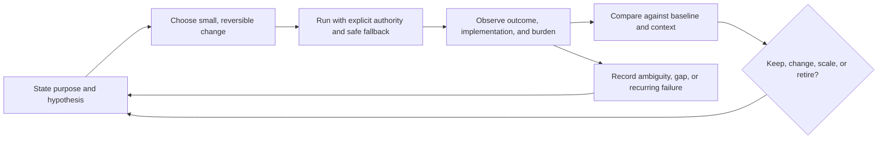

# the standard research — general systems sources and cross-domain translation

## Decision-useful conclusion

the standard should treat a personal or agent-operated system as a **socio-technical system**: it has purpose, actors, inputs, persistent state, handoffs, rules, feedback, delays, failure modes, and maintenance. The transferable discipline is real. The literal component metaphors are not.

The resulting default loop is:



This is PDSA plus explicit observability and decay handling. It applies to a the task system processor, an the agent briefing, a technical feature workflow, a physical routine, and changes to the vault. It does **not** turn a person into a machine or justify covert manipulation.

## Concepts that transfer cleanly

| Technical / systems concept | Clean cross-domain translation | Required design consequence |
| --- | --- | --- |
| Purpose and system boundary | What outcome matters; who and what is in scope; which external conditions matter | State the intended outcome, actors, constraints, and non-goals before selecting a solution. A CDC logic model separates inputs, activities, outcomes, and contextual factors. [CDC](https://www.cdc.gov/evaluation/php/evaluation-framework-action-guide/step-2-describe-the-program.html) |
| State / stock | Durable state that accumulates or depletes: open actions, unresolved clarifications, trust, energy, maintenance debt, project knowledge | Name the authoritative record, owner, read/write path, and freshness expectation. Do not use chat memory as durable state. Meadows explicitly includes nonmaterial system states such as trust and perceived safety. [Meadows](https://donellameadows.org/archives/leverage-points-places-to-intervene-in-a-system/) |
| Flow / queue | Arrivals, processing, deferral, completion, and abandonment | Measure both inflow and unresolved backlog. A system that only records completions hides accumulation and decay. |
| Feedback loop | A detected condition changes a later decision or rule | Every ongoing system needs a cadence, signal, decision rule, owner, and bounded response. Treat feedback as a possible source of unintended effects, not an automatic improvement mechanism. [CDC on feedback](https://www.cdc.gov/polaris/php/thinking-in-systems/looking-for-feedback.html) |
| Delay | Time between action, observation, and effect | Record expected delay before deciding a change failed. Avoid daily retuning of a weekly effect. Meadows identifies delay length relative to system-change rate as a leverage point. [Meadows](https://donellameadows.org/archives/leverage-points-places-to-intervene-in-a-system/) |
| Information flow / observability | A human can inspect what happened, current state, uncertainty, and why a recommendation was made | Persist the evidence and assumptions behind a decision; expose a readable status surface. Information-flow design is a higher-leverage intervention than parameter tuning in Meadows’s framework. [Meadows](https://donellameadows.org/archives/leverage-points-places-to-intervene-in-a-system/) |
| Interface / contract | Explicit handoff expectation between human, the agent, the task system, the knowledge system, and any connection | Define input, output, authority, failure response, and completion evidence. An ambiguity at a handoff becomes a durable clarification item, not an inferred action. |
| PDSA / controlled change | A change is a hypothesis, not a permanent improvement by default | Plan specifies purpose, theory, and success measure; Do preferably starts small; Study observes results; Act adopts, changes, abandons, or expands. [Deming Institute](https://deming.org/explore/pdsa/) |
| Incident/postmortem | Repeated avoidable failure, avoidance pattern, or bad system outcome | Use a blameless record of conditions and corrective actions. Each action needs an owner, priority, verifiable end state, and tracking; untracked “improve this” work decays. [Google SRE Workbook](https://sre.google/workbook/postmortem-culture/) |
| Resilience | Continue safely under disruption, recover to an acceptable state, and adapt based on learning | Design a degraded path before activation: capture still works if enrichment fails; a briefing still works if one integration is absent; no component can silently claim completion. NIST defines resilient systems in terms of anticipating, withstanding, recovering from, and adapting to adverse conditions. [NIST SP 800-160 v2r1](https://csrc.nist.gov/pubs/sp/800/160/v2/r1/final) |
| Choice architecture / friction | Arrange the environment so the desired next action is easy and alternatives have deliberate, proportionate friction | Use it only for choices the operator has authored and can inspect or revise. The evidence is intervention- and context-dependent; effects often weaken after removal. [systematic review](https://pubmed.ncbi.nlm.nih.gov/32264899/) |
| Implementation intention | Pre-decided cue-to-action rule: “If X occurs, I do Y.” | Attach it only when a task or routine needs help crossing intention into action. The cue must be observable and response concrete; retain an override. [Gollwitzer (1999)](https://prospectivepsych.org/sites/default/files/pictures/Gollwitzer_Implementation-intentions-1999.pdf) |
| Log / trace | A minimal contemporaneous account of what happened, why, and what changed | Treat a diary or briefing record as an observability instrument: record facts that inform a later decision, not an exhaustive self-surveillance feed. Periodically check whether the record is used. Self-monitoring effects and durability are context-specific. [systematic review](https://pubmed.ncbi.nlm.nih.gov/31409357/) |
| Test / experiment | A bounded intervention compared with a prior condition or alternative | Record baseline, intervention, outcome measure, timeframe, and confounders such as illness, travel, unusual workload, or changed tools. Before/after impressions alone do not establish causality. [WWC single-case standards](https://ies.ed.gov/ncee/wwc/Handbooks) |

## Measurement without Goodhart

Measurement is mandatory only when it can change a decision. It must distinguish at least three things:

1. **Outcome:** the condition the system exists to improve (for example, a completed real obligation, reliable capture, or lower maintenance burden).
2. **Process:** whether the system ran as designed (for example, briefing delivered, draft generated, clarification surfaced).
3. **Cost and harm:** effort, delay, confusion, lost autonomy, distrust, or displacement of more important activity.

The CDC cautions that performance indicators are not a substitute for evaluation and can be distorted by conditions outside the program; it recommends relating several indicators to a logic model and revising them as evidence changes. [CDC evaluation framework](https://www.cdc.gov/Mmwr/Preview/Mmwrhtml/rr4811a1.htm)

For the standard this means:

- Never use task-completion count, streak length, response speed, or “number of actions automated” as a lone success measure.
- Pair every proxy with the underlying purpose and an explicit failure signal. Example: `Daily Three completed` is a process signal; “was the day more manageable without harmful pressure?” is an outcome/cost check.
- Include qualitative evidence whenever the real outcome is experiential, relational, or contextual.
- Retire a measure when people start serving the number rather than the purpose. This is the useful operational reading of Goodhart’s warning, not a claim that all metrics are invalid.

## Evidence discipline for one-person systems

Personal systems often have one operator and substantial contextual variance. That makes disciplined learning more valuable, not less, but the claim must stay proportional.

Use this minimum experiment record for a material change:

```text
Hypothesis: [change] will improve [outcome] for [context] because [mechanism].
Baseline: [how the present condition is observed].
Intervention: [what changes and what explicitly does not].
Observation window: [start, end, expected delay].
Signals: [outcome, process, burden/harm].
Confounders: [events that make comparison weak].
Decision rule: retain / revise / retire / repeat test when [evidence threshold].
```

Single-case design can support within-person learning only with deliberate phases and repeated measurement; it should not be used to make strong general causal claims from a single before/after comparison. [What Works Clearinghouse standards](https://eric.ed.gov/?id=ED602036) [CDC discussion of single-case designs](https://stacks.cdc.gov/view/cdc/46495/cdc_46495_DS1.pdf)

## Design constraints recovered from the Focus Synthesis

The operator-supplied focus/routine/stopping synthesis provides private contextual evidence that should override generic “best practices” in that operator's profile. Its transferable constraints are preserved here:

- **Autonomy at design time:** rules are authored while regulated; the system must not repeatedly force a fresh in-the-moment negotiation.
- **Low-energy operation:** reduce search space, preserve a bounded pick, and make capture additive. Never make a capture depend on successful AI processing.
- **Decay is a first-class failure mode:** minimize manual maintenance at the input edge; surface genuine maintenance on a surface already used; log correction patterns; review trust and failure signals before abandonment.
- **Loss-proofing:** no automation may destroy progress or silently transform intent. Design graceful, reversible degraded behavior.
- **Humans and wall-clock time can be load-bearing; software cannot substitute for every human/therapeutic function.** This is a boundary, not an implementation deficiency.
- **Continuous and atomic work differ:** an interruption/park-note may help continuous work; it is not automatically suitable for a single atomic action.

## Weak or unsafe analogies to reject

| Tempting analogy | Why it fails | the standard guardrail |
| --- | --- | --- |
| “A human is a deterministic service.” | Motivation, health, consent, values, relationships, and context are not predictable APIs. | Treat human capacity and preferences as changing context; ask rather than infer material intent. |
| “A diary is just a log.” | Diaries carry meaning, privacy, and interpretation; logs are usually machine-structured and exhaustive. | Keep an intentional split between structured operational records and voluntary reflective notes. |
| “Testing proves the life change works.” | One person’s environment changes and weak comparisons confound results. | Say “evidence supports a local decision,” not “proven”; retain baseline and caveats. |
| “Resilience means tolerate any failure.” | In safety/security engineering it is mission-oriented recovery, not endless endurance or self-sacrifice. | Define acceptable degradation and stopping conditions; do not normalize harmful load. |
| “Friction/nudges can replace consent.” | Behavioural interventions can manipulate and decay; the evidence varies by context. | Every consequential friction must be visible, authored, reversible, and proportionate. |
| “Metrics are objective truth.” | Proxies omit value and invite gaming. | Use outcome + process + cost signals, then review qualitative evidence. |

## Recommended reference shelf

1. Donella H. Meadows, *Thinking in Systems: A Primer* (Chelsea Green, 2008): stocks, flows, feedback, delays, boundaries, resilience, and leverage. [Publisher page](https://www.penguinrandomhouse.com/books/801035/thinking-in-systems-by-donella-meadows/)
2. Donella H. Meadows, “Leverage Points: Places to Intervene in a System” (1999): use as a heuristic, with her explicit warning that it is not a recipe. [Primary essay and PDF](https://donellameadows.org/archives/leverage-points-places-to-intervene-in-a-system/)
3. W. Edwards Deming, *The New Economics*, 3rd ed. (MIT Press, 2018): PDSA as theory-guided learning, not checkbox compliance. [Deming Institute overview](https://deming.org/explore/pdsa/)
4. Google SRE Workbook, “Postmortem Culture” and “Postmortem Analysis”: practical standards for learning from failure without blaming the operator. [Postmortem culture](https://sre.google/workbook/postmortem-culture/) [analysis](https://sre.google/workbook/postmortem-analysis/)
5. Peter M. Gollwitzer, “Implementation Intentions” (1999): precise cue-action planning; appropriate for selectively turning an intention into an executable next move. [Article PDF](https://prospectivepsych.org/sites/default/files/pictures/Gollwitzer_Implementation-intentions-1999.pdf)
6. CDC Program Evaluation Framework: logic models, contextual factors, process/outcome distinction, and indicators that do not replace judgment. [CDC framework](https://www.cdc.gov/Mmwr/Preview/Mmwrhtml/rr4811a1.htm)

## the standard implications

the standard should require, for every system or system change with material impact:

1. A one-page system frame: purpose, boundary, actors, authoritative state, handoffs, constraints, failure/degraded path, and maintenance owner.
2. A testable theory of change and a proportionate evaluation plan, including outcome, process, and burden signals.
3. An inspectable decision record: sources, assumptions, ambiguities, and how they will be resolved.
4. A post-change review that can retain, revise, scale, or retire the system—and that propagates accepted changes to legacy state.
5. No automatic action based solely on an ambiguous interpretation or a proxy metric.
