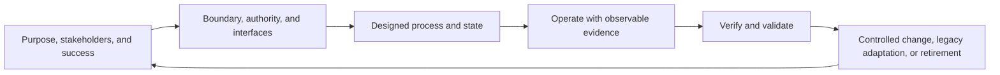

# the standard research: technical systems principles that transfer beyond software

**Purpose.** Evidence for the first the agent system: a reusable method for designing, operating, changing, and retiring systems. This is research input, not the the standard design itself.

**Evidence rule.** “Established” below means the claim is directly supported by a cited systems-engineering, standards-body, or first-party reliability source. “Transfer” is an explicit inference about applying the principle to personal, human–agent, or organisational systems; it must be adopted or rejected deliberately, not treated as a quoted standard.

## Bottom line

The strongest transferable core is not a software development recipe. It is a control loop:

This is compatible with a personal system because systems engineering treats people, processes, information, and technology as parts of a system—not merely hardware and software. It does **not** imply treating a person as a machine: measures, cadence, and recovery policies must account for autonomy, dignity, changing circumstances, and limited energy.

## What is directly supported

| Principle | Direct technical evidence | Careful transfer to the agent / life systems |
| --- | --- | --- |
| Define the system of interest, its boundary, wider context, and what is under whose authority. | SEBoK says the system-of-interest boundary depends on what can be changed versus what must remain fixed, and distinguishes the direct system from wider interacting systems and environment. [SEBoK: Engineered System Context](https://sebokwiki.org/wiki/Engineered_System_Context) | Every system definition needs: purpose, in-scope / out-of-scope, owner, dependencies, and interfaces. An individual’s sleep, health, employer, other people, and external services may affect a personal system without being under the agent’s authority. **Transfer/inference.** |
| Start from stakeholder needs and measures of success, then formulate requirements. | SEBoK’s stakeholder-needs process includes problem/opportunity, mission/goals/objectives, measures of success, stakeholders, risks, constraints, and lifecycle concepts; requirements translate that perspective into a technical one. [Stakeholder Needs and Requirements](https://sebokwiki.org/wiki/Stakeholder_Needs_and_Requirements), [System Requirements Definition](https://sebokwiki.org/wiki/System_Requirements_Definition) | Before selecting tools or workflows, record the desired human outcome, affected people, constraints, and what observable evidence would distinguish success from activity. **Transfer/inference.** |
| Architecture is the durable shape of components and interfaces; interface agreements need explicit ownership and change control. | SEBoK describes architecture as maintained throughout lifecycle and identifies interfaces/interoperability as a central concern. NASA’s interface-document outline calls for purpose/scope, precedence, responsibilities, and change authority. [SEBoK: Architecting approaches](https://sebokwiki.org/wiki/Architecting_Approaches_for_Systems_of_Systems), [NASA Systems Engineering Handbook appendix](https://www.nasa.gov/reference/system-engineering-handbook-appendix/) | Treat a handoff as an interface: state input, output, owner, timing, allowed effects, error behavior, and source of truth. This is directly aligned with the user’s “company as an API” framing. **Transfer/inference.** |
| A system needs state and feedback, not only instructions. | SEBoK models systems in context as interacting with their environment; Google SRE treats monitoring, tickets, and logging as distinct outputs tied to action urgency. [SEBoK: System context](https://sebokwiki.org/wiki/Engineered_System_Context), [Google SRE: Service Best Practices](https://sre.google/sre-book/service-best-practices/) | Durable registries (clarifications, capability gaps, monitored items, change requests) are system state. Briefings consume state; they should not reconstruct it from chat memory. A diary-like log is useful only if its event schema and later use are defined. **Transfer/inference.** |
| Observability must support a decision or investigation, not create unattended noise. | Google distinguishes pages (act now), tickets (act within days), and logs (analysis later), warning that alerts that merely hope for continual human attention will be ignored. It also recommends moving from user-impacting alert signals to explanatory diagnostic metrics. [Service Best Practices](https://sre.google/sre-book/service-best-practices/), [SRE Workbook: Monitoring](https://sre.google/workbook/monitoring/) | Every monitor/briefing item needs a cadence, an escalation threshold, an owner, a next action, and a stop/retirement condition. “Log everything” is not a design. **Transfer/inference.** |
| Verification and validation are separate activities. | SEBoK defines verification as checking correctness of an element throughout the lifecycle and treats it as separate from validation; NASA separately identifies verification and validation in product realization. [SEBoK: System Verification](https://sebokwiki.org/wiki/System_Verification), [NASA handbook PDF](https://www.nasa.gov/wp-content/uploads/2018/09/nasa_systems_engineering_handbook_0.pdf) | **Verification:** “Did the agent/system follow the specified process and produce the promised artifact?” **Validation:** “Did that process actually help the operator in the intended real context?” A simulated compose-only run can verify a proposal and its safety, but cannot validate usefulness until a real, approved use is observed. **Transfer/inference.** |
| Design for adverse conditions and recovery—not only nominal flow. | NIST defines cyber resiliency as the capability to anticipate, withstand, recover from, and adapt to adverse conditions; NASA’s systems-engineering material asks that operational concepts include malfunctions and degraded modes, and defines recovery as restoring needed functions after fault/failure. [NIST SP 800-160 Vol. 2 Rev. 1](https://csrc.nist.gov/pubs/sp/800/160/v2/r1/final), [NASA systems engineering fundamentals](https://www.nasa.gov/reference/2-0-fundamentals-of-systems-engineering/), [NASA handbook appendix](https://www.nasa.gov/reference/system-engineering-handbook-appendix/) | For each material workflow, name failure signals, a safe degraded path, preservation of evidence, recovery owner, and re-entry criteria. Avoid making the preferred integration the only way the system can function. **Transfer/inference.** |
| Include humans as system elements and design human interfaces deliberately. | NASA HSI defines a system as integrating hardware, software, humans, data, and processes; it includes owners, users, operators, maintainers, support, training, and test personnel. [NASA Human Systems Integration Handbook](https://ntrs.nasa.gov/citations/20210010952) | Low-energy operation, readable choices, small next actions, and avoiding hidden assumptions are primary design requirements, not “nice UX.” An agent system that needs high executive function to supervise it is a failed human-system interface. **Transfer/inference.** |
| Configuration/change management needs an approved baseline, impact analysis, authority, traceability, and controlled evolution. | SEBoK defines a baseline as an approved lifecycle snapshot that normally changes via formal procedure; it says change management includes analysis, justification, evaluation, coordination, and disposition. [SEBoK: Configuration Management](https://sebokwiki.org/wiki/Configuration_Management), [Configuration Baselines](https://sebokwiki.org/wiki/Configuration_Baselines) | A change request must identify: current rule/version, proposed rule, rationale, affected system artifacts and legacy records, required migration/backfill, simulation evidence, approval authority, and rollback/retirement. “Update docs” alone does not handle legacy state. **Transfer/inference.** |
| Lifecycle includes operation, maintenance, transition, disposal/retirement—not only initial build. | NIST’s systems-security engineering framing explicitly covers lifecycle processes including implementation, integration, verification, transition, validation, operation, maintenance, and disposal. NASA says transition occurs throughout the lifecycle and that de-integration/disposal needs engineering from concept definition; SEBoK covers retirement. [NIST SP 800-160 Vol. 1 Rev. 1](https://csrc.nist.gov/pubs/sp/800/160/v1/upd2/final), [NASA Product Transition](https://www.nasa.gov/reference/5-5-product-transition/), [NASA Product Integration](https://www.nasa.gov/reference/5-2-product-integration/), [SEBoK: Disposal and Retirement](https://sebokwiki.org/wiki/Disposal_and_Retirement) | Each durable system needs an operating cadence, health/review conditions, an update path, and an explicit retirement path that preserves or migrates necessary records. This is the formal underpinning for “design for decay from the start.” **Transfer/inference.** |
| Metrics must be connected to decisions, timely, comprehensive enough, and regularly reassessed; target fixation can distort outcomes. | NIST says measures should inform decisions, be accurate/timely, include qualitative information where relevant, and be reassessed. It warns that targets/rankings can incentivize focus on the metric at the expense of overall outcomes. [NIST: Thinking about Performance Measurement](https://www.nist.gov/baldrige/thinking-about-performance-measurement) | Measure the underlying outcome plus counter-metrics and human feedback. Do not score “three tasks completed” as a proxy for a good day; it is a floor designed to support agency. Reassess when measures cause avoidance, gaming, anxiety, or no longer alter a decision. **Transfer/inference.** |
| Reliability improvement requires baselines, learning from failure, and explicit follow-up—not blame. | Google SRE says reliability can improve only from a known baseline and tracked progress; postmortems record impact, mitigation, contributing causes, and preventive actions, and should be blameless. [Tracking Outages](https://sre.google/sre-book/tracking-outages/), [Postmortem Culture](https://sre.google/sre-book/postmortem-culture/) | A system review asks “what conditions and design gaps made this outcome likely?” before asking “what should the operator have done?” Persistent failure is evidence against the design, not grounds for moral judgment. **Transfer/inference.** |

## the standard design implications

These are candidate invariants for the eventual skill/instructions, **not yet accepted rules**:

1. **Outcome before solution.** A system begins with the problem/opportunity, stakeholder, intended effect, constraints, and measurable or otherwise observable success condition.
2. **Scope and authority before automation.** No system may silently assume authority over people, services, money, data, commitments, or legacy records.
3. **One source of truth per kind of state.** A process may project or link data elsewhere, but its authoritative state and synchronization direction must be explicit.
4. **Interfaces are first-class.** Each handoff specifies producer, consumer, input, output, timing, permissions, failure behavior, and how an ambiguity or gap is surfaced.
5. **Simulation precedes activation.** Compose-only simulations verify no-effect behavior and expose mistaken interpretation before live operation; approval to activate is separate.
6. **Run-time evidence is durable.** State that must survive chat/context loss is written into explicit artifacts or registries, with enough provenance to inspect it later.
7. **Change has a migration.** Changing a rule entails an impact scan of previously processed records, not merely applying the new rule going forward.
8. **Human capacity is an architectural constraint.** A design must remain usable on a low-energy day and should make the desired action easier than the harmful/default action.
9. **Metrics remain subordinate to the purpose.** A metric must have a decision it informs, a cadence appropriate to the process, a review date, and qualitative context where needed.
10. **Every durable system can be retired.** It has a stop condition, ownership transfer/archive plan, and a way to avoid leaving silently active or contradictory legacy state.

## Distinctions the standard should preserve

| Do not collapse | Why it matters |
| --- | --- |
| **Purpose / requirement / implementation** | A desired outcome, the rule that constrains the outcome, and the chosen tool/workflow can change independently. This prevents a tool choice from becoming the goal. |
| **System boundary / context / authority** | Something can affect the system without being part of it or controllable by the agent. This prevents unsafe or magical thinking about external actors. |
| **Event log / decision record / knowledge** | A diary or run log records what happened; a decision record says what rule governs; knowledge explains stable facts. Each needs different lifecycle and retrieval behavior. |
| **Monitor / alert / briefing question** | A monitor observes a condition; an alert requires immediate attention; a briefing question is a batched decision or clarification. Combining them produces noise or missed urgency. |
| **Verification / validation** | A run can comply with spec yet not help the user, or help by accident while violating safety requirements. Both must be assessed. |
| **Capability gap / ambiguity / failure** | A missing tool, an under-specified request, and an operational defect have different safe responses and different owners. |
| **Change / migration / rollback / retirement** | A new rule, its application to old state, reversal after harm, and permanent stop are distinct operations. |

## Mapping technical concepts to life systems: useful, but not literal

| Technical concept | Legitimate analogue | Unsafe overextension to avoid |
| --- | --- | --- |
| Logging | Timestamped record of a decision, condition, intervention, and result; private reflection can be additional qualitative evidence. | Treating extensive journaling as automatically useful observability. Logging without review questions or privacy boundaries becomes data accumulation. |
| Test | A pre-declared scenario or simulation that checks a system rule; e.g., ambiguous capture must create a clarification rather than a guessed task. | Treating a human’s lived day as a pass/fail test or assuming one result proves a general rule. |
| Staging | Compose-only/sandboxed trial or a tightly bounded pilot with zero or limited effects. | Running a silent live experiment involving external commitments, messages, or personal data. |
| Monitoring | A periodic check tied to a defined decision, threshold, cadence, and resolution condition. | Checking because data exists, or creating alerts whose only action is “remember to worry.” |
| Incident / postmortem | A material undesired outcome analysed for conditions, signals, mitigations, and preventive action. | Blaming a person’s character or converting normal variability into an incident. |
| Error budget | A consciously limited tolerance for imperfect performance, used to decide when to stabilize rather than add scope. | A productivity quota or permission to neglect health/commitments. |
| Configuration baseline | A versioned, approved description of the governing system and material state. | Freezing ordinary personal preferences or requiring bureaucratic approval for trivial adjustments. |
| Migration | A verified update of previously processed tasks/notes/registries after a rule changes. | Automatically rewriting original captures or historical reflections; preserve originals and record transformations. |

## Measurement and Goodhart: required safeguards

“Goodhart’s law” is a useful warning label but not a complete design method. The directly supported NIST point is narrower: targets/rankings can induce behavior that distorts overall outcomes. the standard should therefore require all of the following before a metric controls behavior:

1. Name the decision the metric changes.
2. State the human outcome it represents and at least one way the measure can be falsely improved.
3. Add a counter-signal or qualitative review when material distortion is plausible.
4. Set a review cadence and stop/revise the metric if it no longer discriminates useful performance or increases harm.
5. Never infer personal worth, diagnosis, or moral failure from an operational metric.

Google SRE provides a compatible engineering pattern: user-centred service objectives, an explicitly limited tolerance for failure, and a change/stability decision informed by observed performance. [Service Level Objectives](https://sre.google/sre-book/service-level-objectives/), [Error Budget Policy](https://sre.google/workbook/error-budget-policy/). Applying it to personal systems remains an inference and must preserve the safeguards above.

## Sources to use as the evidence spine

1. **SEBoK / INCOSE community** — [Engineered System Context](https://sebokwiki.org/wiki/Engineered_System_Context); [Stakeholder Needs and Requirements](https://sebokwiki.org/wiki/Stakeholder_Needs_and_Requirements); [Configuration Management](https://sebokwiki.org/wiki/Configuration_Management); [System Verification](https://sebokwiki.org/wiki/System_Verification); [System Validation](https://sebokwiki.org/wiki/System_Validation); [Measurement](https://sebokwiki.org/wiki/Measurement). Use for lifecycle, context/boundary, requirements, configuration, V&V, and measurement vocabulary.
2. **NASA** — [NASA Systems Engineering Handbook](https://www.nasa.gov/wp-content/uploads/2018/09/nasa_systems_engineering_handbook_0.pdf); [fundamentals](https://www.nasa.gov/reference/2-0-fundamentals-of-systems-engineering/); [interface requirements appendix](https://www.nasa.gov/reference/system-engineering-handbook-appendix/); [configuration management](https://www.nasa.gov/reference/6-5-configuration-management/); [product transition](https://www.nasa.gov/reference/5-5-product-transition/); [NASA Human Systems Integration Handbook record](https://ntrs.nasa.gov/citations/20210010952). Use for interfaces, technical plans, V&V, lifecycle evidence, controlled change, and treating human participants as system elements.
3. **NIST** — [SP 800-160 Vol. 1 Rev. 1](https://csrc.nist.gov/pubs/sp/800/160/v1/upd2/final) and [Vol. 2 Rev. 1](https://csrc.nist.gov/pubs/sp/800/160/v2/r1/final); [Thinking about Performance Measurement](https://www.nist.gov/baldrige/thinking-about-performance-measurement). Use for lifecycle-spanning resilience, adaptation/recovery, and metric hazards.
4. **Google SRE** — [Service Best Practices](https://sre.google/sre-book/service-best-practices/); [Monitoring](https://sre.google/workbook/monitoring/); [Postmortem Culture](https://sre.google/sre-book/postmortem-culture/); [Tracking Outages](https://sre.google/sre-book/tracking-outages/); [SLOs](https://sre.google/sre-book/service-level-objectives/). Use for operational feedback, visibility, user-oriented measures, intentional alerting, and learning loops.

## Named secondary books worth using for later synthesis

These are not used as primary evidence above; they are useful interpretive sources if the standard needs a public explanatory bibliography.

- Donella H. Meadows, *Thinking in Systems: A Primer* (Chelsea Green, 2008) — feedback, leverage, system behavior.
- Nancy Leveson, *Engineering a Safer World: Systems Thinking Applied to Safety* (MIT Press, 2011) — safety as control/constraints rather than simple component failure.
- Erik Hollnagel, David D. Woods, and Nancy Leveson (eds.), *Resilience Engineering: Concepts and Precepts* (Ashgate, 2006) — resilience and human adaptation.
- John D. Sterman, *Business Dynamics: Systems Thinking and Modeling for a Complex World* (McGraw-Hill, 2000) — dynamics, delays, and misleading intuitions.

## Research limits

- SEBoK and NASA provide authoritative systems-engineering framing, but personal-system application is a design judgement, not a standard-certified result.
- Google SRE’s practices arise from large-scale production services. Their observability and postmortem principles transfer well; exact thresholds, SLOs, and paging practices do not transfer automatically.
- NIST SP 800-160’s subject is cybersecurity/resilience. Its anticipate–withstand–recover–adapt pattern is strong evidence for resilience thinking, not a mandate to frame ordinary life as an adversarial threat model.
- This report does not decide the level of ceremony. the standard must later specify a proportional rule so small one-off choices do not become paperwork.
