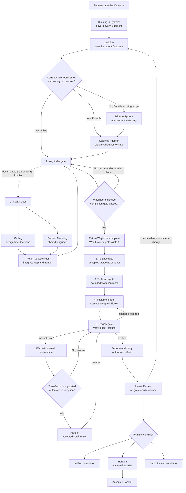

# Workflow

Own one parent Outcome from request to verified completion, accepted transfer, or authoritative cancellation in Inline or Durable mode. Load and apply the `'Thinking in Systems'` skill first, then enter one Workflow context before any response, phase capability, or effect. Reading Workflow without establishing and retaining that context is incomplete. Workflow evaluates the ordered gates below from left to right, integrates every bounded return, and remains responsible for the parent terminal condition.

## Run the ordered gates



Always evaluate the gates in this order: **Wayfinder → To Spec → To Tickets → Implement → Review**. Finish a gate before entering the next one. A bounded Inline request may pass a gate inside Workflow without invoking its skill only when the gate's complete contract is already present and Workflow records the proof. Durable or Material delivery invokes each named gate skill. A direct request for a later skill first enters Workflow and proves every earlier gate in order. Discovery companions run inside Wayfinder; Supplemental reviewers run inside Review. A child capability returns to its immediate invoker, and the return chain unwinds to Workflow before the next gate starts.

```text
enter(gate n + 1) = completion record for gate n exists
  and its exact revision is current
  and Workflow has integrated it

enter(To Spec) = Wayfinder status is complete
  and coverage audit is complete
  and empty-frontier confirmation is current
  and user confirmation is recorded
```

Missing or stale evidence keeps the current gate active. It never becomes permission to start the next skill.

0. **Establish the parent and representation.** Preserve the request and enter exactly one Workflow context before responding, invoking a phase capability, or performing an effect. Join a matching open Outcome or distinguish new, related, and replacement work. Record the owner, Authority, result revision, current gate, and every immediate return route. Use Inline mode only before a Persistence boundary. At a Durable boundary, read [Durable mode](references/durable-mode.md), select one canonical Adapter, declare its capability levels, and materialize the Outcome before child execution or an effect. When a Durable existing scope lacks a trustworthy current-state map, invoke `'Migrate System'` now and integrate its bounded return before gate 1. Complete when exactly one parent context and truthful representation govern the ordered gates.
1. **Finish Wayfinder.** For every Durable or Material Outcome, invoke `'Wayfinder'` first. Give it the parent context, accepted destination, current evidence, Authority, and immediate return route. Wayfinder owns discovery routing: documented plans or design records invoke `'Grill With Docs'`; Grill With Docs composes Grilling and Domain Modeling and returns to Wayfinder; other present uncertainties invoke their owning companions. Wayfinder integrates those returns and completes only when its collective completion gate proves the whole material decision frontier exhausted or the remaining fog governed. A destination answer, one question, one interview round, one resolved frontier item, or a merely plausible route is non-terminal; keep Workflow at gate 1 and invoke or resume Wayfinder again. Advance to To Spec only after Workflow integrates an explicit `Wayfinder complete` result with its coverage evidence. A bounded Inline request passes this gate without invoking Wayfinder only when its destination, terms, facts, decisions, Constraints, Authority, and Proof seam are already sufficient. Complete when Workflow has integrated the explicit Wayfinder completion result or recorded exact evidence that the Inline gate already passes.
2. **Finish To Spec.** Enter this gate only after gate 1 returns an explicit `Wayfinder complete` result at one exact Map revision. The handoff must contain the complete coverage audit, empty-frontier confirmation, accepted decisions, remaining governed fog, and the user's confirmation of shared understanding. A `Wayfinder incomplete` result, one question round, missing coverage evidence, or unconfirmed shared understanding keeps Workflow at gate 1. After admission, invoke `'To Spec'` for every Durable or Material Outcome and supply the accepted Outcome, Wayfinder decisions and Strategy, Constraints, Authority, Proof seam, and exact return route. Integrate the accepted Specification revision before continuing. A bounded Inline request may use its complete semantic Specification in the conversation only with Workflow's recorded Wayfinder-gate pass evidence. A blocking Specification gap returns to gate 1 through Workflow. Complete when one accepted Specification governs downstream work.
3. **Finish To Tickets.** After gate 2 passes, invoke `'To Tickets'` for every Durable or Material Outcome. Supply the accepted Specification revision, dependencies, ownership and Authority boundaries, proof obligations, and exact return route. Integrate the accepted Ticket-set revision and Work frontier before continuing. A bounded Inline request may use one implicit Ticket only when its Result, owner, Authority, Proof seam, and terminal condition are explicit. A decomposition gap returns to gate 2 or gate 1 through Workflow. Complete when every executable unit has an accepted Ticket contract.
4. **Finish Implement.** After gate 3 passes, invoke `'Implement'` for each accepted unblocked Ticket. Each Implement invocation returns one exact Result revision and Evidence to Workflow for the later Review gate. Dependencies control Ticket order; independent Tickets may run concurrently only after To Tickets records safe ownership, Claims, write boundaries, and return routes. Implementation waiting or failure retains its Work owner and returns an owned Continuation to Workflow, but gate 4 stays active and gate 5 remains closed. Complete only when every required Ticket has an exact Review submission at its current revision.
5. **Finish Review.** Enter this gate only after gate 4 collectively passes. Invoke `'Review'` for every submitted Result against the accepted Specification, Ticket, standards, Result revision, and Proof seam. For software changes, a configured `'code-review'` capability runs inside this gate and returns its two-axis findings to Review; Review retains the integrated verdict. `Changes required` reopens gate 4 with the exact findings and invalidates the affected collective Implement completion. `Inconclusive` keeps gate 5 active with owned waiting or recovery. `Verified` returns revision-bound Evidence to Workflow. Complete when every required Result is Verified and the parent proof inputs are current.
6. **Perform effects and close the parent.** After gate 5 passes, perform only authorized effects through deterministic guards, verify the real result, update affected current and legacy state, and run parent Review over the integrated Outcome. New evidence or a Material change returns to the earliest affected gate and replays every later gate. End parent responsibility only on a verified parent proof bundle, an accepted transfer with exact continuation, or authoritative cancellation with every Material disposition. Delegation, submission, approval, scheduling, waiting, failure, child completion, and an unaccepted handoff remain non-terminal.

## Durable coordination boundary

At a Durable boundary, read [Durable mode](references/durable-mode.md) completely. It is the single authority for record meanings, materialization, Adapter capabilities, transition guards, System Record binding, migration, waiting, Degraded operation, effects, and the parent proof bundle.

## Route discovery inside Wayfinder

| Uncertainty | Invoke | Required return |
| --- | --- | --- |
| Documented plan or design decisions | `'Grill With Docs'` skill, invoked by Wayfinder | Confirmed decisions, shared language, and qualifying durable records returned to Wayfinder |
| Unclear or conflicting terminology | `'Domain Modeling'` skill, invoked by Wayfinder | Operative meanings and visible conflicts returned to Wayfinder |
| Decisions held by the current user | `'Grilling'` skill, invoked by Wayfinder | Accepted decisions and remaining frontier returned to Wayfinder |
| Missing external facts | `'Research'` skill, invoked by Wayfinder | Cited findings and remaining uncertainty returned to Wayfinder |
| One empirical design question | `'Prototype'` skill, invoked by Wayfinder | Reversible experiment verdict and evidence returned to Wayfinder |
| Knowledge held by another person | `'To Questionnaire'` skill, invoked by Wayfinder | Complete asynchronous questionnaire returned to Wayfinder |

Treat missing companion skills as capability gaps. Act directly only when the same bounded contract remains satisfiable; otherwise enter visible Degraded mode with preserved state and an exact resumption condition.

## Handle every new message during active work

Preserve the message and classify each operative clause before changing state. One message may contain several classes. Compatible clauses can be processed together; replacement or unrelated-switch clauses decide which Outcome later clauses address.

| Class | Test | Route |
| --- | --- | --- |
| **Clarification** | Resolves an ambiguity without changing the accepted Outcome, scope, Constraints, Authority, proof, or treatment of existing state. | Append the clarified meaning or fact and continue at the same Specification and result revisions. |
| **Extension or Constraint change** | Adds or changes the Outcome, scope, supported conditions, Constraint, interface, Authority, proof, or legacy treatment. | Propose the change, create a new Specification or result revision when material, inspect affected work, and reroute only that work. |
| **Correction** | Shows that an earlier interpretation, evidence claim, result, or completion assertion was false under the original contract. | Append a correction event, preserve history, invalidate false evidence, reopen affected responsibility, and recover from the failed seam. |
| **Authorized override or Informed exception** | Requests a safeguard to be bypassed within claimed Authority. | Verify Authority. When it holds, record the skipped protection, plausible consequence, affected scope and duration, and Review, reversal, or recovery trigger. When it does not, preserve the exact proposal and result, perform no guarded effect, and enter approval or waiting with an owner and observable unblock condition. Keep every unaffected safeguard active. |
| **Explicit replacement or supersession** | Replaces the active Outcome or accepted contract instead of extending it. | Record the predecessor, partial effects, retained evidence, dependencies, and every child disposition before establishing or joining the successor. |
| **Unrelated switch** | Does not advance, clarify, correct, replace, or share a material contract with the active Outcome. | Preserve exact continuation first, then start or join the other Outcome. Resume the original from its recorded pickup point. |

When the class or Authority is materially ambiguous, preserve the plausible routes and ask the smallest question that changes the route. Preference or willingness to accept risk is not proof of Authority.

For every material extension, Constraint change, exception, or replacement:

1. Preserve the baseline and record the source message, classification, proposed revision, rationale, Authority, and expected effect.
2. Trace the changed contract slice through present or plausibly affected Tickets, dependencies, evidence, Reviews, approvals, effects, interfaces, current state, and legacy state.
3. Mark each inspected item affected or unaffected with a reason. Invalidate only affected evidence, Review, approval, completion, or child contracts.
4. Propagate the exact revision, proof seam, and next action to every affected child owner. Preserve unaffected ownership, claims, evidence, and progress.
5. Re-evaluate parent coverage and integration. A material Durable system change also updates its Change and Legacy Record.

Use the [material-change template](references/material-change-template.md) when the change must persist.

## Interrupt and resume safely

- **Continuous work:** stop at a coherent checkpoint. Preserve source and result revisions, owner, completed range, pickup point, next action, and proof still required.
- **Atomic work before its effect boundary:** stop before the boundary. Preserve the exact proposal, Review, approval, preconditions, and recheck action.
- **Atomic work crossing its effect boundary:** observe the accepted effect or failure and enter verification or recovery before switching attention.
- **Changed approved work:** invalidate affected Review and approval. Recheck validity, expiry, revocation, conditions, and exact revision immediately before resuming any effect.

Use the [continuation template](references/continuation-template.md) when state must survive the interaction. Short waits may be observed directly. Longer waits need an accepted durable continuation and scheduled resumption or monitor when available. Invoke the `'Handoff'` skill when responsibility or context must transfer, including when automatic resumption is unavailable. It returns an accepted continuation with the responsible Actor and exact next check. If that capability is unavailable, preserve the same contract in visible Degraded mode until a safe equivalent, restored capability, or accepted transfer is available. Waiting remains owned.

## Use Supplemental skills at declared Extension points

Configuration may attach user-selected Supplemental skills only at these seams:

| Extension point | Input | Return to the core owner |
| --- | --- | --- |
| `workflow.discovery` | Blocking uncertainty, sources, Constraints, and required decision | Evidence or a bounded discovery result |
| `workflow.specification` | Accepted Outcome, governing decisions, and proof obligations | Specialist constraints or evidence for To Spec |
| `workflow.decomposition` | Accepted Specification and dependency context | Specialist decomposition evidence for To Tickets |
| `workflow.implementation` | Accepted Ticket, Authority, and proof seam | Specialist execution result and evidence for Implement |
| `workflow.review` | Exact Specification and result revisions | Specialist findings for Review |
| `workflow.effect` | Reviewed revision, Authority, and effect contract | Specialist effect evidence for Workflow |

The core skill supplies inputs, integrates the returned evidence, and retains its job, responsibility, and completion criterion. Advisory failure is recorded and may permit continuation; required failure routes to waiting or recovery. Overlapping mappings require an explicit configured selection. Use the [Extension-point template](references/extension-point-template.md) when declaring or evaluating a mapping.

## Preserve Authority and proof

A clear request to perform an effect may supply Authority within its explicit boundary. A draft request, ambiguous Authority, changed result revision, or consequential effect outside granted Authority creates an approval gate. Approval binds one exact result revision and is rechecked immediately before the effect.

An authorized Informed exception may compress an artifact or phase when its prerequisites are already satisfied or the skipped protection and recovery are understood. Thinking in Systems, responsibility, Authority, Review, and truthful completion remain active proportionately.

Return the smallest user-visible result that proves the accepted Outcome. Preserve history, raw evidence, current and legacy effects, parent responsibility, and unaffected work across every route.
