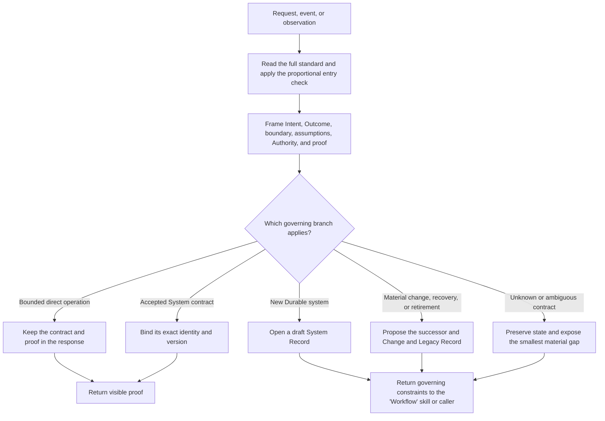
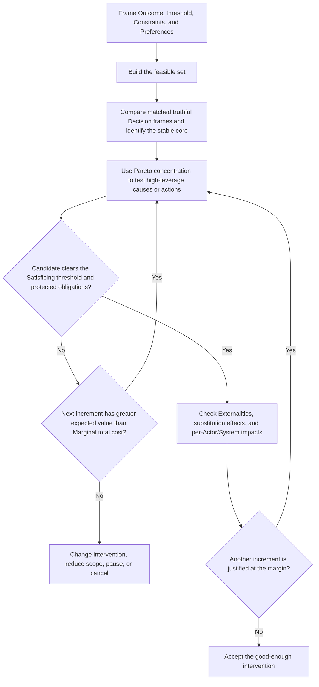
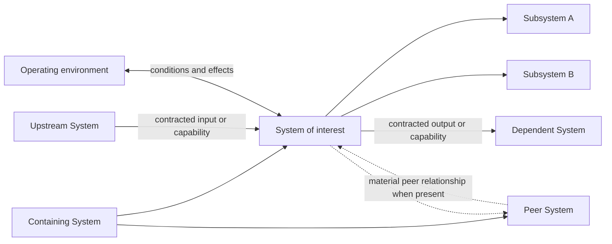
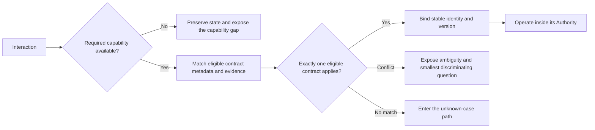
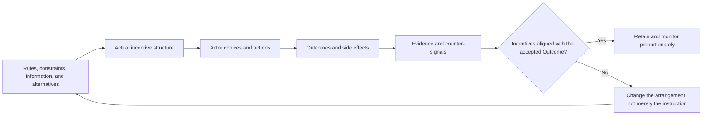
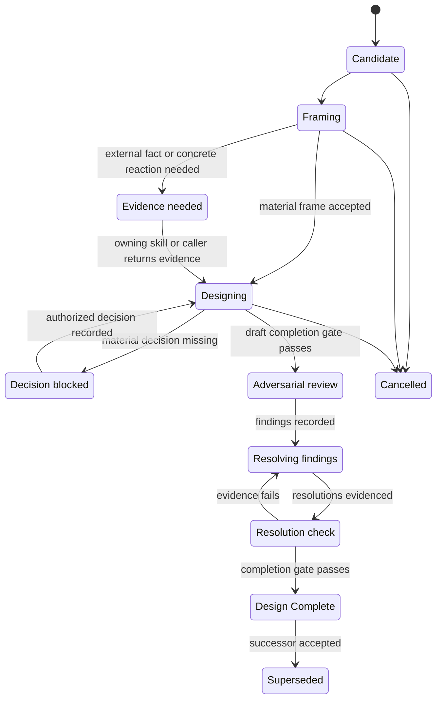
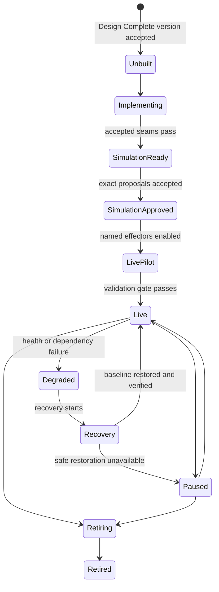

Read and apply every section before returning a systems judgment. Scale the depth, output, and durable artifacts to consequence. A small request changes how much work is visible; it does not make any part of the method disappear.

## Use these terms consistently

- **Thinking in Systems:** the method in this standard for governing arrangements so they advance an intended Outcome under real operating conditions.
- **System:** a bounded arrangement of interdependent Actors, information, rules, state, mechanisms, and operating conditions that produces or protects an Outcome across one or more interactions. It may be one-time, recurring, or continuous; recurrence is not the admission test. [Sources](sources.md#system-boundaries-subsystems-and-dependent-systems)
- **System of interest:** the System currently being governed at the selected level of analysis. Its boundary separates what it owns or controls from the wider context that affects it.
- **Containing System:** the larger System whose boundary includes the System of interest; the canonical term for its parent System at the selected decomposition level.
- **Subsystem:** a System inside another System's boundary that has its own internal arrangement and bounded contributory Outcome; the canonical term for a child System. Its local success does not prove the Containing System's Outcome.
- **Upstream System:** an external System whose output, availability, interface, or policy the System of interest materially relies on.
- **Dependent System:** an external System that materially relies on the System of interest. Upstream and dependent relationships create interface and change obligations without creating Authority across the boundary.
- **Peer System:** a System with the same known Containing System as the System of interest at the selected decomposition level. A Peer System is sometimes called a sibling System; peerhood alone creates no dependency, interface, Ownership, or Authority.
- **System interaction:** a request, event, or observation interpreted or acted on through a System. Every agent request is one System interaction, even when it needs only an inline result.
- **Durable system:** a System whose rules, state, Authority, or effects must persist beyond the current interaction.
- **Actor:** a person, agent, team, service, or other party that performs, decides, approves, supplies, or receives something within a System.
- **Incentive structure:** the material arrangement of rewards, costs, constraints, defaults, information, consequences, and available alternatives that makes an Actor's choices more or less attractive. Inspect actual incentives, including indirect and unintended ones, rather than relying on stated intentions. [Sources](sources.md#incentives-friction-routines-and-operating-conditions)
- **Ownership:** continuing Responsibility for integrating and sustaining a whole System or Outcome through operation, recovery, change, and terminal proof. Delegation does not transfer Ownership unless a successor explicitly accepts it.
- **Responsibility:** an Actor's accepted or assigned duty to perform, decide, approve, verify, or recover a bounded part through its completion within that Actor's Authority. [Sources](sources.md#actors-ownership-responsibility-authority-and-handoffs)
- **Intent:** the problem, opportunity, value, or avoided loss that gives direction to an Outcome and constrains acceptable means.
- **Outcome:** the externally meaningful condition that the work is responsible for producing or preserving.
- **Material:** capable of changing the accepted Outcome, scope, Authority, external effect, risk, burden, proof, or treatment of existing state.
- **Authority:** explicit permission for an Actor or mechanism to interpret, decide, prepare, approve, or perform a named effect within a defined boundary.
- **LLM:** a probabilistic language model used for interpreting unstructured context, identifying uncertainty, comparing bounded options, or composing proposals. Do not use _model_ when this is the intended meaning.
- **Deterministic mechanism:** a rule-governed component that owns enforceable state, timing, validation, transitions, retries, approvals, or effects without relying on an LLM to remember or improvise the rule.
- **System representation:** a description, diagram, record, simulation, or other view of a System; it may guide or report on the System but is not the System itself.
- **System Record:** the canonical human-readable contract for one version of a Durable system, including its Outcome, boundary, Authority, behavior, proof, operation, and retirement conditions.
- **Change and Legacy Record:** the versioned contract for moving from one Durable system version to another, including affected existing state, compatibility, rollout, rollback, verification, and predecessor retirement.
- **Opportunity cost:** the value of the best feasible alternative forgone by a decision, considered with displaced resources, delay, transition, maintenance, and reversibility.
- **Constraint:** a condition that limits the feasible alternatives. A hard constraint excludes an alternative; a soft constraint changes its cost, burden, risk, or attractiveness. Budget, time, capacity, Authority, safety, rights, and operating conditions may all constrain a System.
- **Feasible set:** the alternatives that satisfy the hard Constraints and are actually available within current Authority, capabilities, resources, and operating conditions.
- **Preference:** an Actor's evidence-backed ordering among feasible alternatives or Outcome attributes under stated conditions. A Preference is an input to design, not a Requirement or grant of Authority; Preferences may differ among Actors and change with conditions.
- **Decision frame:** the representation through which an Actor evaluates a decision, including its reference point, gain or loss formulation, absolute or relative quantities, denominator, probability format, time horizon, order, grouping, and salience.
- **Framing effect:** a material change in judgment or choice when the Decision frame changes while the underlying alternatives, outcomes, probabilities, and consequences remain materially equivalent. Compare multiple matched truthful frames to expose the judgment that remains stable and the part that is frame-sensitive. [Sources](sources.md#decision-frames-and-framing-effects)
- **Satisficing (good enough):** selecting an option that clears an explicit Outcome threshold after a bounded search. The Pareto principle can prioritize the search; Marginal analysis decides whether further search or refinement is worth its incremental total cost. [Sources](sources.md#satisficing-pareto-marginal-analysis-opportunity-cost-and-preparation)
- **Pareto principle (80/20 rule):** a hypothesis that a minority of causes or actions may produce most relevant value. It focuses investigation; it is not a universal ratio or permission to discard requirements, safety, rights, trust, accessibility, recovery, counter-signals, or rare catastrophic cases.
- **Pareto improvement:** a change that makes at least one affected Actor better off on an explicit accepted criterion without making any affected Actor worse off on a material criterion. Claim it only when affected parties and impacts are known; it does not by itself prove fairness or a good starting distribution.
- **Marginal analysis:** comparing the expected incremental Outcome or information value of the next unit of search, preparation, capacity, scope, or operation with its incremental total cost, burden, risk, and Externalities at the current state.
- **Cost structure:** the fixed cost of establishing or retaining capacity, variable cost that changes with activity, Marginal cost of the next increment, and average total cost per comparable Outcome unit over a stated horizon. When repeated comparable units exist, **minimum efficient scale** is the smallest sustained scale at which relevant long-run average total cost per comparable Outcome unit is minimized within the supported range and assumptions. [Sources](sources.md#constraints-preferences-substitution-cost-structure-and-externalities)
- **Substitution effect:** a change in relative cost, friction, access, delay, or availability shifts an Actor toward an alternative means even when the underlying Intent may be unchanged. Treat it as a hypothesis to test, not proof of stable or fully ordered Preferences.
- **Externality:** a material cost, burden, risk, or benefit affecting an Actor or System that is not represented in the deciding Actor's or System owner's accountability and trade-off. Externalities can cross the selected boundary without being economy-wide.
- **Mise en place:** proportional preparation of the context, materials, capabilities, permissions, operating conditions, proof seam, fallback, and resumption state required by the next action. It is paired with a stopping rule. [Sources](sources.md#satisficing-pareto-marginal-analysis-opportunity-cost-and-preparation)
- **Strategy:** a rule for making decisions as conditions and information change. A **Plan** is a proposed sequence under current assumptions.
- **Fog of war:** material uncertainty that limits what can currently be known.
- **Proof seam:** the human-visible boundary where intended behavior and effects can be evaluated independently of internal implementation.
- **Informed exception:** an authorized choice to bypass a safeguard after the skipped protection, plausible consequence, affected scope, and recovery trigger are visible.
- **Design Complete:** another competent person or agent can implement and simulate one System version without inventing a material rule.

## 1. Apply systems thinking proportionately

Every request to interpret, decide, prepare, or act is a **System interaction**. Classify it as one of these branches:

- a bounded direct operation;
- an instance of an accepted System contract;
- a new Durable system;
- a material change, recovery, or retirement of an existing System; or
- an unknown case whose governing contract is missing or ambiguous.

The whole method applies to every branch. The branch controls persistence and depth:

- A local, reversible operation with an obvious completion check can keep its contract and proof in the response.
- An accepted-contract instance binds the exact governing version and stays within its Authority.
- A new Durable system needs a visible draft System Record.
- A material change needs a proposed successor System Record and a linked Change and Legacy Record.
- An unknown case preserves the request and exposes the smallest gap that blocks a safe interpretation.

A System need not recur to deserve governance. A one-time handoff to another person, agent, service, or context is still a System interaction and may itself be a bounded System when its Actors, boundary, information, Authority, Responsibility, commitment, risk, proof, or recovery are material. Recurrence changes lifecycle and persistence obligations; it does not decide whether Thinking in Systems applies.

A request has durable or change consequences when it can recur; creates or changes lasting state, rules, structure, or Authority; crosses a handoff; produces an external effect or meaningful commitment; creates continuing ownership or recovery work; or changes how existing items must be handled.



For a spelling correction, preserve the source, make only the correction, and show the exact result. For a request to govern future corrections, design or change the repeatable System. Both apply systems thinking; only the second needs durable structure.

## 2. Frame the Outcome and decision

Start from the original request. Preserve its exact wording or source whenever later interpretation, correction, audit, or migration may depend on it.

Concept sources: [Intent, Outcome, and bounded Authority](sources.md#intent-outcome-and-bounded-authority), [Decision frames and framing effects](sources.md#decision-frames-and-framing-effects), [Satisficing and Marginal analysis](sources.md#satisficing-pareto-marginal-analysis-opportunity-cost-and-preparation), and [Constraints and Preferences](sources.md#constraints-preferences-substitution-cost-structure-and-externalities).

Resolve these questions proportionately:

1. **Requested operation:** What was literally requested, and what role is the agent being asked to perform?
2. **Intent:** What problem, opportunity, value, or avoided loss motivates the request? Is the requested operation the Outcome or one proposed means?
3. **Outcome and satisficing threshold:** What should become true, under which conditions, and what observable result is good enough now? What would justify further search or a higher threshold?
4. **Constraints and feasible set:** Which hard Constraints exclude alternatives, which soft Constraints change trade-offs, and what is actually feasible under current Authority, resources, capabilities, and operating conditions?
5. **Preferences and substitution:** Which Actor Preferences are evidenced, where do they conflict, and how could changes in relative cost, friction, access, delay, or availability redirect behavior?
6. **Decision frames:** Which matched truthful gain/loss, absolute/relative, reference-point, probability, and time-horizon frames could expose a Framing effect? What judgment remains stable across them?
7. **Boundary:** What is included, excluded, supported, affected, and explicitly not owned?
8. **Actors and Authority:** Who or what may interpret, decide, prepare, approve, and perform each effect?
9. **Facts, assumptions, and unknowns:** Which sources support the interpretation? Which propositions remain unconfirmed, including material privacy, retention, safety, or legal conditions?
10. **Proof:** What human-visible observation would show that the result is correct and useful?

For a material decision that may be frame-sensitive, use two or more materially equivalent Decision frames rather than trusting one presentation as neutral. Hold the alternatives, outcomes, probabilities, denominators, Constraints, time horizon, and material omissions constant while varying the formulation. Identify the Outcome criteria and trade-offs that remain stable across the matched frames. A choice reversal is material evidence of a Framing effect, not proof of a stable Preference; return the sensitivity and unresolved trade-off to the active `'Workflow'` skill or caller. Frames are not equivalent when they change facts, uncertainty, alternatives, effort, defaults, or consequences.

When two reasonable interpretations differ materially, preserve both and ask the smallest question that distinguishes them. Safe preparatory work may continue only inside the accepted Authority boundary.

Every material assumption is source-linked, reviewable, correctable, and marked as a supported proposal, confirmed, unresolved, rejected, or superseded. Before an effect, it must be supported within accepted Authority or confirmed by approval bound to the exact result revision; confidence alone is not resolution. When an assumption proves materially wrong, trace it to the governing source, rule, interface, or missing fact; correct that cause; find affected similar work; and replay the case before restoring the same autonomy.

An execution contract makes the following visible in proportion to consequence:

- the request and accepted interpretation;
- the Outcome, boundary, and material assumptions;
- the governing sources and Authority;
- what is proposed, what has happened, and what has not happened;
- any approval required for an effect; and
- the completion proof.

The response itself is enough for a bounded reversible operation. Consequential or cross-session work persists the contract and binds approvals and evidence to the exact result revision.

### Intentionality and progress

Intentional action and progress are different facts. **Intentional productivity** is chosen use of time or energy toward an accepted end; the accepted end may be work, maintenance, rest, leisure, learning, preservation, or another legitimate Outcome. **Progress** is observable movement toward an accepted Outcome whether intentional or incidental.

Useful incidental progress may be recorded without rewriting the prior intent. Unplanned activity is not automatically failure, and intended rest or leisure is not disguised work. The System preserves the actor's stated intent instead of assigning a moral score.

Every accepted action moves the line forward by delivering part of the Outcome, reducing material uncertainty, preserving or restoring state, producing reusable evidence, or making the next action genuinely easier. Activity that only improves a proxy does not qualify.

## 3. Choose an intervention

Use **Satisficing** to choose an intervention that clears the explicit good-enough threshold within the Constraints. Prefer a reversible alternative when it can satisfy the Outcome without an unacceptable trade-off. Use the **Pareto principle** to test where value or failure is concentrated, then use **Marginal analysis** to decide whether the next increment of search, preparation, scope, or capacity is worth its incremental total cost. A bounded search stops only after the feasible alternatives, known trade-offs, and condition for further search are visible.

Concept sources: [Satisficing, Pareto, Marginal analysis, Opportunity cost, and preparation](sources.md#satisficing-pareto-marginal-analysis-opportunity-cost-and-preparation) and [Constraints, Preferences, substitution, cost structure, and Externalities](sources.md#constraints-preferences-substitution-cost-structure-and-externalities).

For a material decision, compare the feasible classes that could satisfy the Outcome:

- do nothing;
- wait for named information or conditions, with a recheck trigger;
- change the surrounding process or operating conditions;
- configure an existing System;
- adopt a maintained existing solution; or
- build a custom solution.

### Opportunity cost and decision economics

Evaluate the alternatives together, once:

- the binding hard and soft Constraints and resulting feasible set;
- affected Actor Preferences, conflicts, and plausible substitution effects;
- Decision-frame sensitivity and the judgment that remains stable across materially equivalent frames;
- the best feasible alternative forgone;
- time, attention, money, capacity, or other resources displaced;
- transition and switching cost;
- ongoing ownership and maintenance cost;
- cost of delay;
- reversibility and option value;
- prospective benefit and remaining cost, excluding sunk investment; and
- the evidence that the selected option clears the threshold without an unaccounted Externality.

When the accepted Outcome requires an irreversible or costly-to-reverse effect, do not reject it merely because rollback is impossible. Require explicit Authority for the exact effect, tested material assumptions, stronger pre-effect proof, acknowledged consequences and Externalities, the least-irreversible feasible scope, and defined containment, mitigation, repair, or recovery for surrounding state. Never claim a rollback path that does not exist.

Show a credible downside of delay beside the expected benefit and uncertainty. Do not manufacture fear, shame, artificial loss or scarcity, streak penalties, or irreversible commitment merely to push a decision.

Use the **Pareto principle (80/20 rule)** as a local concentration hypothesis: test whether a small set of causes or actions produces most of the relevant value. Preserve the useful many, and keep any remaining work that protects safety, rights, trust, accessibility, recovery, legal duties, counter-signals, rare catastrophic cases, or an explicit requirement. Do not assume the numerical ratio.

The Pareto principle, Satisficing, and Marginal analysis answer different connected questions. Concentration evidence orders the search toward likely high-value causes or actions. The Satisficing threshold defines adequate performance. Marginal analysis decides whether one more increment is worth its incremental total cost after accounting for protected obligations. When the threshold is unmet but the next increment is not worthwhile, reduce scope, change the intervention, pause, or cancel instead of relabeling the result good enough.

Prefer a **Pareto improvement** when one is feasible. Evaluate effects separately for each affected Actor, Subsystem, Upstream System, and Dependent System; an aggregate gain is not enough. When a proposal creates a loser or transfers burden, state the distributional trade-off, whose Authority can accept it, and the mitigation, compensation, reversal, or informed exception. Do not relabel a trade-off as Pareto-improving.

Search for **Externalities** beyond the decision boundary, including costs, burdens, risks, or benefits shifted to a Containing System, Peer System, Dependent System, support owner, future operator, or otherwise affected Actor. A local improvement that exports a material burden is not a System improvement until the effect is represented in the decision, assigned to an accountable owner, or explicitly accepted within Authority.

Model the **Cost structure** when recurrence, capacity, or scale could change the decision. State the horizon and relevant units; distinguish fixed, variable, Marginal, and average total cost without double counting. Money may provide a common comparison unit when the conversion is evidence-based, but time, attention, energy, coordination, support load, risk, trust, and other burdens remain visible when monetization would hide meaning or create false precision. Use minimum efficient scale only when repeated comparable Outcome units and a credible long-run cost relationship exist.

When an objective, Constraints, units, and trade-off Authority are explicit and sufficiently measurable, a bounded local analysis may maximize accepted Outcome within a fixed resource constraint or minimize total cost while clearing the Satisficing threshold. Do not invent a single utility function for multiple Actors or aggregate incompatible Preferences into one score.

Ask for or measure a quantity only when a plausible range could change the decision. Record ranges, provenance, uncertainty, and the smallest discriminating value question; return unanswered material questions to the active `'Workflow'` skill or caller for coordinated evidence gathering.

Waiting is an explicit alternative within this comparison. It preserves option value only when it names what may change, what evidence is expected, what happens meanwhile, and the trigger for deciding again. It is not an unowned pause.

Avoid false numerical precision. Use an outside view when comparable work exists: compare the current case with actual prior outcomes and explain the differences in actors, conditions, interfaces, responsibility, and evidence. When material architecture or operating assumptions remain unresolved, estimate a bounded evidence-producing experiment rather than delivery.



### Mise en place and stopping rule

Use proportional **mise en place**: prepare the inputs, context, materials, capabilities, permissions, operating conditions, proof seam, fallback, and resumption state that the next action actually requires. Classify each readiness condition as required or optional.

Continue preparation while a required condition is missing, an irreversible or high-consequence assumption is untested, or another information step is likely to change the decision more than it costs. Stop preparing when required readiness passes and execution or a bounded experiment now has greater expected Outcome or information value.

A bounded experiment names the learning question and the decision its evidence will change, and preserves the critical Proof seam. “Build more to learn” is not a reason unless those are explicit.

At the stopping point, choose one disposition: run the smallest safe execution or experiment; expose a capability or knowledge gap and pause with a resumption condition; reduce scope; defer to a named trigger; or cancel. No fixed preparation ratio or fixed elapsed time applies across Systems.

When decision burden is material, present the smallest safe next action and either a safe default or a bounded set of materially distinct choices. Do not replace a decision with an unbounded option list.

Exploration reduces uncertainty; exploitation uses an established path to produce the Outcome. State which one the next action serves and what evidence permits commitment or a return to execution. Enthusiasm can justify a bounded experiment, but evidence and accepted priorities govern a commitment.

## 4. Design the System

Inspect each material seam. A seam has a governing rule or remains a visible gap.

### System structure and relationships

Select the System of interest explicitly. Identify its Containing System when one exists, its internal Subsystems, its Upstream Systems, its Dependent Systems, its material Peer Systems, and the operating environment. For every material relationship, name the boundary crossed, exchanged input or output, interface contract, assumptions, Ownership, Responsibility, Authority, failure propagation, proof, and change-notification obligation.

Concept sources: [System boundaries, Subsystems, and Dependent Systems](sources.md#system-boundaries-subsystems-and-dependent-systems).

Record each known material relationship in the System Record's relationship index. The index identifies the relationship and material boundary and links to, rather than duplicates, its interface or handoff contract. It is not an exhaustive-discovery requirement: record an unknown only when that uncertainty can change Outcome, risk, proof, Authority, support, recovery, or change impact.

Subsystem work has nested Responsibility: the Subsystem owner is responsible for its bounded contract, while the Containing System owner remains responsible for integration and the containing Outcome. A dependent relationship never silently transfers Ownership or Authority. A Peer System requires a known shared Containing System; shared technology, domain, Actor, environment, or resemblance is insufficient. One related System may have several relationship kinds—for example, a Peer may also be Upstream—and mutual reliance uses two directional dependency relationships. When a System changes, recovers, degrades, or retires, assess what it relies on, what relies on it, and which Peer contracts or shared Constraints may be affected.



### Actors, Ownership, Responsibility, Authority, and handoffs

Identify every Actor that supplies, decides, approves, performs, receives, operates, supports, or recovers something. For each handoff, define:

- producer and consumer;
- input and preconditions;
- output and completion evidence;
- timing or service expectation;
- Authority and effect boundary; and
- failure, degraded, retry, and resumption behavior.

Name one owner for each integrated Outcome or Durable system and a responsible Actor for each bounded duty. Delegation creates nested Responsibility: the delegator retains parent Ownership, integration, and terminal proof while the recipient accepts Responsibility for the bounded child contract. Submission, waiting, failure, or a completed child result does not end parent Ownership. Transfer requires an explicit successor, accepted state, Authority, and continuation contract.

Capability, confidence, and ownership do not create Authority. Authority is explicitly granted for a named effect and boundary. An agent or LLM may propose a wider action but cannot authorize it.

Keep every handoff contract human-readable. When a material handoff rule is formalizable, bind it to a named deterministic validator or effect guard. The validator implements the accepted rule; it does not become a competing policy authority.

Concept sources: [Actors, Ownership, Responsibility, Authority, and handoffs](sources.md#actors-ownership-responsibility-authority-and-handoffs).

### State, identity, and representations

Assign one writable authority to each material information type. Preserve original inputs, edits, decisions, history, and provenance through interpretation, simulation, failure, migration, reset, and retirement.

A **System representation**—a record, diagram, dashboard, index, cache, or generated view—is not the System itself. A derived representation names its authoritative source, revision, and freshness and cannot silently become a second editable authority. Human-readable contracts own meaning and rationale; machine-enforced contracts own only formal rules that a runtime consumer needs.

Material state, assumptions, gaps, proposed or actual effects, health signals, changes, and legacy Outcomes need a browsable human-readable representation with canonical links and explicit freshness, stale, or failure state. For a material attention or delivery representation, keep both the authoritative item and its delivery or freshness state independently discoverable if the representation fails; it cannot be the only route to a required human judgment.

Every durable System publishes enough identity and applicability information to determine whether it may govern an interaction: stable identity, purpose, supported operations and conditions, version, design and operational state, dependencies, Authority, precedence, owner, and canonical record. An ineligible, unbuilt, superseded, retired, or incompatible contract cannot govern execution.

Bind an interaction only to an eligible contract whose applicability, version, and precedence match visible evidence. An LLM or semantic retrieval may find and interpret candidates, but it cannot create eligibility or Authority. No match enters the unknown-case path; conflicting matches enter the ambiguity path.

Concept sources: [Representations, LLM judgment, and deterministic mechanisms](sources.md#representations-llm-judgment-and-deterministic-mechanisms).



### LLM judgment and deterministic mechanisms

Use an **LLM** for probabilistic language work: interpreting unstructured context, identifying ambiguity, retrieving and synthesizing evidence, comparing bounded options, and composing proposals.

Each material LLM judgment boundary names its inputs, governing sources, decision rubric, permitted output, uncertainty behavior, correction path, and the human or deterministic Authority gate for effects. Uncertainty behavior selects among proceeding, composing without effect, clarifying, or pausing; it never silently widens Authority.

Use **deterministic mechanisms** for enforceable rules: clocks, schedules, stable IDs, durable state, schemas, transitions, locks, retries, version binding, approvals, reconciliation, invariants, and effect gates. A deterministic trigger can start an operation, durable state can select eligible work, an LLM can interpret or compose, and deterministic validation can bind the exact approved effect. The LLM is not the clock, ledger, policy engine, or sole memory.

Simulation and live operation share the same retrieval, interpretation, decision, and composition path. Only the named effector boundary changes.

### Incentives, friction, and operating conditions

Treat incentive structure as a primary design material and a first-line diagnostic. Inspect what the arrangement makes easy, rewarding, costly, avoidable, gameable, or invisible for every Actor, including indirect incentives created by metrics, defaults, access, status, delay, risk transfer, and who bears each cost or receives each benefit. Compare those actual incentives with the accepted Outcome; do not assume that stated goals, instructions, or goodwill override them.

Keep **Framing effects** distinct from incentives and friction. A matched frame changes the formulation while holding material alternatives and consequences constant. A default, preselection, order, or presentation that changes effort, access, implied recommendation, or available alternatives also changes the Incentive structure and must be governed there. Use multiple truthful frames to support informed judgment, never a selected frame to manufacture approval, urgency, fear, or compliance.

When behavior diverges from intent, first inspect incentives and constraints, information, capability, Authority, friction, interfaces, and operating conditions before blaming an Actor. Failure to identify and account for a material incentive is itself a System-design failure. The intended path should be easier and more rewarding than harmful or irrelevant alternatives without using shame, hidden manipulation, artificial scarcity, proxy rewards, or coercion.

Repeated remembering, checking, searching, noticing, understanding, or exerting willpower is a real System dependency. Remove avoidable compliance dependencies with clear defaults, deterministic triggers, preserved state, prepared choices, and exception-based attention. Keep irreducible human judgment explicit.

The operating environment is part of the System when it changes behavior. Inspect relevant access, availability, timing, location, visibility, resources, social or organizational conditions, competing paths, and transition cost before blaming an Actor or building software. Treat an environmental or process change as a testable intervention with a mechanism, proof, abort rule, and reversal path.

Metrics change incentives. For each material metric, name the Outcome it represents, how it could improve while the Outcome worsens, and a counter-signal. A proxy may inform a decision but cannot replace the Outcome or authorize promotion by itself.



Concept sources: [Incentives, friction, routines, and operating conditions](sources.md#incentives-friction-routines-and-operating-conditions).

### Ambient progress and attention

Safe, pre-authorized preparation, preservation, maintenance, reconciliation, or recovery may continue without active human attention. Each ambient operation declares its exact Authority and version, inputs, trigger, permitted state change, forbidden effects, health signal, exception route, review or resumption condition, and—when data is involved—purpose, privacy, retention, and data-use limits. No declaration means no Authority.

Healthy routine behavior may recede from attention; exceptions, stale assumptions, decisions, and effects that require judgment remain conspicuous and independently inspectable. Zero attention is not an Outcome when attention protects autonomy, meaning, safety, or correction.

## 5. Operate under real conditions

Design for the weakest realistic condition in which the essential Outcome, state, or future option must survive. Relevant conditions can include interruption, reduced human or machine capacity, missing input or approval, unavailable dependency, stale information, delayed response, overload, or partial connectivity. Select conditions from evidence about this System, including routines when they are part of it; do not assume a context-specific routine, cadence, or elapsed-time threshold whose mechanism and relevance are unestablished.

Concept sources: [Resilience, monitoring, decay, and recovery](sources.md#resilience-monitoring-decay-and-recovery).

Every applicable Durable system defines these modes:

| Mode | Governing behavior |
| --- | --- |
| Normal | Pursue the full accepted Outcome. |
| Degraded | Perform only pre-authorized work that still advances the Outcome or safely limits damage. Preserve and expose the limitation. |
| Paused | Preserve state and prevent effects because no safe useful action remains. Keep the unblock condition visible. |
| Recovery | Restore an accepted healthy baseline, verify it, and resume in bounded steps. |

For each mode, define its trigger, allowed effects, blocked effects, preserved state, visibility, owner, retry or resumption rule, and exit proof. Degraded operation is a floor, not a hidden permanent downgrade. A partial artifact or attempted action never masquerades as the original Outcome.

When required attention or response may be delayed, define queue growth, retry, reminder, deadline, stale-assumption, and external-effect behavior. Recovery uses preserved state and bounded triage; it must not require context reconstruction or present an unbounded backlog as the first action.

### Capability gaps

When a required capability, connection, permission, operating environment, or proof seam is missing, preserve the exact work and result revision, expose the blocked Outcome, name allowed safe work, and define the proof and condition for resumption. After the capability is restored, revalidate governing sources and the System contract, replay affected simulation cases, and renew approval when the exact proposal or its assumptions became stale.

Interruption behavior follows the work unit. Continuous work may preserve a pickup point and stop midstream; atomic work stops at a boundary when interruption would corrupt the unit. The System declares which behavior applies.

Treat material incidents, ambiguities, capability gaps, and change proposals as linked records rather than replacements for lifecycle state. A material incident records contributing conditions, corrective action, owner, and visible proof.

### Decay, reset, and recovery

Every live System defines:

- the accepted healthy baseline;
- what can decay or become stale;
- evidence that reveals decay;
- the response owner and escalation route;
- the safest useful degraded path;
- a meaningful reset or maintenance action;
- proof that the baseline was restored; and
- conditions for adaptation, pause, replacement, or retirement.

Prefer event-driven decay review when the evidence can surface in time; otherwise set a cadence before delayed discovery would become material. Put the maintenance action on a control surface its responsible Actor can reach, and name the evidence inspected and the decision that follows.

Reset restores and verifies the baseline, records the new baseline revision or date when relevant, and preserves history. It does not hide deterioration. Avoidance, workarounds, overrides, correction rate, queue age, declining use, support cost, and broken assumptions are possible decay signals—not proof of laziness or disobedience.

When a failure recurs, trace the contributing conditions until reaching a controllable condition, external constraint, value trade-off, or testable uncertainty. Correct the governing cause, find affected similar work, and replay the failure class before restoring the same autonomy.

## 6. Prove and learn

Treat every material System change as a hypothesis. Distinguish:

Concept sources: [Verification, validation, measurement, and learning](sources.md#verification-validation-measurement-and-learning).

- **verification:** the System behaves according to its accepted contract;
- **validation:** the System improves the intended real Outcome;
- **burden and harm:** the cost, effort, confusion, pressure, privacy loss, displacement, or damage produced; and
- **sustainment:** the System remains operable, trusted, recoverable, and owned.

Technical availability, adoption, correct use, Outcome improvement, and sustainment are separate evidence claims. Maturity labels such as `Idea`, `Spike`, `Pilot`, and `Production` do not prove any of them.

### Simulation before effects

Simulation uses the production-intended path and renders exact proposed writes, messages, waits, artifacts, and effects while disabling production effectors and durable or user-visible writes. It may write only isolated state explicitly marked as simulation. Approval binds the exact proposal revision and material assumptions.

Representative proof covers the credible support matrix: normal operation, ambiguity, weakest realistic condition, missing capability or dependency, degraded behavior, recovery, incorrect assumptions, affected legacy state, and retirement where applicable. Proof observes public seams and expected visible results, not internal implementation steps.

Correct every rejected material simulation case and replay it successfully before approving activation.

### Measurement and learning record

For a material hypothesis, record:

```text
Hypothesis: [change] should improve [Outcome] in [conditions] because [mechanism].
Baseline: [what happens now and how it was observed].
Intervention: [what changes and what does not].
Observation window and delay: [when evidence can answer the decision].
Outcome signal: [the real condition the System exists to improve].
Operation signal: [whether the System ran as designed].
Burden or harm signal: [cost, effort, confusion, pressure, displacement, or side effect].
Confounders: [material condition changes].
Decision rule: [retain, revise, expand, pause, repeat, or retire].
```

Choose the observation window from the mechanism's expected delay and the decision the evidence must inform. Do not reuse a fixed duration from another domain.

Prefer quantitative operational evidence when it can validly answer the question without disproportionate collection burden. Show denominators, distributions, and trends where they matter. Use qualitative evidence for meaning, harm, exceptions, and changing conditions that counts cannot represent, and name its comparison or rubric. Do not invent precision or infer causality or mental state from sparse telemetry.

When evidence uses sensitive or passively collected personal data, name its purpose, Authority or consent, minimization rule, retention, access and deletion rules, and interpretation limits.

Qualitative reflection supplies context and meaning; deterministic event history supplies operational facts. Neither substitutes for the other.

Do not redesign a System around one ordinary outlier when the distribution and trend still support the accepted rule. A catastrophic, safety-critical, rights-violating, or irreversible event may require immediate action even when the aggregate trend is favorable.

Every metric names its decision, underlying Outcome, gaming route, counter-signal, and retirement condition. This is the practical protection described by Goodhart's law and Campbell's law: a proxy can become misleading when treated as the Outcome or target. Study both Outcome and burden, then retain, revise, expand, pause, or abandon the intervention.

When attention is a material burden, measure the checks, reminders, searches, decisions, corrections, or interventions demanded per meaningful Outcome, and interpret that burden beside Outcome, autonomy, trust, and correction signals. Zero attention is not automatically better.

A recurring monitor names the decision it serves, cadence, threshold, owner, next action, and retirement condition. Do not monitor merely because data exists.

### Review and completion gates

A System version is **Design Complete** only when another competent person or agent can implement and simulate it without inventing a material rule. Open details may remain only when safely reversible, explicitly delegated, and unable to change the contract.

Design progresses through `Candidate` → `Framing` → `Designing` → `Adversarial Review` → `Resolution Check` → `Design Complete`. A candidate may be cancelled or superseded, and a Design Complete version may later be superseded without pretending that its live predecessor has already retired. The `'Workflow'` skill or caller coordinates these phases; Thinking in Systems supplies their governing gates.

Before Design Complete, run one independent, risk-proportionate adversarial review of credible failure modes. The reviewer did not author the reviewed revision. Resolve or explicitly accept each material finding, then have a checker who neither authored the revision nor made the fix verify the resolution evidence. A new full pass is warranted only by materially new evidence or a materially changed boundary.



Operational progression remains distinct from design: `Unbuilt` → `Implementing` → `Simulation Ready` → `Simulation Approved` → bounded `Live Pilot` → `Live`. A live System may enter `Degraded`, `Paused`, `Recovery`, `Retiring`, or `Retired`. A design label never claims implementation, adoption, validation, or operation.



## 7. Govern change, legacy, and retirement

A change is not complete because a rule, instruction, integration, or program was installed. It must address affected existing state and prove the transition.

Concept sources: [Change, legacy, and retirement](sources.md#change-legacy-and-retirement).

Reopen the boundary when a change adds or alters an Actor, user group, environment, dependency, permission, interface, state transition, exception, irreversible effect, scale class, support duty, or recovery obligation. Prior estimates, evidence, Authority, and approval do not carry forward automatically.

Evaluate three independent axes:

1. **Scope:** supported actors, cases, conditions, states, volumes, and interfaces.
2. **Construction:** disposable experiment, bounded temporary tool, or maintained System others depend on.
3. **Evidence:** what the real operating path has actually demonstrated.

Compare the proposed case with the nearest proven case and expose every material assumption difference. Development evidence does not imply production evidence, and apparent completion does not imply actual usability. Use reference-class evidence to correct the inside view.

Before adopting a material change:

- propose the successor System Record for the new steady-state contract;
- create a linked Change and Legacy Record for transition;
- identify the affected population and truthful unknown coverage;
- classify each discoverable cohort as `unaffected`, `compatible`, `auto-adapt`, `review-required`, `conflict`, `exempt`, or `unreachable/unknown`;
- simulate the transformation without effects;
- define bounded rollout, cutover, rollback or repair, and verification; and
- retire or preserve the predecessor explicitly.

For each affected cohort, record the exact transformation or re-evaluation, make live application bounded and resumable, report coverage counts and unknown coverage, and update monitoring or health evidence needed for the successor.

Historical facts and original captures remain intact. Migration records what changed instead of rewriting history to imply that the new rule always applied.

Retirement stops new intake, disposes of or transfers outstanding work, preserves required history, removes obsolete effects and access, updates discovery state, and leaves a visible retired contract.

An agent may detect, research, draft, simulate, and review a governance change. It cannot approve a change to its own governing method, its own Authority expansion, Design Complete, or activation of a consequential System unless that class of decision was explicitly delegated in advance.

## 8. Record only what must persist

Create durable records when state, responsibility, evidence, Authority, waiting, approval, effects, or recovery must survive the interaction. Do not create a System Record for a bounded reversible result whose source, interpretation, action, and proof fit in the response.

Concept sources: [System boundaries](sources.md#system-boundaries-subsystems-and-dependent-systems), [Ownership and handoffs](sources.md#actors-ownership-responsibility-authority-and-handoffs), and [representations](sources.md#representations-llm-judgment-and-deterministic-mechanisms).

One canonical System Record governs each Durable system version. It contains only fields required by a named consumer or material risk. Its non-optional meaning is:

### Frame

- original request or problem, Intent, accepted Outcome, Satisficing threshold, and non-Outcomes;
- System of interest, Containing System, Subsystems, Upstream Systems, Dependent Systems, Peer Systems, supported conditions, affected Actors, Constraints, feasible set, Preferences, material Decision frames, and explicit non-ownership;
- owner, nested Responsibilities, decision Authority, and material domain vocabulary;
- authoritative facts, decisions, assumptions, unknowns, and ambiguity behavior; and
- selected intervention, Opportunity cost, Marginal analysis, Cost structure and scale where material, Externalities, rationale, and review conditions.

### Contract

- Ownership, Actor Responsibilities, nested Responsibility, and handoff contracts;
- writable authority for each information type and any derived representations;
- inputs, preconditions, outputs, stable identities, timing, transitions, and completion evidence;
- approval and external-effect boundaries;
- known material System relationships and links to their interface or handoff contracts;
- incentives, Preferences, substitution effects, friction, operating conditions, Externalities, and proxy-gaming counter-signals;
- Normal, Degraded, Paused, Recovery, reset, and retirement behavior;
- safe ambient operations and irreducible human judgments; and
- applicability, dependencies, version, operational state, precedence, and discovery metadata.

### Proof and operation

- credible acceptance scenarios and exact visible results;
- simulation fixtures and the effector boundary;
- baseline, Outcome, operation, burden, and sustainment evidence;
- decay signals, healthy baseline, reset and recovery proof, and owner;
- material review findings and resolution-check evidence; and
- change, legacy, migration, rollback, and retirement disposition.

Use the [System Record template](system-record-template.md) to instantiate this contract. Omit irrelevant conditional fields or mark a materially expected omission with a short reason. Link to facts owned elsewhere instead of copying them.

The method does not prescribe a task manager, database, document system, schema language, or storage layout. Each implementation defines which information types it owns, which representations are writable, how projections expose freshness, and how reconciliation detects drift.

## 9. Apply informed exceptions

Concept source: [Intent, Outcome, and bounded Authority](sources.md#intent-outcome-and-bounded-authority). The informed-exception contract itself is a normative safeguard defined by this standard.

A person with the relevant Authority may choose to bypass a safeguard after seeing:

- the safeguard and protection being skipped;
- the plausible consequence;
- the affected scope and duration; and
- the review, reversal, or recovery trigger.

Record the decision proportionately and respect it without coercion or shame. The exception changes the chosen safeguard; it does not erase systems thinking, responsibility, evidence, or the remaining Authority boundary.

Before returning, account for every section above. Mark a clause inapplicable only after reading it and state the reason when its omission could be material. Return the accepted interpretation, governing constraints, unresolved gaps, permitted Authority, proof obligations, and change or legacy consequences to the active `'Workflow'` skill or caller. Do not take over phase coordination or claim the parent Outcome complete.
