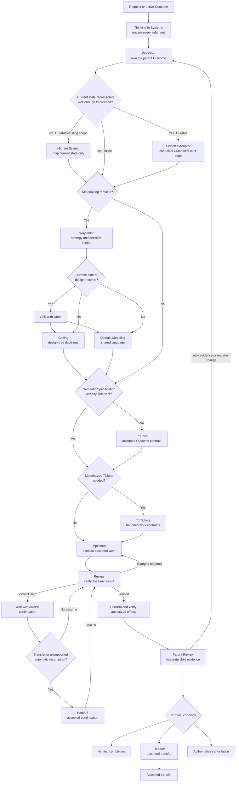

# Workflow

Own one parent Outcome from request to verified completion, accepted transfer, or authoritative cancellation in Inline or Durable mode. Load and apply the `'Thinking in Systems'` skill first. Workflow chooses the smallest truthful route, coordinates bounded phase results, and remains responsible for their integration and the parent terminal condition.

## Follow the route

The diagram shows every capability; follow only the smallest path needed to satisfy unmet contracts. Inline work may carry the Specification, one Ticket, and Review in the conversation; Durable work materializes the same meanings through one selected Adapter. Both modes follow the same systems judgment and completion rules.

1. **Enter one Workflow context.** Preserve the request. Join a matching open Outcome when one exists; otherwise distinguish new, related, and replacement work before accepting one parent Outcome. Record the Outcome owner, current phase, accepted Authority, result revision, selected Adapter, capability levels, and return route proportionately. Complete this step when exactly one parent context governs the work or the smallest material ambiguity is visible.
2. **Choose the representation.** Use Inline mode for bounded synchronous work before a Persistence boundary. Use Durable mode when state, responsibility, waiting, approval, assignment, multiple independently finishable units, or meaningful risk must survive the interaction. Complete this step when the representation can preserve the contract or an exact capability gap and resumption condition are visible.
3. **Materialize Durable state.** At a Persistence boundary, read [Durable mode](references/durable-mode.md), select one canonical Adapter, declare its `Baseline`, `Coordination`, and `Continuation` capabilities, and create or update the canonical Outcome before child execution or an external effect. Record Tickets, Claims, Evidence references, Continuation, transition history, and exact revisions only through that authority. If Baseline is unavailable, enter visible Degraded mode with complete preserved state and an exact resumption or accepted-handoff condition; never claim fictional storage, monitoring, or completion. Complete this step when the parent and every persistent child have a readable canonical locator or the capability gap is durably visible.
4. **Map existing reality when needed.** If Durable work materially depends on an existing scope without a current verified map, invoke the `'Migrate System'` skill for bounded current-state mapping. Record actual sources, Actors, responsibilities, relationships, active work, evidence, waiting state, and unknowns. Independent areas may be delegated, but the migration owner integrates and verifies them. Route persistent Fog of war to the `'Wayfinder'` skill. Route every discovered change to ordinary Workflow; migration does not repair the represented System. Complete this step when the materially affected current state is trustworthy enough for ordinary work.
5. **Remove only blocking uncertainty.** Select discovery by the uncertainty table below. The `'Wayfinder'` skill begins with the `'Domain Modeling'` and `'Grilling'` skills when their capabilities are available. When durable plans or design records are in scope, it uses the `'Grill With Docs'` skill, which composes both. Independent discovery may run concurrently; dependent questions wait. Complete this step when the remaining uncertainty either permits a truthful Specification or is an explicit operating rule for irreducible Fog of war.
6. **Specify and decompose proportionately.** A complete bounded request may remain the semantic Specification for one implicit Inline Ticket. Invoke the `'To Spec'` skill when a Specification must persist, cross an approval or assignment boundary, coordinate multiple phases, govern meaningful risk, or is explicitly requested. Invoke the `'To Tickets'` skill when work has independently finishable units, delegation, dependencies, concurrency, cross-session execution, or another Persistence boundary. A direct request for a later phase enters there only after its minimum contract, owner, Authority, exact revision, Proof seam, and return route are present. Bind each Durable Specification and Ticket to the selected Adapter's exact revision. Complete this step when every executable unit is covered by an accepted contract without invented prerequisites.
7. **Implement, Review, and integrate.** Each invoked capability joins the active Workflow context, owns its bounded result, and returns revision-bound Evidence. Review every exact result at its accepted Proof seam. Perform only authorized effects through the Adapter's deterministic transition and effect guards, verify the real result, update affected current and legacy state, and run parent Review over the integrated Outcome. Complete this step when all required child dispositions, Continuations, effects, and propagation are integrated at the current revisions.
8. **Reach a truthful terminal condition.** End parent responsibility only on a verified parent proof bundle, an accepted transfer with exact continuation, or authoritative cancellation with every material disposition. Delegation, submission, approval, scheduling, waiting, failure, child completion, and an unaccepted handoff are non-terminal.

## Durable coordination boundary

At a Durable boundary, Workflow coordinates one canonical adapter-neutral
record set: Outcome, Ticket, Claim, Evidence, Continuation, transition history,
and (when consequence warrants) a Change and Legacy Record. The selected
Adapter may store those meanings in Local Markdown, Git, GitHub, or an external
native record, but it must declare actual capabilities and keep one writable
authority. Transient Conversation is an Inline representation only; at the
Persistence boundary it must materialize through a Baseline Adapter or enter a
visible Degraded continuation. Read [Durable mode](references/durable-mode.md)
for the materialization sequence, capability matrix, queue and transition
guards, #35 System Record binding, migration, waiting, Degraded operation,
effects, and parent proof bundle.

When the represented scope is a Durable System, bind its Outcome and system
transition to the accepted #35 System Record: one human-readable Markdown
authority with constrained YAML formal fields, the canonical relationship
index, native Adapter mappings where applicable, and optional read-only
projections. A missing or failed `System Record structural validator` or
`System Record action guard` leaves the record readable but blocks machine
transitions, projections, and effects. This is a capability boundary inside
Workflow, not a second System Record or migration skill.

## Select discovery by uncertainty

| Uncertainty | Invoke | Required return |
| --- | --- | --- |
| Unclear or conflicting terminology | `'Domain Modeling'` skill | Operative meanings and visible conflicts |
| Documented plan or design decisions | `'Grill With Docs'` skill | Confirmed decisions, shared language, and qualifying durable records |
| Decisions held by the current user | `'Grilling'` skill | Accepted decisions and remaining frontier |
| Persistent, multi-session, or irreducible Fog of war | `'Wayfinder'` skill | Operating strategy and current decision frontier |
| Missing external facts | `'Research'` skill | Cited findings and remaining uncertainty |
| One empirical design question | `'Prototype'` skill | Reversible experiment verdict and evidence |
| Knowledge held by another person | `'To Questionnaire'` skill | Complete asynchronous questionnaire and return use |

Treat missing companion skills as capability gaps. Act directly only when the same bounded contract remains satisfiable; otherwise enter visible Degraded mode with preserved state and an exact resumption condition.

## Handle every new message during active work

Preserve the message and classify each operative clause before changing state. One message may contain several classes. Compatible clauses can be processed together; replacement or unrelated-switch clauses decide which Outcome later clauses address.

| Class | Test | Route |
| --- | --- | --- |
| **Clarification** | Resolves an ambiguity without changing the accepted Outcome, scope, Constraints, Authority, proof, or treatment of existing state. | Append the clarified meaning or fact and continue at the same Specification and result revisions. |
| **Extension or Constraint change** | Adds or changes the Outcome, scope, supported conditions, Constraint, interface, Authority, proof, or legacy treatment. | Propose the change, create a new Specification or result revision when material, inspect affected work, and reroute only that work. |
| **Correction** | Shows that an earlier interpretation, evidence claim, result, or completion assertion was false under the original contract. | Append a correction event, preserve history, invalidate false evidence, reopen affected responsibility, and recover from the failed seam. |
| **Authorized override or Informed exception** | Requests a safeguard to be bypassed within claimed Authority. | Verify Authority. When it holds, record the skipped protection, plausible consequence, affected scope and duration, and Review, reversal, or recovery trigger. When it does not, preserve the exact proposal and result, perform no guarded effect, and enter approval or waiting with an owner and observable unblock condition. Keep every unaffected safeguard active. |
| **Explicit replacement or supersession** | Replaces the active Outcome or accepted contract instead of extending it. | Record the predecessor, partial effects, retained evidence, dependencies, and every child disposition before establishing or joining the successor. |
| **Unrelated switch** | Does not advance, clarify, correct, replace, or share a material contract with the active Outcome. | Preserve exact continuation first, then start or join the other Outcome. Resume the original from its recorded pickup point. |

When the class or Authority is materially ambiguous, preserve the plausible routes and ask the smallest question that changes the route. Preference or willingness to accept risk is not proof of Authority.

For every material extension, Constraint change, exception, or replacement:

1. Preserve the baseline and record the source message, classification, proposed revision, rationale, Authority, and expected effect.
2. Trace the changed contract slice through present or plausibly affected Tickets, dependencies, evidence, Reviews, approvals, effects, interfaces, current state, and legacy state.
3. Mark each inspected item affected or unaffected with a reason. Invalidate only affected evidence, Review, approval, completion, or child contracts.
4. Propagate the exact revision, proof seam, and next action to every affected child owner. Preserve unaffected ownership, claims, evidence, and progress.
5. Re-evaluate parent coverage and integration. A material Durable system change also updates its Change and Legacy Record.

Use the [material-change template](references/material-change-template.md) when the change must persist.

## Interrupt and resume safely

- **Continuous work:** stop at a coherent checkpoint. Preserve source and result revisions, owner, completed range, pickup point, next action, and proof still required.
- **Atomic work before its effect boundary:** stop before the boundary. Preserve the exact proposal, Review, approval, preconditions, and recheck action.
- **Atomic work crossing its effect boundary:** observe the accepted effect or failure and enter verification or recovery before switching attention.
- **Changed approved work:** invalidate affected Review and approval. Recheck validity, expiry, revocation, conditions, and exact revision immediately before resuming any effect.

Use the [continuation template](references/continuation-template.md) when state must survive the interaction. Short waits may be observed directly. Longer waits need an accepted durable continuation and scheduled resumption or monitor when available. Invoke the `'Handoff'` skill when responsibility or context must transfer, including when automatic resumption is unavailable. It returns an accepted continuation with the responsible Actor and exact next check. If that capability is unavailable, preserve the same contract in visible Degraded mode until a safe equivalent, restored capability, or accepted transfer is available. Waiting remains owned.

## Use Supplemental skills at declared Extension points

Configuration may attach user-selected Supplemental skills only at these seams:

| Extension point | Input | Return to the core owner |
| --- | --- | --- |
| `workflow.discovery` | Blocking uncertainty, sources, Constraints, and required decision | Evidence or a bounded discovery result |
| `workflow.specification` | Accepted Outcome, governing decisions, and proof obligations | Specialist constraints or evidence for To Spec |
| `workflow.decomposition` | Accepted Specification and dependency context | Specialist decomposition evidence for To Tickets |
| `workflow.implementation` | Accepted Ticket, Authority, and proof seam | Specialist execution result and evidence for Implement |
| `workflow.review` | Exact Specification and result revisions | Specialist findings for Review |
| `workflow.effect` | Reviewed revision, Authority, and effect contract | Specialist effect evidence for Workflow |

The core skill supplies inputs, integrates the returned evidence, and retains its job, responsibility, and completion criterion. Advisory failure is recorded and may permit continuation; required failure routes to waiting or recovery. Overlapping mappings require an explicit configured selection. Use the [Extension-point template](references/extension-point-template.md) when declaring or evaluating a mapping.

## Preserve Authority and proof

A clear request to perform an effect may supply Authority within its explicit boundary. A draft request, ambiguous Authority, changed result revision, or consequential effect outside granted Authority creates an approval gate. Approval binds one exact result revision and is rechecked immediately before the effect.

An authorized Informed exception may compress an artifact or phase when its prerequisites are already satisfied or the skipped protection and recovery are understood. Thinking in Systems, responsibility, Authority, Review, and truthful completion remain active proportionately.

Return the smallest user-visible result that proves the accepted Outcome. Preserve history, raw evidence, current and legacy effects, parent responsibility, and unaffected work across every route.
